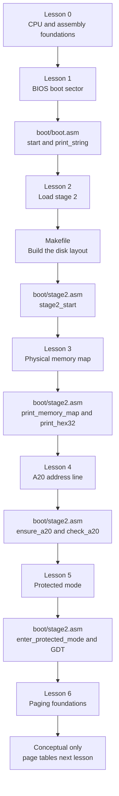

# Code reading map

This map connects the book chapters to the implementation. Source-code line
numbers change whenever comments or instructions are added, so the lessons use
stable **symbols**—names such as `start:` and `print_memory_map:`—instead of line
numbers.

To locate a symbol from the repository root, use:

```sh
rg -n '^symbol_name:' boot
```

For example:

```sh
rg -n '^print_memory_map:' boot
```

returns the current file and line where that routine begins.

## Recommended reading order



## Lesson-to-code index

| Lesson | Concept | File | Stable marker to find |
|---|---|---|---|
| 0 | Registers, stack, calls, labels | [`lessons/00-cpu-assembly-foundations.md`](lessons/00-cpu-assembly-foundations.md) | Conceptual examples; applied by the symbols below |
| 1 | CPU and segment initialization | [`boot/boot.asm`](boot/boot.asm) | `start:` |
| 1 | Null-terminated string loop | [`boot/boot.asm`](boot/boot.asm) | `print_string:` |
| 1 | Permanent halt | [`boot/boot.asm`](boot/boot.asm) | `halt_forever:` |
| 1 | Boot signature and padding | [`boot/boot.asm`](boot/boot.asm) | `times 510` and `dw 0xaa55` |
| 2 | Save the BIOS disk number | [`boot/boot.asm`](boot/boot.asm) | `boot_drive` |
| 2 | Prepare the CHS disk request | [`boot/boot.asm`](boot/boot.asm) | comment beginning `INT 13h/AH=02h` |
| 2 | Enter stage 2 | [`boot/boot.asm`](boot/boot.asm) | `jmp 0x0000:STAGE2_LOAD_ADDRESS` |
| 2 | Stage-2 entry | [`boot/stage2.asm`](boot/stage2.asm) | `stage2_start:` |
| 2 | Build one raw disk image | [`Makefile`](Makefile) | `$(OS_IMAGE):` |
| 3 | Enumerate BIOS memory regions | [`boot/stage2.asm`](boot/stage2.asm) | `print_memory_map:` |
| 3 | Validate an E820 response | [`boot/stage2.asm`](boot/stage2.asm) | `.next_entry:` under `print_memory_map` |
| 3 | Print a character | [`boot/stage2.asm`](boot/stage2.asm) | `print_character:` |
| 3 | Convert a number to hexadecimal | [`boot/stage2.asm`](boot/stage2.asm) | `print_hex32:` |
| 3 | Receive one BIOS record | [`boot/stage2.asm`](boot/stage2.asm) | `e820_buffer:` |
| 4 | Require access above one MiB | [`boot/stage2.asm`](boot/stage2.asm) | `call ensure_a20` |
| 4 | Test and request A20 | [`boot/stage2.asm`](boot/stage2.asm) | `ensure_a20:` |
| 4 | Perform the alias test | [`boot/stage2.asm`](boot/stage2.asm) | `check_a20:` |
| 4 | Stop after failure | [`boot/stage2.asm`](boot/stage2.asm) | `a20_failure:` |
| 5 | Build and load the GDT | [`boot/stage2.asm`](boot/stage2.asm) | `gdt_start:` through `gdt_descriptor:` |
| 5 | Enable protected mode | [`boot/stage2.asm`](boot/stage2.asm) | `enter_protected_mode:` |
| 5 | Start 32-bit execution | [`boot/stage2.asm`](boot/stage2.asm) | `protected_mode_entry:` |
| 5 | Direct VGA/debug output | [`boot/stage2.asm`](boot/stage2.asm) | `pm_print_string:` |
| 6 | Virtual addresses, pages, and page-table translation | [`lessons/06-paging-foundations.md`](lessons/06-paging-foundations.md) | Conceptual lesson; implementation begins next lesson |

## Understanding local-label markers

A marker such as `.next_entry:` is local to the nearest preceding non-local
label. The full conceptual name is therefore:

```text
print_memory_map.next_entry
```

When a table in this map names a local label, it also names its containing
non-local routine so the correct occurrence is unambiguous.

## Build products are not source files

The build creates these generated files:

| Generated file | Created from | Purpose |
|---|---|---|
| `build/boot.bin` | `boot/boot.asm` | Raw 512-byte stage 1 |
| `build/stage2.bin` | `boot/stage2.asm` | Raw four-sector stage 2 |
| `build/os.img` | Both binaries | Complete virtual floppy given to QEMU |

Generated files are useful for inspecting bytes, but explanations should point
to the assembly source and Makefile because rebuilding replaces `build/`.
