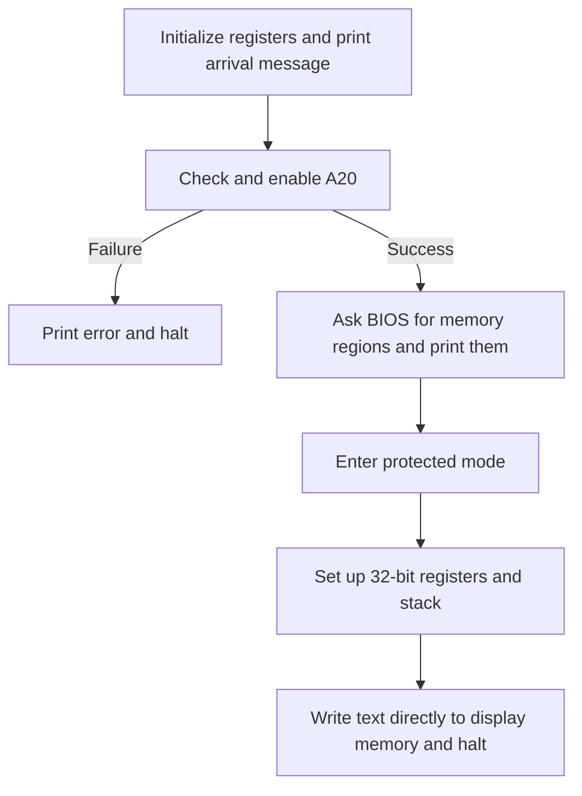

# stage2.asm: prepare the CPU for our future kernel

For hardware → assembly → C examples from this file, see [the contextual mappings](code-mappings.md).

For explanations of registers and basic notation, see [the boot.asm guide](02-boot-asm.md).
You can explore these sections in any order; this is not a lesson prerequisite.
Source: [`boot/stage2.asm`](../boot/stage2.asm).

A **kernel** is the core of an operating system. There is no kernel running yet.
This file prepares the machine, demonstrates 32-bit execution, and stops.

Stage 1 answered: “Can we load more instructions and reach them?” Stage 2 asks
what those instructions can safely assume about the machine:

```text
Are higher addresses distinct? → verify A20
Which ranges are RAM?          → ask BIOS for a memory map
What rules will segments use?  → build and load the GDT
How do we execute 32-bit code? → change CPU configuration and jump
How do we print afterward?     → write directly to display memory
```

Each step prepares a dependency of later code. The ordering matters because
ordinary BIOS services are available before the mode switch, while our later
printing routine must operate without those services.

## 1. Follow execution, not the order of definitions

Stage 1 loads this file at `0x8000` and jumps there. The CPU is still in real mode,
and the stack configured by stage 1 is still available.



Helper routines appear later in the file. A `call` jumps to them; `ret` returns.
The CPU does not simply execute every line from top to bottom, including data.

## 2. Establish addresses and print the first message

```asm
bits 16
org 0x8000
STAGE2_SIZE equ 4 * 512
%define stage2_address(label) (0x8000 + (label - $$))
```

These are NASM directives. `%define` creates a shorthand expression:
`stage2_address(message)` expands to the address calculation on the right.
It is not a function executed by the CPU.

At `stage2_start`, `xor ax, ax`, `mov ds, ax`, and `mov es, ax` establish zero
segments again. `cld` makes string reads move forward. Setting `SI` to the message
address and calling `print_string` works like stage 1.

## 3. A20: make two different addresses stay different

A **MiB** is 1,048,576 bytes, or `0x100000`. **A20** is address bit 20, the bit
with that value. An old compatibility mechanism can force it to zero, making
some addresses one MiB apart refer to the same byte. We need it enabled before
using higher memory reliably.

`ensure_a20` first calls `check_a20`. This helper returns `AX = 1` for enabled,
`AX = 0` for disabled. Returning a result in a register is a convention chosen
by this code; `ret` itself only returns execution.

### How check_a20 proves it

It compares the behavior of two addresses:

| Segment:offset | Calculation | Physical address with A20 enabled |
| --- | --- | --- |
| `0000:0500` | `0 × 16 + 0x0500` | `0x000500` |
| `ffff:0510` | `0xffff × 16 + 0x0510` | `0x100500` |

`push` saves a value on the stack; `pop` restores the most recently saved value.
`pushf` and `popf` do the same for flags. The routine saves flags and registers,
then uses `cli` so ordinary interrupts cannot interrupt its temporary memory edits.

It saves the original bytes into `BL` and `BH`, then writes:

```asm
mov byte [es:di], 0x00
mov byte [ds:si], 0xff
```

`byte` specifies the write size. The explicit `es:` and `ds:` select the segment
used for each address. If the second write changes the first location to `0xff`,
the two addresses refer to the same byte: A20 is disabled.

`cmp` compares values by setting flags without changing the values. `je` means
jump if equal, using the same Zero Flag condition as `jz`.
The routine sets `AX` to its result, restores the original memory bytes and saved
registers in reverse order, restores flags, and returns.

### Why write two different values and restore them?

Think of the two addresses as two names that might identify one storage byte.
Writing zero through the first name and `0xff` through the second reveals that:

```text
separate bytes: low = 0x00, high = 0xff → A20 enabled
same byte:     low also reads 0xff     → A20 disabled
```

Reading without writing would not prove anything: two separate bytes could
happen to contain equal values. The writes create a difference we can test.
Saving and restoring the originals lets us ask the question without leaving
our test data behind. Restoring registers likewise keeps the caller's address
setup intact; `AX` is the deliberately returned answer.

### If A20 was disabled

`ensure_a20` requests BIOS service `int 0x15` with `AX = 0x2401` to enable it.
It saves `DS` and `ES` around that call. BIOS reporting an error through Carry
causes failure; otherwise it calls `check_a20` again to verify the result.

Back at `stage2_start`, `test ax, ax` and `jz a20_failure` stop on zero.
On success, it prints the A20 confirmation and continues.

## 4. Ask BIOS which memory regions exist

RAM is not one uninterrupted region we may freely overwrite. Some address ranges
belong to firmware or devices. `print_memory_map` asks BIOS to describe the ranges.
It prints the results; it does not yet allocate memory or keep a complete map.

Registers beginning with `E`, such as `EAX`, are 32-bit registers. `AX` is the
lower 16 bits of `EAX`. A 16-bit code section can still use 32-bit registers;
NASM encodes the necessary instruction prefixes.

BIOS operation **E820** returns one memory-region record per call:

| Input | Meaning |
| --- | --- |
| `EAX = 0xe820` | Select the memory-map operation |
| `EDX = 0x534d4150` | Required identification value, named `SMAP` |
| `ECX = 24` | Space available for a record, in bytes |
| `ES:DI` | Address of `e820_buffer`, where BIOS writes the record |
| `EBX = 0` initially | Start with the first region |

After each successful call, BIOS supplies a continuation value in `EBX`. We pass
it unchanged to the next request. Zero means there are no more records.

### Why keep the BIOS continuation value?

The interface returns one region at a time. `EBX` is BIOS's bookmark for where
to continue; our code should not guess what its numeric value means.

```text
EBX = 0 → request first region
BIOS returns a record and a bookmark
pass that bookmark back → request next region
BIOS returns EBX = 0 → finished
```

If we reset `EBX` to zero on every iteration, we would keep requesting the first
region. If printing destroys it, the next request loses its place. This explains
why the code preserves it across printing.

### What the returned bytes mean

An **offset** here means a byte distance from the beginning of the buffer.

| Offset | Size | Field |
| --- | --- | --- |
| `0` | 8 bytes | Base: beginning address of the region |
| `8` | 8 bytes | Length: number of bytes in the region |
| `16` | 4 bytes | Type: what the region is for; type 1 means usable RAM |
| `20` | 4 bytes, if supplied | Extended attributes, including a validity bit |

Even a type-1 region can already contain our code or stack. “Usable RAM” does
not mean every byte is currently free.

The code checks Carry, the returned `SMAP` value, and the record size.
`jne` jumps if unequal; `jb` jumps if the preceding comparison found the first
unsigned number smaller than the second.

A 20-byte response is accepted. For a response of at least 24 bytes, it checks
bit zero of the attributes using `test ..., 1`; a clear bit skips the record.
`dword` means four bytes, specifying the memory operand's size.

The length spans two 32-bit pieces. `or` combines corresponding bits; the result
is zero only if both pieces were zero. Zero-length records are skipped.

For other records, the code prints base, length, and type. It saves `EBX` on the
stack while printing so the continuation value survives. It repeats until `EBX`
is zero. On a BIOS error it prints an error and returns: **this implementation
still proceeds to protected mode after a memory-map error.**

## 5. How the printing helpers work

`print_string` reads one byte with `lodsb`, stops at zero, and calls
`print_character` for every other byte. Its `jmp print_string` repeats the loop;
a jump does not add another return address to the stack.

`print_character` saves `AX` and `BX`, writes `AL` to debug port `0xe9`, requests
BIOS video output with `int 0x10`, then restores those registers and returns.

### Turn a number into text: print_hex32

A number in a register is not already a sequence of printable digits.
`print_hex32` converts `EAX` into exactly eight hexadecimal characters.
One hex digit represents four bits, so 32 bits require eight digits.

The routine saves its working registers and copies the number to `EDX`.
For each digit:

```asm
rol edx, 4
mov ebx, edx
and ebx, 0x0f
mov si, stage2_address(hex_digits)
add si, bx
mov al, [si]
call print_character
loop .next_digit
```

- `rol edx, 4` rotates bits left, wrapping the highest four into the lowest four.
- `and ebx, 0x0f` keeps only those lowest four bits: a value from 0 to 15.
- `hex_digits` contains `0123456789ABCDEF`. Adding the value to its address
  selects the matching character, which is loaded into `AL` and printed.
- `loop` decreases the count and repeats while it is nonzero. In this 16-bit
  section it uses `CX`; initializing `ECX` to 8 also initializes `CX` to 8.

For example, `0x1234abcd` prints `1234ABCD`. A 64-bit base or length is printed
as its high 32 bits followed by its low 32 bits, producing 16 digits.

## 6. Prepare new rules for memory access: the GDT

**Protected mode** is an x86 operating mode that supports permissions and the
32-bit execution environment used here. Switching requires a table describing
code and data segments: the **Global Descriptor Table**, or **GDT**.

A **descriptor** is an eight-byte table entry describing a segment's starting
address, size limit, and allowed operations. This program defines three:

| Entry | Selector | Meaning |
| --- | --- | --- |
| 0 | `0x00` | Required unusable entry |
| 1 | `0x08` | Executable, readable, 32-bit code |
| 2 | `0x10` | Readable, writable data |

A **selector** identifies an entry in this table. Here its value is the entry
number multiplied by eight; its low bits also encode table/privilege choices,
which are zero in our selectors.

Unlike real mode, a segment register will now hold a selector, not a value to
multiply by 16. Both useful descriptors have base address zero and cover four
GiB (2³² bytes). This is a **flat** layout: segment bases add nothing to offsets.
It describes an address range, not a guarantee that four GiB of RAM exists.

### Read the descriptor declarations

`db`, `dw`, `dd`, and `dq` emit 1, 2, 4, and 8 bytes respectively.
The descriptor fields are split across these declarations because x86 requires
that exact byte layout.

- The base pieces are all zero.
- `0xffff` plus the low four bits of `11001111b` form a 20-bit limit, `0xfffff`.
- The suffix `b` means binary. The upper bits of `11001111b` select 32-bit
  defaults and size units of 4096 bytes. The effective final offset is
  `0xfffff × 4096 + 4095 = 0xffffffff`.
- `10011010b` marks usable, executable, readable code at privilege level zero.
- `10010010b` marks usable, writable data at privilege level zero.

Privilege level zero, also called **ring 0**, gives this code the CPU's highest
privilege. This small program does not yet establish application isolation.

`gdt_descriptor` is a separate six-byte description of the table: its size minus
one, followed by its starting address. Three eight-byte entries give size 24,
so the stored limit is 23.

### Why prepare the table before changing the mode?

In real mode, `DS = 0` means a base address of `0 × 16`. After the switch,
`DS = 0x10` means “use entry two of the GDT.” The number has a new interpretation.
The table must already exist when the CPU needs to look up those descriptions.

This is also why merely choosing a larger register is not a mode switch.
`EAX` holds a 32-bit value; the GDT and control register establish the rules
under which instructions and memory accesses operate.

## 7. Actually switch the CPU mode

```asm
cli
lgdt [stage2_address(gdt_descriptor)]
mov eax, cr0
or eax, 0x00000001
mov cr0, eax
jmp dword 0x08:stage2_address(protected_mode_entry)
```

`cli` disables ordinary hardware interrupts. We have not installed protected-mode
interrupt handlers, so they must remain disabled.

`lgdt` loads the GDT's location and size into the CPU. `CR0` is a **control
register**, holding CPU configuration bits. We copy it into `EAX`, use `or` to
set bit zero without clearing the other bits, and copy it back. That bit is
**PE**, protected-mode enable.

The far jump selects our code descriptor (`0x08`) and the new instruction address.
`dword` requests a 32-bit jump offset. The loaded code descriptor establishes
32-bit instruction defaults.

The nearby `bits 32` tells NASM to encode the destination code accordingly.
The CPU mode change comes from `CR0` and the jump, not from the directive.
This routine never returns; the call's old return address is abandoned.

## 8. Start 32-bit execution and print without BIOS

At `protected_mode_entry`, the code puts selector `0x10` into `DS`, `ES`, `FS`,
`GS`, and `SS`. `FS` and `GS` are additional data segment registers.
It sets `ESP`, the 32-bit stack pointer, to `0x90000`.

This stack location is fixed by the code; it is not chosen from the printed
memory map. That is a limitation of this early demonstration.

Ordinary real-mode BIOS calls are no longer directly usable under these new
rules. `pm_print_string` writes to the **VGA text buffer**, memory used by the
emulated display, beginning at `0xb8000`.

```asm
mov al, [esi]
inc esi
...
mov [edi], al
mov [edi + 1], ah
add edi, 2
```

`ESI` points to message bytes; `EDI` points to display bytes. `inc` adds one.
Each screen cell takes two bytes: a character and a color attribute.
`AH = 0x07` selects light gray on black. Advancing `EDI` by two selects the next
cell. The zero-byte check ends the string, and `out 0xe9, al` mirrors output to
QEMU's debug console.

This helper starts at the screen's first cell, overwriting earlier text there.
It does not interpret carriage return and line feed: the message's `13, 10`
bytes are written as character cells. The debug output also receives those bytes.

After printing, the CPU stays in the `cli` / `hlt` / `jmp` loop.

## 9. Why bits 16 appears again later

Later helper definitions, including `check_a20` and `print_memory_map`, execute
**before** the switch. NASM therefore needs to encode them as 16-bit code even
though their definitions appear after the 32-bit routines.

That later `bits 16` does not switch the running CPU back. Execution has already
ended in the 32-bit halt loop; it does not fall through into those helpers.

The file ends with message bytes, a 24-byte buffer, and zero padding:

```asm
times STAGE2_SIZE - ($ - $$) db 0
```

This makes the binary exactly 2048 bytes, matching stage 1's four-sector read.
Stage 2 needs no BIOS boot signature because stage 1 loads it explicitly.

**Check:** Does reaching `bits 32` in the source make the CPU switch mode?
No. NASM uses it when building the file; execution switches through `CR0` and
the far jump using the GDT.

You can now follow stage 2's checks, BIOS requests, mode switch, and output.
It has not enabled paging (translation through page tables), entered 64-bit mode,
or started a kernel. Those are later steps, not hidden behavior in this file.
