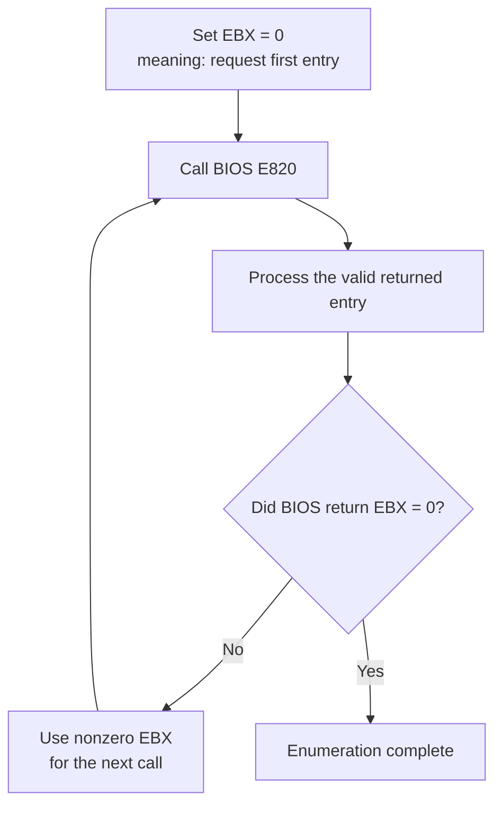

# Worked exercises — Lesson 3

These results correspond to the exercises in
[`lessons/03-physical-memory-map.md`](../lessons/03-physical-memory-map.md). The
experiments were run with QEMU; temporary source changes were restored afterward.

## Exercise 1 — Compare 128 MiB and 64 MiB memory maps

### Method

The normal image was run once with 128 MiB and once with 64 MiB:

```sh
qemu-system-i386 -m 128M -drive format=raw,file=build/os.img,if=floppy
qemu-system-i386 -m 64M  -drive format=raw,file=build/os.img,if=floppy
```

`-m` selects how much RAM QEMU presents to the virtual machine. The suffix `M`
means that the number is counted in MiB, where one MiB is 1,048,576 bytes.

### Observed type-1 regions

Type 1 means that BIOS reports the region as available RAM.

| QEMU memory | Base | Length | Type |
|---:|---:|---:|---:|
| 128 MiB | `0x0000000000000000` | `0x000000000009FC00` | 1 |
| 128 MiB | `0x0000000000100000` | `0x0000000007EE0000` | 1 |
| 64 MiB | `0x0000000000000000` | `0x000000000009FC00` | 1 |
| 64 MiB | `0x0000000000100000` | `0x0000000003EE0000` | 1 |

The low type-1 region is identical in both runs. The larger region still begins
at `0x00100000`, but its length changes:

```text
128 MiB run: 0x07EE0000 bytes
 64 MiB run: 0x03EE0000 bytes
difference:  0x04000000 bytes = 64 MiB
```

The complete maps also contain reserved ranges. The reserved range near the top
of configured RAM moves from base `0x07FE0000` in the 128 MiB run to base
`0x03FE0000` in the 64 MiB run.

### Conclusion

The output is discovered from the virtual machine rather than hard-coded. When
QEMU presents 64 MiB less RAM, BIOS reports a large available region that is
exactly 64 MiB shorter.

## Exercise 2 — Change only the printed type prefix

### Method

The source string was temporarily changed from:

```asm
type_prefix db ' type=0x', 0
```

to:

```asm
type_prefix db ' kind=0x', 0
```

The image was rebuilt and run with 128 MiB. One original line was:

```text
base=0x0000000000100000 length=0x0000000007EE0000 type=0x00000001
```

The modified output was:

```text
base=0x0000000000100000 length=0x0000000007EE0000 kind=0x00000001
```

All six entries retained the same base, length, and numeric type. Only the literal
characters printed before the type number changed. The source was then restored
to `type=0x` and rebuilt.

### Why

`type_prefix` is read only by `print_string`. BIOS writes the numeric record into
`e820_buffer`, and the prefix is stored elsewhere. Changing the prefix therefore
changes presentation but does not modify the E820 request or response.

## Exercise 3 — Split a 64-bit value

Given:

```text
0x0000000123456789
```

A 32-bit half contains eight hexadecimal digits because each hexadecimal digit
represents four bits and `8 × 4 = 32`.

Splitting after eight digits from the right gives:

```text
full value: 0x00000001 23456789
                 │        │
high 32 bits ────┘        └──── low 32 bits
```

Therefore:

```text
high 32 bits = 0x00000001
low 32 bits  = 0x23456789
```

`print_hex32` prints the high half first and the low half second, recreating the
16-digit value without needing a 64-bit instruction.

## Exercise 4 — Why test `EBX` after processing?

Before the first E820 call, `EBX = 0` has a special input meaning:

```text
EBX = 0 before a call → request the first entry
```

After a successful call, it has an output meaning:

```text
EBX ≠ 0 after a call → use this value to request another entry
EBX = 0 after a call → the entry just returned was the final entry
```

If stage 2 tested `EBX` before the first call and treated zero as “finished,” it
would stop without requesting any entries. More subtly, the final E820 call still
returns a valid entry while also returning `EBX = 0`. We must process that entry
before ending the loop.



The test belongs after processing because `EBX = 0` means “there is no entry
after the one just returned,” not “the current call returned no entry.”
