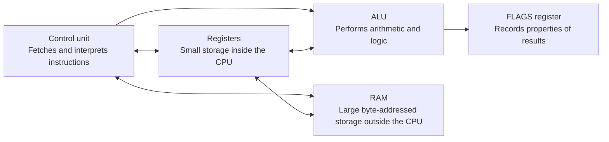
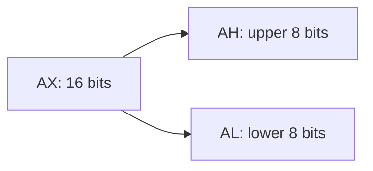
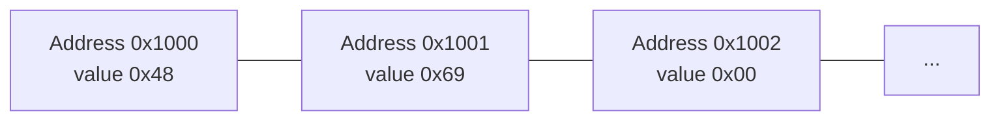
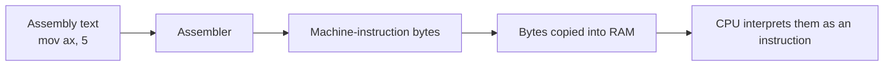
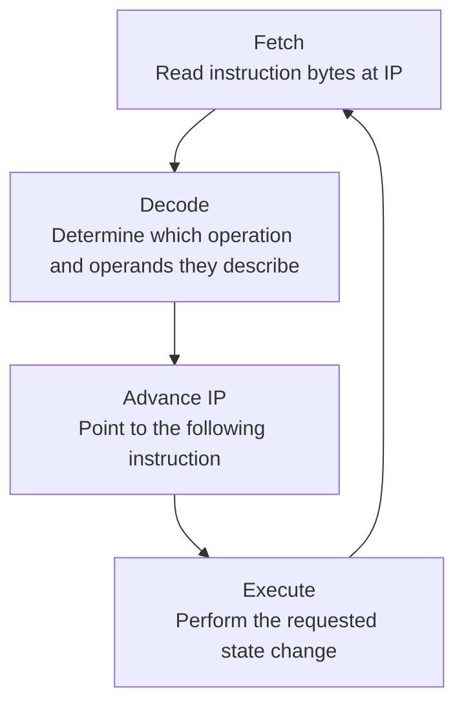
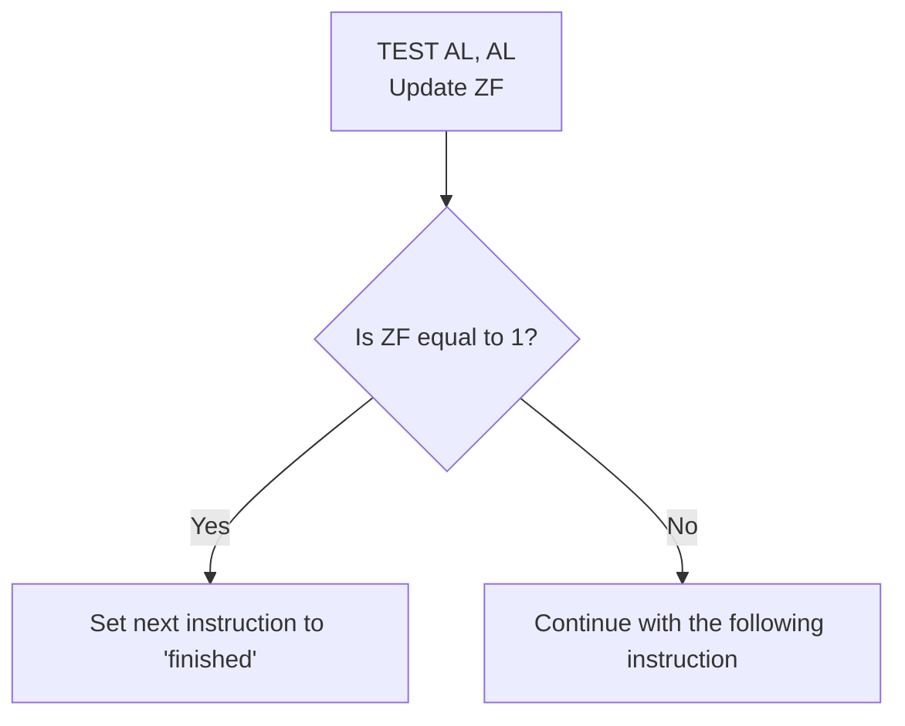
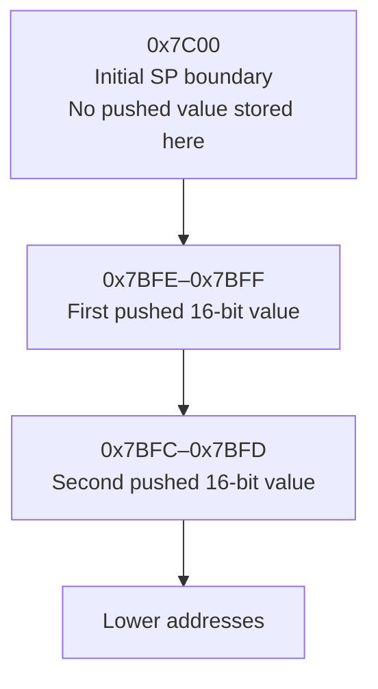
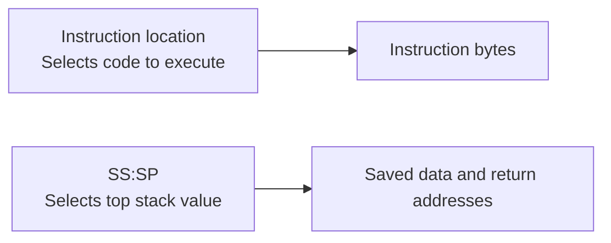
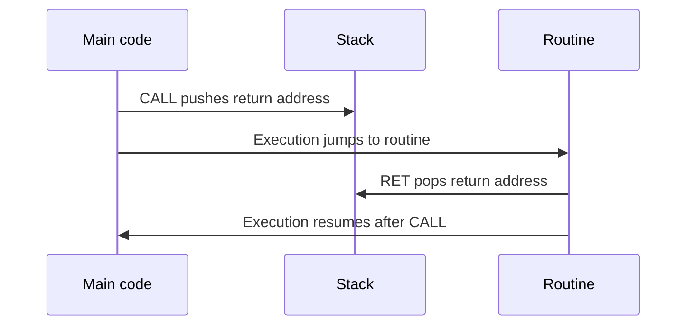
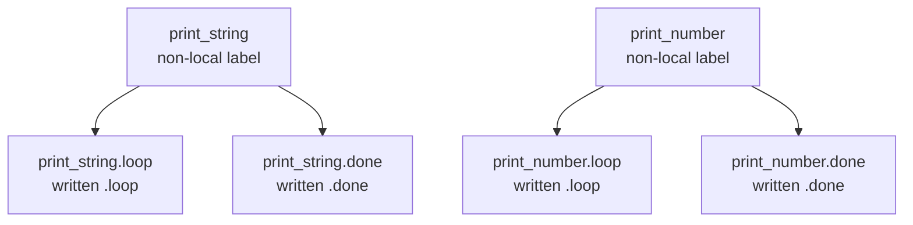

# Lesson 0 — How a CPU executes assembly

## Code companion

This lesson establishes concepts before asking you to read the bootloader. After
each concept is understood, use the central
[`CODE_READING_MAP.md`](../CODE_READING_MAP.md) to find where it appears in
[`boot/boot.asm`](../boot/boot.asm) and
[`boot/stage2.asm`](../boot/stage2.asm). In particular:

| Concept from this lesson | First concrete example to read |
|---|---|
| Registers and `MOV` | `start:` in `boot/boot.asm` |
| Stack and `CALL` | `call print_string` in `boot/boot.asm` |
| Non-local and local labels | `print_string:` and `.print_character:` |
| Flags and conditional jumps | `test al,al` followed by `jz .done` |
| 32-bit register forms | `print_memory_map:` in `boot/stage2.asm` |

## Why this lesson comes first

Before learning how a computer boots, we need a small model of the machine that
will execute our bootloader. Otherwise instructions such as `mov`, `push`, and
`jmp` look like unexplained rituals.

This lesson builds that model from the bottom up. We will not boot anything yet.
We will answer a more fundamental question:

> When the processor executes an assembly instruction, what actually changes?

The explanation uses a simplified imaginary 16-bit processor whose important
behaviors match the early x86 environment we will use. Real x86 processors are
much more complex internally, but they preserve the visible behavior described
here. That visible behavior is what assembly programs depend on.

## 1. Bits: the smallest values

A **bit** can hold one of two values: 0 or 1. Hardware can represent those two
possibilities using two distinguishable physical conditions, such as lower and
higher voltage ranges.

One bit can represent two values. Adding more bits increases the number of
possible patterns:

| Number of bits | Number of patterns | Patterns or range |
|---:|---:|---|
| 1 | 2 | `0`, `1` |
| 2 | 4 | `00`, `01`, `10`, `11` |
| 3 | 8 | `000` through `111` |
| 8 | 256 | `00000000` through `11111111` |
| 16 | 65,536 | `0` through `65,535` when treated as unsigned |

The general rule is that `n` bits have `2ⁿ` possible patterns.

A group of eight bits is called a **byte**. A group of 16 bits occupies two
bytes. “16-bit processor mode” means, among other details introduced later, that
the instruction forms we currently use naturally operate on 16-bit values.

## 2. Binary and hexadecimal

**Binary** is a base-2 number system. Each position represents a power of two:

```text
binary 1011
       │││└─ 1 × 2⁰ = 1
       ││└── 1 × 2¹ = 2
       │└─── 0 × 2² = 0
       └──── 1 × 2³ = 8

total = 8 + 0 + 2 + 1 = decimal 11
```

Long binary numbers are difficult to read. **Hexadecimal** is base 16 and uses
digits `0`–`9` followed by `A`–`F`. One hexadecimal digit represents exactly four
bits:

| Binary | Hexadecimal | Decimal |
|---|---:|---:|
| `0000` | `0` | 0 |
| `0001` | `1` | 1 |
| `1001` | `9` | 9 |
| `1010` | `A` | 10 |
| `1111` | `F` | 15 |

Therefore the 16-bit binary value `0111 1100 0000 0000` can be written more
compactly as `0x7C00`. The `0x` prefix tells the reader that the following digits
are hexadecimal.

Hexadecimal does not change the stored value. Binary `1010`, hexadecimal `A`, and
decimal `10` are three written representations of the same number.

### Why hexadecimal is convenient for bytes

A byte contains 8 bits. One hexadecimal digit represents 4 bits, so exactly two
hexadecimal digits represent one complete byte:

```text
binary:       1010 0111
hexadecimal:     A    7
byte:         0xA7
```

Each of the byte's 256 possible bit patterns has a two-digit hexadecimal name,
from `0x00` through `0xFF`:

```text
0x00 = binary 0000 0000
0x01 = binary 0000 0001
0xA7 = binary 1010 0111
0xFF = binary 1111 1111
```

That is why hexadecimal is especially convenient when inspecting bytes: no bits
are hidden or approximated, and each hex digit maps directly to a four-bit group.
It is also convenient for larger values such as addresses; we simply write more
hexadecimal digits. For example, four hex digits represent 16 bits, and eight
hex digits represent 32 bits.

## 3. The parts in our first CPU model

For now, imagine the processor as four cooperating pieces:



The **control unit** coordinates instruction execution. The **registers** hold a
small number of values immediately available to the processor. The **Arithmetic
Logic Unit**, abbreviated **ALU**, performs operations such as addition,
subtraction, AND, and XOR. The **FLAGS register** records facts about results.
**RAM** holds far more bytes than the registers, but accessing it requires a
memory address.

This diagram describes responsibilities, not the exact internal wiring of a
modern processor. Modern x86 CPUs may split, reorder, or perform several internal
operations at once while preserving the result the instruction set promises.

## 4. Registers are named storage locations

A **register** is a storage location inside the processor. In our current 16-bit
x86 code, registers such as `AX`, `BX`, `SP`, and `IP` can each hold 16 bits.

Suppose the current state is:

```text
AX = 0x0000
BX = 0x0000
```

After executing:

```asm
mov ax, 5
```

the state becomes:

```text
AX = 0x0005
BX = 0x0000
```

`MOV` copies a value into a destination. It does not mean that a physical object
travels through memory, and it does not modify unrelated registers.

Some 16-bit registers can be addressed as two separate 8-bit halves:



If `AX = 0x1234`, then `AH = 0x12` and `AL = 0x34`. Changing `AL` changes the
lower half of `AX`; it is not a separate piece of storage.

## 5. RAM is an array of addressed bytes

We can begin with a simple model of RAM: many storage locations that can each hold
one byte. Every location has a numeric **address** that identifies the location.
The address is not the byte stored there: address `0x1000` might currently contain
`0x48`, and writing a different byte changes the content while the address remains
`0x1000`.



An address and the value stored at that address are different things:

- `0x1000` can mean the address itself.
- `[0x1000]` means the value stored in memory at that address.

In NASM syntax, square brackets request a memory access:

```asm
mov al, [0x1000] ; Read the byte stored at address 0x1000 into AL.
```

If address `0x1000` contains `0x48`, then `AL` becomes `0x48`. Without square
brackets, the numeric value `0x1000` would be used rather than the stored byte.

## 6. Instructions are bytes too

Assembly text is for humans. An **assembler** translates it into numeric machine
instructions. Those instructions are stored as bytes, just like messages and
ordinary data.



Bytes do not carry permanent labels saying “instruction” or “data.” Their meaning
depends on how the program uses them. If the CPU's next-instruction address points
to some bytes, it attempts to decode them as an instruction. If a load instruction
reads those same bytes, they are treated as data.

## 7. The fetch–decode–execute cycle

The **Instruction Pointer**, named `IP` in 16-bit x86 mode, identifies the offset
of the next instruction. We will introduce the accompanying code segment in
Lesson 1; for this first model, imagine that `IP` directly selects an instruction
in memory.

The processor repeatedly performs a conceptual cycle:



For the program:

```asm
mov ax, 5
add ax, 3
```

a simplified trace is:

| Step | Instruction | `AX` before | Action | `AX` after |
|---:|---|---:|---|---:|
| 1 | `mov ax, 5` | `0` | Copy 5 into `AX` | `5` |
| 2 | `add ax, 3` | `5` | ALU adds 3 to `AX` | `8` |

Executing the first instruction does not place the second instruction on the
stack. The instructions already exist in memory. Normally, `IP` advances through
their encoded bytes.

## 8. The ALU and operands

An **operand** is an input to, or destination of, an instruction. In:

```asm
add ax, bx
```

`AX` and `BX` are operands. For this instruction, x86 defines `AX` as both an
input and the destination:

```text
AX after = AX before + BX before
```

If `AX = 5` and `BX = 3`, the ALU calculates 8 and the processor stores 8 in
`AX`. `BX` remains 3.

The ALU also performs logic operations on corresponding bits. For example, XOR
produces 1 when its two input bits differ and 0 when they match:

| Input A | Input B | A XOR B |
|---:|---:|---:|
| 0 | 0 | 0 |
| 0 | 1 | 1 |
| 1 | 0 | 1 |
| 1 | 1 | 0 |

Every bit equals itself, so a value XOR itself becomes zero. That is why early
x86 code often contains:

```asm
xor ax, ax ; Set AX to zero.
```

## 9. FLAGS record facts about a result

Some instructions update individual bits in the `FLAGS` register. A **flag** is
one such bit. It answers a yes/no question about a result or controls part of CPU
behavior.

The first result flag we need is the **Zero Flag**, abbreviated `ZF`:

- `ZF = 1` means the relevant result was zero.
- `ZF = 0` means it was not zero.

The instruction:

```asm
test al, al
```

performs a bitwise AND calculation to update flags but does not store the
calculated value back into `AL`. Testing a value against itself produces zero
only when the original value was zero. We can then use:

```asm
jz finished
```

`JZ` means “jump if zero.” It changes the next-instruction location when `ZF` is
1. This is how a processor turns a recorded condition into a decision.



## 10. The stack is a memory convention

The **stack** is a region of ordinary RAM managed in a last-in, first-out order.
“Last in, first out” means the most recently added value is the first one removed,
like removing the top plate from a stack of plates.

Two registers identify the stack in 16-bit real-mode x86:

- `SS` holds the stack segment.
- `SP` holds the stack pointer, which identifies the current top boundary.

Lesson 1 will explain how a segment and offset form an address. For the examples
below, assume `SS = 0`, making the numeric value in `SP` equal to the memory
address we discuss.

The x86 stack grows toward lower addresses. If `SP` initially equals `0x7C00`, a
16-bit `PUSH` works conceptually as follows:

```asm
sub sp, 2          ; Make room for two bytes.
mov [ss:sp], ax    ; Store the 16-bit value there.
```

The real `push ax` instruction performs that behavior for us.



`POP` reverses the operation: it reads the value at `SS:SP` and then increases
`SP` by the value's size.

```asm
mov ax, 0x1111
push ax            ; SP: 0x7C00 → 0x7BFE
mov ax, 0x2222
push ax            ; SP: 0x7BFE → 0x7BFC
pop bx             ; BX = 0x2222, SP becomes 0x7BFE
pop cx             ; CX = 0x1111, SP becomes 0x7C00
```

The stack does not store each instruction as it executes. Instructions are fetched
using the instruction location; stack values are accessed through `SS:SP`. These
are separate flows:



## 11. Why `CALL` and `RET` need the stack

A **routine** is a reusable sequence of instructions. `CALL` transfers execution
to a routine, but the processor must remember where to continue afterward.

For a 16-bit near call, the processor conceptually:

1. pushes the address of the instruction following `CALL`; and
2. changes `IP` to the routine's address.

`RET` pops that saved address back into `IP`.



This is why a valid stack is necessary before our bootloader uses `CALL`. The
instructions themselves remain in their original memory locations; only the
return address is temporarily stored on the stack.

## 12. A complete traced example

Assume this initial state:

```text
AX = 0
BX = 0
SP = 0x7C00
ZF = 0
```

Now execute:

```asm
mov ax, 3
push ax
sub ax, 3
test ax, ax
jz equal
mov bx, 1
equal:
pop bx
```

The trace is:

| Step | Instruction | Important effect |
|---:|---|---|
| 1 | `mov ax, 3` | `AX` becomes 3 |
| 2 | `push ax` | `SP` becomes `0x7BFE`; 3 is stored there |
| 3 | `sub ax, 3` | The ALU calculates 3 − 3; `AX` becomes 0 |
| 4 | `test ax, ax` | The tested result is zero, so `ZF` becomes 1 |
| 5 | `jz equal` | Because `ZF = 1`, execution jumps over `mov bx, 1` |
| 6 | `pop bx` | `BX` becomes 3; `SP` returns to `0x7C00` |

Final state:

```text
AX = 0
BX = 3
SP = 0x7C00
ZF = 1
```

This example connects data movement, an ALU operation, a flag, a conditional
jump, and the stack without involving BIOS yet.

## 13. Non-local and local labels in NASM

A **label** gives a name to an address in the assembled program. A label ending
with a colon does not perform an operation by itself; it names the address of the
instruction or data that follows it.

NASM distinguishes two forms:

```asm
something:        ; A non-local label.
.something_else:  ; A local label belonging to `something`.
```

A label without a leading dot begins a new scope. A label beginning with a dot is
local to the nearest preceding non-local label. NASM internally treats the second
label above approximately as:

```text
something.something_else
```

This lets different routines reuse short names such as `.loop` and `.done`:

```asm
print_string:
.loop:
    ; Instructions belonging to print_string
    jz .done
    jmp .loop
.done:
    ret

print_number:
.loop:
    ; Instructions belonging to print_number
    jz .done
    jmp .loop
.done:
    ret
```

Although `.loop` and `.done` appear twice, they refer to different addresses:

```text
print_string.loop
print_string.done
print_number.loop
print_number.done
```

Inside `print_number`, `jmp .loop` resolves to `print_number.loop`, not the loop
inside `print_string`.



The colon is optional for many NASM labels, but this project uses it because it
makes label definitions visually distinct from instructions. The leading dot—not
the colon—is what makes a label local.

## 14. What “x86 supports an instruction” means

An **instruction set architecture**, abbreviated **ISA**, is the programmer-visible
contract of a processor family. It defines items such as:

- available instructions and their meanings;
- programmer-visible registers;
- how instructions encode their operands into bytes;
- how memory is addressed; and
- which flags or other state an instruction changes.

**x86** names an instruction-set family that has grown over decades. **x86-64** is
its 64-bit extension. We will not memorize every x86 instruction: there are far
too many, and operating-system development does not require using them all at
once. Each lesson will introduce the small subset needed to solve its current
problem and state the effect of every newly used instruction.

The processor's internal implementation of an instruction may differ between CPU
models. One CPU may break an instruction into several smaller internal operations
while another handles it differently. Both are compatible when the visible
register, memory, and flag results follow the ISA contract.

## What we now know

We can now explain:

- how bits form bytes and numeric values;
- why hexadecimal is useful when reading binary state;
- the roles of the control unit, registers, ALU, flags, and RAM;
- how assembly becomes machine-instruction bytes;
- the fetch–decode–execute cycle;
- the difference between an address and the value stored there;
- how arithmetic results influence flags and conditional jumps;
- why executing instructions does not place them on the stack;
- how `PUSH`, `POP`, `CALL`, and `RET` use `SS:SP`; and
- what it means for x86 to define an instruction-set contract.

We have not yet explained how BIOS starts our code or why real-mode addresses use
segments. Those are the next concepts in [Lesson 1](01-bios-boot-sector.md).
