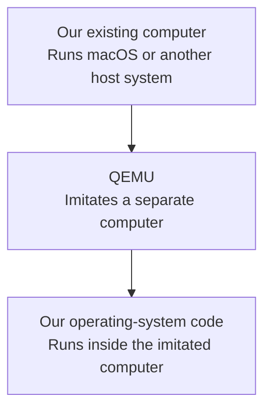
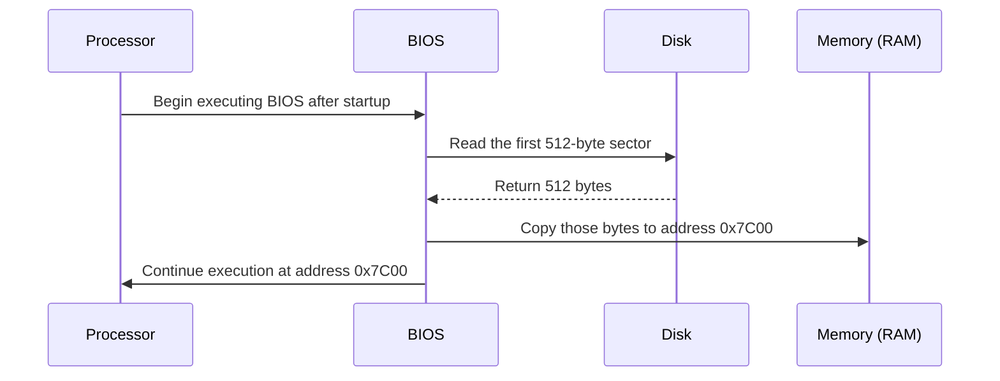
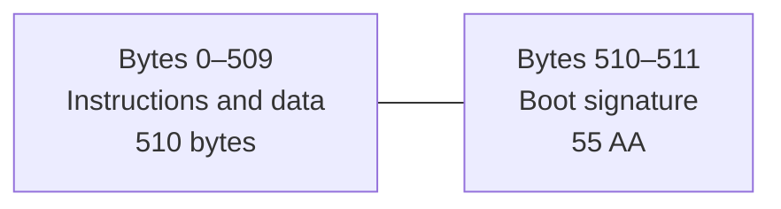
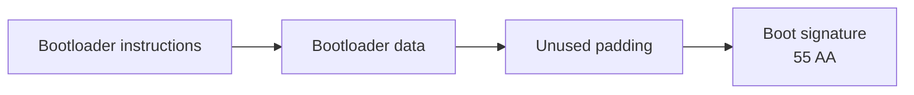
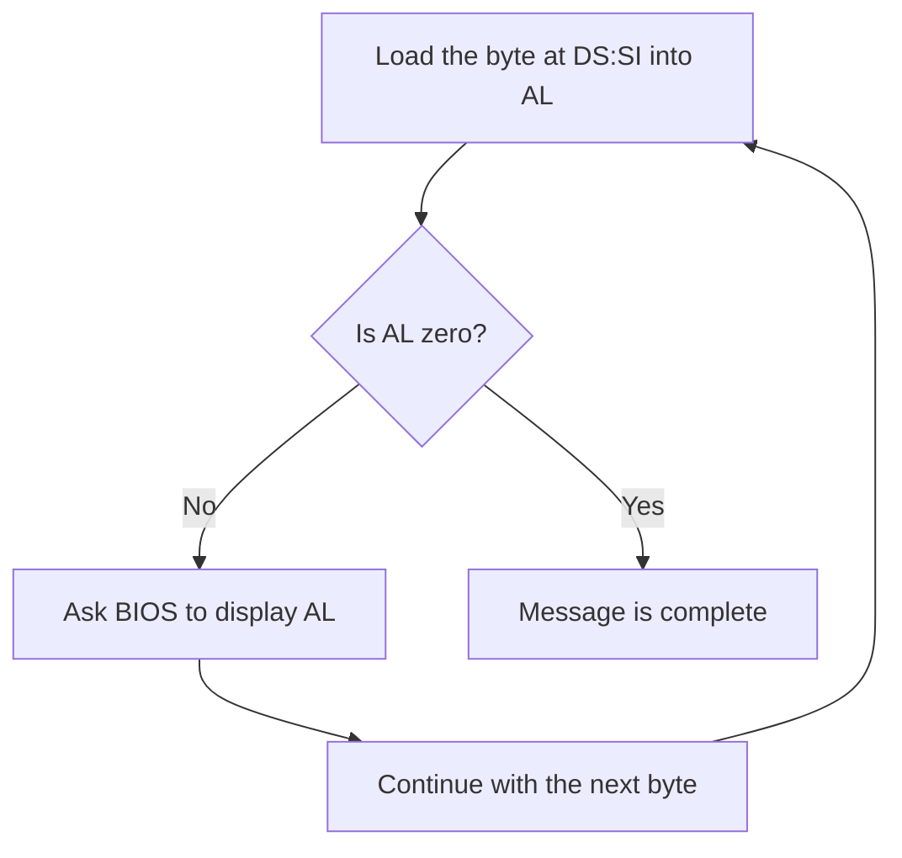

# Lesson 1 — Our first BIOS boot sector

## Before starting

This chapter builds on [Lesson 0](00-cpu-assembly-foundations.md), which introduces
bits, bytes, hexadecimal, registers, memory, instruction execution, flags, jumps,
and the stack. If terms such as `AX`, `IP`, `SP`, or `PUSH` are unfamiliar, read
Lesson 0 first.

## Code companion

The current [`boot/boot.asm`](../boot/boot.asm) has grown through Lesson 3, but
the following stable markers implement the Lesson 1 foundation:

| Lesson section | Code to find in `boot/boot.asm` |
|---|---|
| BIOS entry and register preparation | `start:` |
| Segment and stack initialization | instructions from `cli` through `sti` |
| String traversal and BIOS output | `print_string:` |
| Stopping the processor | `halt_forever:` |
| Fixed sector size | `times 510 - ($ - $$) db 0` |
| Boot signature | `dw 0xaa55` |

Use [`CODE_READING_MAP.md`](../CODE_READING_MAP.md) for the complete cross-lesson
index. Lesson 2 explains the disk-loading instructions that now appear between
the initialization and printing routines.

## What are we building?

An **operating system** is the foundational software that manages a computer and
provides services to other programs. Eventually, our operating system will manage
memory, processors, and devices. We cannot begin there, because the processor
does not automatically know where our operating system is or how to run it.

Our first goal is much smaller:

> Make a virtual computer execute instructions that we wrote and display a
> message on its screen.

Completing that goal will prove that we control the computer after startup.

## The computer we will use

Building an operating system directly on a physical computer would make every
mistake capable of freezing or restarting that computer. Instead, we use **QEMU**.
QEMU is a program that imitates a complete computer. The imitated computer is
called a **virtual machine**, or VM.

Our host computer runs QEMU, and QEMU provides the processor, memory, display,
and disk seen by our operating system:



The virtual machine behaves sufficiently like a physical x86-64 computer for the
boot code we are learning. If our code stops the virtual processor, only the VM
stops; the host operating system continues running.

## What happens when the virtual computer starts?

A processor can execute instructions, but immediately after power-on our
operating system is still stored on a disk. Something must locate it, copy it
into memory, and tell the processor where it was copied.

For now, that first piece of software is the **BIOS**, short for Basic
Input/Output System. BIOS is firmware: software supplied as part of the computer
rather than loaded from our disk. QEMU provides a BIOS implementation to the VM.

The simplified startup sequence is:



Let us define the measurements used in that diagram:

- A **bit** is a value that can be either 0 or 1.
- A **byte** is a group of eight bits.
- A **sector** is a fixed-size piece of a disk. Our boot disk uses 512-byte
  sectors.
- **RAM**, or Random Access Memory, holds bytes that the processor can use while
  the computer is running.
- A memory **address** is a number that identifies one byte in RAM.

The first disk sector is called the **boot sector** because BIOS uses it to begin
the process of booting—starting—the computer's software.

## How BIOS recognizes a boot sector

BIOS does not treat every first sector as executable boot code. It checks the
last two bytes for a particular pattern:

```text
55 AA
```

This pattern is called the **boot signature**. It occupies bytes 510 and 511,
because byte positions begin at zero:



The signature does not make arbitrary bytes into a working program. It only tells
BIOS that the sector is intended to be bootable. BIOS does not inspect the other
510 bytes to decide whether they form a sensible program.

Those first 510 bytes contain our **first-stage bootloader**: the initial code
whose job is to begin loading the operating system. They can contain three kinds
of bytes:

- processor instructions that perform the loading work;
- data needed by those instructions, such as text messages; and
- zero-valued padding used to place the signature at the required position.



The 510-byte region does not normally contain the entire operating system. It is
too small. Instead, the first-stage bootloader loads a larger program from
additional disk sectors. In our project, it loads stage 2; stage 2 will eventually
load the 64-bit kernel. The **kernel** is the central part of the operating system
that remains active and manages the computer after startup.

If bytes 510 and 511 contain `55 aa` but the preceding bytes are not valid code,
BIOS may still jump to them. The processor will then try to interpret those bytes
as instructions, which can cause the virtual computer to freeze, restart, or
behave unpredictably.

## Instructions and assembly language

The processor understands **machine instructions**, represented by numeric byte
patterns. Writing those numbers directly would be difficult to read, so we write
short textual names such as `mov`, `jmp`, and `hlt`. This notation is called
**assembly language**.

An **assembler** translates assembly-language text into the instruction bytes the
processor understands. We use an assembler named NASM:


The directive `BITS 16` tells NASM to encode instructions for the processor mode
in which BIOS starts us. A **directive** gives information to the assembler; it
is not itself an instruction executed by the processor.

```asm
bits 16
```

Although our final kernel will be 64-bit, the legacy BIOS startup contract begins
in the processor's older 16-bit mode. Later lessons will change modes explicitly.

## Hexadecimal numbers

Addresses are commonly written in **hexadecimal**, or base 16. Ordinary decimal
numbers have ten digits, `0` through `9`. Hexadecimal has sixteen digits, using
`A` through `F` for values ten through fifteen.

We prefix hexadecimal numbers with `0x`, so `0x7c00` is hexadecimal rather than
decimal. Hexadecimal is convenient because one hexadecimal digit represents
exactly four bits.

NASM's `ORG` directive tells the assembler which address should correspond to the
beginning of the binary:

```asm
org 0x7c00
```

BIOS copies our sector to address `0x7c00`, so this lets NASM calculate the
runtime addresses of labels correctly.

## Registers: storage inside the processor

A **register** is a small storage location located directly inside the processor.
Registers hold values currently being operated on, including addresses and
characters. x86 gives registers names such as `AX`, `BX`, `SI`, and `SP`.

In the processor's 16-bit mode, the registers discussed here hold 16 bits. Some
have special conventional roles:

| Register | Role in this lesson |
|---|---|
| `AX` | Holds temporary values and the character sent to BIOS |
| `BX` | Supplies display settings to BIOS |
| `SI` | Holds the address of the next message byte |
| `SP` | Holds the address of the top of the stack |

The two halves of `AX` can also be addressed separately. `AH` is its high eight
bits and `AL` is its low eight bits.

## Real-mode segment addresses

BIOS starts the processor in **real mode**, an operating mode retained from early
x86 processors. In real mode, a memory address is formed from two 16-bit values:
a **segment** and an **offset**. The notation `segment:offset` displays the pair.

The processor calculates the memory address as:

```text
memory address = segment × 16 + offset
```

For example, both of these pairs identify address `0x7c00`:

```text
0000:7C00 → 0x0000 × 16 + 0x7C00 = 0x7C00
07C0:0000 → 0x07C0 × 16 + 0x0000 = 0x7C00
```

Different pairs can therefore identify the same byte. Our code chooses zero for
its data and stack segments so offsets can be treated directly as addresses.

The segment registers used here are:

| Register | Meaning |
|---|---|
| `CS` | Code segment used when fetching instructions |
| `DS` | Data segment used for most data accesses |
| `ES` | Extra data segment used by some instructions and BIOS routines |
| `SS` | Stack segment used together with `SP` |

BIOS does not promise that all of these contain the values we want. Our program
therefore establishes its own known state.

## Preparing the segments and stack

The **stack** is an area of memory used to temporarily save values and return
addresses. `SS:SP` identifies its current top. On x86, the stack grows toward
lower memory addresses as values are added.

We temporarily block ordinary hardware interruptions while changing `SS` and
`SP`. Otherwise, the processor might try to use the stack after only one half of
the address has been updated.

```asm
cli             ; Temporarily block maskable hardware interrupts.
xor ax, ax      ; AX XOR AX produces zero, so AX becomes 0.
mov ds, ax      ; Set the data segment to 0.
mov es, ax      ; Set the extra segment to 0.
mov ss, ax      ; Set the stack segment to 0.
mov sp, 0x7c00 ; Put the initial stack top just below our boot sector.
cld             ; Make string instructions move toward higher addresses.
sti             ; Allow maskable hardware interrupts again.
```

An **interrupt** temporarily redirects the processor to code that handles an
event. Some interrupts are requested by hardware devices. `CLI` clears the CPU
bit that permits maskable hardware interrupts, and `STI` sets it again. “Maskable”
means this particular class of interruption can be temporarily blocked.

`XOR` compares corresponding bits. A bit XOR itself is always zero, which makes
`xor ax, ax` a compact way to set `AX` to zero.

## Storing the message

The assembler directive `db` means “define bytes.” It places the message's
character bytes directly into the binary:

```asm
message db 'Hello from our OS!', 13, 10, 0
```

Values 13 and 10 move the cursor to the beginning of the next line. The final
zero is a **terminator**: a value chosen to mark where the string ends. It is not
displayed.

A **label** is a name assigned to an address. Here, `message` names the address of
the first character. We put that address in `SI` before entering the print loop.

## Printing one character at a time

The loop uses this sequence:

```asm
lodsb
test al, al
jz .done
mov ah, 0x0e
mov bx, 0x0007
int 0x10
jmp .print_character
```

Step by step:

1. `lodsb` copies the byte at address `DS:SI` into `AL`, then increases `SI` so it
   points to the following byte.
2. `test al, al` checks whether the byte is zero without changing it.
3. `jz .done` jumps out of the loop if that byte was the zero terminator.
4. `mov ah, 0x0e` selects the BIOS teletype display operation.
5. `mov bx, 0x0007` selects display page zero and a light-gray text color where
   that setting applies.
6. `int 0x10` requests the BIOS video routine. BIOS displays the character in
   `AL` and returns to our code.
7. `jmp .print_character` returns to the beginning of the loop for the next byte.

A **jump** changes which instruction executes next. A conditional jump such as
`jz` jumps only when a specified condition is true. An unconditional jump such
as `jmp` always jumps.



## Stopping the processor

After printing the message, there is nothing else to execute. The `HLT`
instruction stops normal instruction execution until an event wakes the
processor. We first use `CLI` so ordinary maskable hardware interrupts do not
wake it repeatedly, and we keep `HLT` inside a loop as a defensive fallback:

```asm
cli
.forever:
    hlt
    jmp .forever
```

This is not how our completed operating system will idle. It is appropriate only
because this first program has finished all of its work.

## Producing exactly 512 bytes

The program and message currently occupy fewer than 510 bytes. This NASM
directive inserts zero bytes until the file reaches byte position 510:

```asm
times 510 - ($ - $$) db 0
```

In NASM, `$` means the current position and `$$` means the beginning of the
current section. Therefore `$ - $$` is the number of bytes produced so far.

Finally, this directive adds the boot signature:

```asm
dw 0xaa55
```

`dw` means “define a 16-bit word.” x86 stores the lower byte first, so the word
`0xaa55` appears in the file as `55 aa`, exactly as BIOS expects.

## Build and run

The current project has progressed through Lesson 2, so `make run` now prints a
stage-1 message followed by a stage-2 message. The same first-sector principles
from this lesson remain present in `boot/boot.asm`.

```sh
make clean
make
make run
```

The `make` command follows the build instructions in the project's `Makefile`.
NASM creates the instruction bytes, the build checks the sector size and boot
signature, and QEMU starts the resulting virtual disk.

## What we learned

We can now explain:

- why another program must run before our operating system code;
- what BIOS does with the first disk sector;
- the roles of bytes, sectors, RAM, addresses, registers, and segments;
- how a message becomes bytes inside the boot sector;
- how our loop asks BIOS to display those bytes; and
- why the boot sector must be exactly 512 bytes ending in `55 aa`.

We have not yet taught our code to read additional sectors. That is the single
new problem addressed by [Lesson 2](02-stage2-loader.md).
