# Lesson 2 — Loading more than one disk sector

## Before starting

This chapter builds on [Lesson 0](00-cpu-assembly-foundations.md) and
[Lesson 1](01-bios-boot-sector.md). Lesson 0 establishes the CPU and assembly
model; Lesson 1 establishes the BIOS boot-sector and real-mode addressing model.

## Code companion

Lesson 2 spans three files because it covers both building and running the two
stages:

| What to understand | File | Stable marker |
|---|---|---|
| Save the BIOS boot disk | [`boot/boot.asm`](../boot/boot.asm) | `boot_drive` |
| Build the `INT 13h` request | [`boot/boot.asm`](../boot/boot.asm) | comment `INT 13h/AH=02h` |
| Handle a failed disk read | [`boot/boot.asm`](../boot/boot.asm) | `disk_error:` |
| Jump into the loaded bytes | [`boot/boot.asm`](../boot/boot.asm) | `jmp 0x0000:STAGE2_LOAD_ADDRESS` |
| Begin executing stage 2 | [`boot/stage2.asm`](../boot/stage2.asm) | `stage2_start:` |
| Place both binaries on one disk | [`Makefile`](../Makefile) | `$(OS_IMAGE):` |

The later `print_memory_map:` routine in `stage2.asm` belongs to Lesson 3, not
this lesson. The complete index is in
[`CODE_READING_MAP.md`](../CODE_READING_MAP.md).

## Where we are starting

Lesson 1 produced one file named `boot.bin`. It is exactly 512 bytes long. QEMU
pretends that this file is the first 512-byte piece of a disk, and the BIOS copies
it into memory and runs it.

Before changing the program, we need three small definitions:

- A **bit** is a value that can be either 0 or 1.
- A **byte** is a group of eight bits. Memory and file sizes are commonly counted
  in bytes.
- A **sector** is a fixed-size piece of a disk. The disk we emulate uses sectors
  of 512 bytes.

In Lesson 1, our entire program had to fit inside one sector. Two bytes were also
reserved for the BIOS boot signature, leaving only 510 bytes for our instructions
and message.

Our immediate goal is modest: load four additional sectors and run the program
stored in them. We call the initial program **stage 1** and the newly loaded
program **stage 2**. A stage is simply one step in a sequence of programs where
an earlier program prepares and starts the next one.

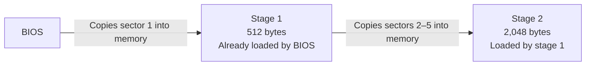

This gives the next part of our loader four times as much space. We are not using
that space for advanced features yet. First, we are learning how code moves from
the disk into memory and how the CPU begins executing that code.

## Disk and memory are different places

The assembled instructions begin on the emulated disk. The CPU cannot execute
them directly from there. They first have to be copied into **RAM**, the working
memory used by running programs.

An address is a number that identifies a byte in memory. Stage 1 is already at
address `0x7c00`. We choose address `0x8000` for stage 2. The `0x` prefix means
the number is written in hexadecimal, a base-16 notation commonly used because
it maps cleanly to groups of bits.

Stage 1 occupies addresses `0x7c00` through `0x7dff`. Stage 2 will occupy
`0x8000` through `0x87ff`, so the two programs do not overwrite one another.

Why not begin stage 2 at the first free address, `0x7e00`? We could. Choosing
`0x8000` is arbitrary; it is simply a round hexadecimal address that is easy to
recognize. The unused 512-byte gap costs us nothing here. If we chose `0x7e00`,
both stage 1's load address and stage 2's `ORG` value would need to use it.

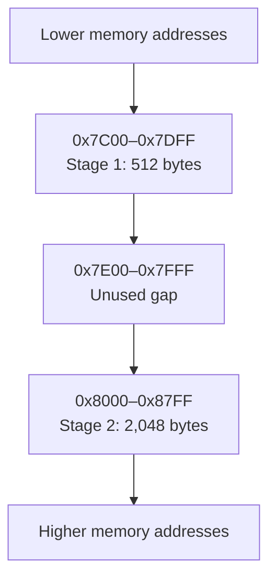

## Remembering which disk BIOS used

A **register** is a small storage location inside the CPU. Registers are much
faster and smaller than RAM. The x86 processor gives its registers names such as
`AX`, `BX`, and `DX`. Some 16-bit registers can be divided into two 8-bit halves:
`DX` has a high half named `DH` and a low half named `DL`.

Immediately before BIOS starts stage 1, it writes a number into `DL`. This is what
the phrase “BIOS passes the boot drive in `DL`” means: BIOS uses the register to
supply an input to our code, much like giving an argument to a routine. The
number identifies the disk from which BIOS read our boot sector. For example,
`0x00` commonly means the first floppy disk and `0x80` commonly means the first
hard disk.

Stage 1 will need that number when it asks BIOS to read more data. Other work may
change `DL`, so we immediately copy its value into a byte of memory named
`boot_drive`:

```asm
mov [0x7c00 + (boot_drive - $$)], dl
```

The same address calculation appears when we prepare to print a message:

```asm
mov si, 0x7c00 + (loading_message - $$)
```

`loading_message` is the label attached to the message. `$$` means the beginning
of the assembled section. NASM calculates `loading_message - $$` while assembling
the file; the result is the message's byte offset from the beginning of the boot
sector. BIOS loads the beginning of that sector at address `0x7c00`, so adding
`0x7c00` converts the file offset into the message's memory address. `MOV` places
that resulting address in `SI`; the CPU does not repeat this addition at runtime.

For example, if the message began 100 bytes into the sector, NASM would calculate:

```text
loading_message - $$ = 100
0x7C00 + 100 = address 0x7C64
```

With `DS = 0`, `DS:SI` would then identify the first byte of the message at
physical address `0x7c64`.

Without square brackets, `0x1000` means the address number itself. With square
brackets, `[0x1000]` means the content stored in memory at address `0x1000`.
For example, if memory address `0x1000` contains the byte `0x41`:

```asm
mov ax, 0x1000   ; Put the address itself—the number 0x1000—into AX.
mov al, [0x1000] ; Read memory at that address and put its content, 0x41, in AL.
```

Therefore the brackets in `[boot_drive]` mean “use the byte stored at the address
named `boot_drive`,” rather than using the address of `boot_drive` itself.

## Asking BIOS to read the disk

Stage 1 still has access to routines supplied by BIOS. A **routine** is a reusable
sequence of instructions that performs one task. BIOS provides a disk routine,
selected with the instruction `int 0x13`.

The word `int` is short for **interrupt**. For now, think of this particular
instruction as a controlled request to BIOS: execution temporarily enters a BIOS
routine and later returns to our program. Interrupts have more uses and internal
details, but we do not need them yet to understand this disk read.

We tell the routine what to do by placing values in registers before executing
`int 0x13`:

| Register part | Value | Meaning in this call |
|---|---:|---|
| `AH` | `0x02` | Select the BIOS “read sectors” operation |
| `AL` | `4` | Read four sectors |
| `CH` | `0` | Choose cylinder 0 |
| `CL` | `2` | Begin with sector 2 |
| `DH` | `0` | Choose head 0 |
| `DL` | saved value | Read from the disk that booted us |
| `ES:BX` | `0000:8000` | Copy the bytes to memory address `0x8000` |

`AH` and `AL` are the high and low halves of `AX`. The same naming rule gives us
`BH`/`BL`, `CH`/`CL`, and `DH`/`DL`.

### Building the request one instruction at a time

The entire request in stage 1 is:

```asm
mov ah, 0x02
mov al, STAGE2_SECTORS
mov ch, 0x00
mov cl, 0x02
mov dh, 0x00
mov dl, [0x7c00 + (boot_drive - $$)]
mov bx, STAGE2_LOAD_ADDRESS
int 0x13
```

This is similar to filling in the fields of a form before submitting it. The BIOS
interface defines which register holds each field. The CPU does not inherently
know that `AH = 0x02` means “read sectors”; the BIOS routine reached through
`INT 13h` interprets it that way because that is part of the BIOS interface.

#### 1. Select the read operation

```asm
mov ah, 0x02
```

`AH` is the upper eight-bit half of the 16-bit `AX` register. `MOV` copies the
number `0x02` into `AH`.

The BIOS disk interface supports several operations. Its documented operation
number `0x02` means **read sectors into memory**. We did not choose that number,
and the number is not derived from the sector address. It is an identifier chosen
by the designers of the BIOS interface. Other operation numbers request other
work. For example, `0x00` requests a disk-system reset and `0x03` requests a
sector write.

Therefore this instruction means:

> When we enter the BIOS disk routine, perform its operation number `0x02`, which
> is the read-sector operation.

It does not perform the read yet. It only prepares one input.

#### 2. State how many sectors to read

```asm
mov al, STAGE2_SECTORS
```

`AL` is the lower eight-bit half of `AX`. `STAGE2_SECTORS` is a name defined in
our source code:

```asm
STAGE2_SECTORS equ 4
```

`EQU` is short for **equate**. Its syntax is:

```text
name EQU constant
```

It tells NASM, while assembling, “treat this name as another way to write this
constant.” Here, `STAGE2_SECTORS` becomes a readable name for the number 4. This
line is an assembler directive, not a CPU instruction: it produces no instruction
bytes, reserves no memory, and does not create a value that can change while the
bootloader runs.

NASM therefore assembles:

```asm
mov al, STAGE2_SECTORS
```

exactly as if we had written:

```asm
mov al, 4
```

The name explains what the 4 means. If we later changed the stage-2 size, we could
update the definition instead of searching for unexplained occurrences of the
number 4 throughout the source.

After the first two instructions, the two halves of `AX` contain:

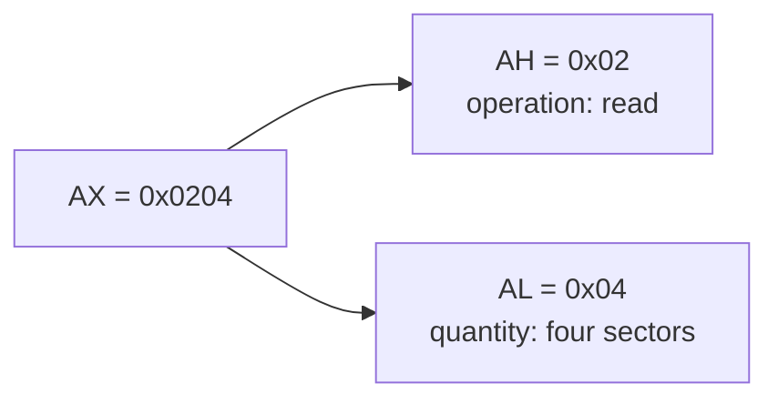

#### 3. Select cylinder zero

```asm
mov ch, 0x00
```

`CH` receives the cylinder number. Cylinder numbering starts at zero, so this
selects the first cylinder of the emulated floppy.

#### 4. Begin with sector two

```asm
mov cl, 0x02
```

`CL` receives the starting sector number. Unlike cylinders, CHS sector numbering
starts at one:

```text
sector 1 = our boot sector
sector 2 = the first sector of stage 2
```

We therefore put 2 in `CL`. Because `AL` contains 4, BIOS will read sectors 2,
3, 4, and 5.

#### 5. Select head zero

```asm
mov dh, 0x00
```

`DH` receives the head number. Head numbering starts at zero, so this selects the
first disk surface presented by QEMU.

The three preceding instructions collectively select the starting CHS location:

```text
cylinder 0, head 0, sector 2
```

#### 6. Select the disk

```asm
mov dl, [0x7c00 + (boot_drive - $$)]
```

Yes: this copies the byte stored at the calculated memory address into `DL`. To
understand why, connect it to an earlier instruction in stage 1:

```asm
; Near the beginning of stage 1:
mov [0x7c00 + (boot_drive - $$)], dl ; Save DL into memory.

; Later, immediately before the disk request:
mov dl, [0x7c00 + (boot_drive - $$)] ; Restore DL from memory.
```

When BIOS first starts our bootloader, `DL` contains the boot disk's identification
number. The first instruction copies that number from `DL` into a reserved byte of
RAM named `boot_drive`. Later work, including calls to BIOS routines, may change
registers. The second instruction retrieves our saved copy so that `DL` once again
contains the correct disk number when we call the BIOS disk routine.

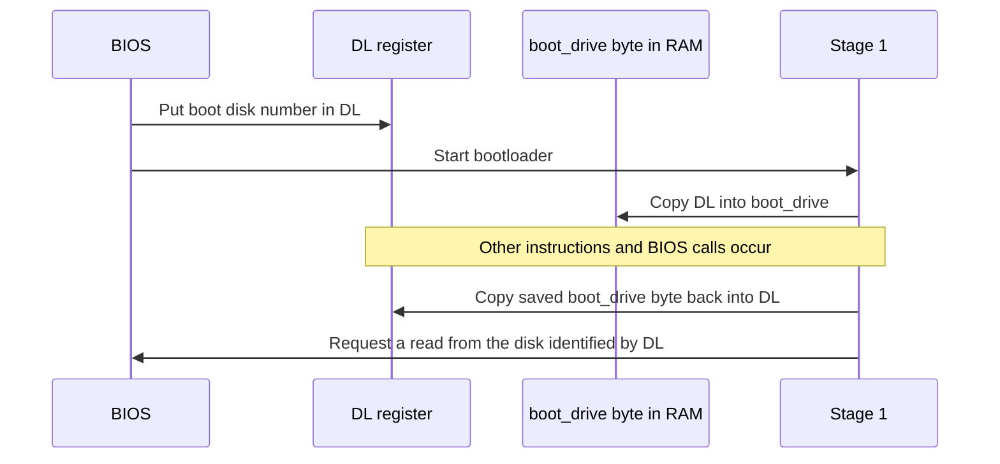

The expression calculates where the reserved byte exists in RAM:

```text
boot_drive - $$
    = byte offset of boot_drive inside boot.bin

0x7c00 + that offset
    = address of boot_drive after BIOS loads boot.bin at 0x7c00
```

For example, if `boot_drive` were 200 bytes from the beginning of the boot sector:

```text
boot_drive - $$ = 200 decimal = 0xC8
0x7C00 + 0xC8 = 0x7CC8
```

The restore instruction would then be equivalent to:

```asm
mov dl, [0x7cc8] ; Read the saved byte at address 0x7CC8 into DL.
```

The square brackets are important: we want the disk number stored at
`boot_drive`, not the address of `boot_drive`.

#### 7. Select the destination in RAM

```asm
mov bx, STAGE2_LOAD_ADDRESS
```

`STAGE2_LOAD_ADDRESS` is defined as `0x8000`, so this puts `0x8000` into `BX`.
Why `BX` instead of `SI`, `DX`, or another register? Because the designers of the
BIOS `INT 13h`, operation `AH=02h`, interface defined `ES:BX` as the place where
the caller must supply the destination address. This is a rule of this BIOS
routine, not a general CPU rule. `BX` is an ordinary 16-bit register in many other
instructions, but BIOS gives it this particular meaning while handling this call.

The BIOS interface therefore uses the pair `ES:BX` as the destination address.
Stage 1 previously set `ES` to zero, giving:

```text
ES:BX = 0000:8000

physical address = ES × 16 + BX
                 = 0 × 16 + 0x8000
                 = 0x8000
```

BIOS will copy the first byte it reads to address `0x8000`; the remaining bytes
follow consecutively.

This destination is a sequential buffer, not a stack. The two mechanisms grow in
opposite directions:

| Mechanism | Address pair | Starting address | Direction as data is added |
|---|---|---:|---|
| Stack pushes | `SS:SP` | `0x7c00` in our loader | Toward lower addresses |
| BIOS disk-read buffer | `ES:BX` | `0x8000` | Toward higher addresses |

`BX` therefore points to the lowest address of the destination buffer, not its
highest address. Four 512-byte sectors occupy 2,048 bytes, so a transfer beginning
at `0x8000` fills addresses `0x8000` through `0x87ff`. We must calculate that
range and ensure it does not overlap stage 1, the downward-growing stack, or any
other memory we need to preserve.

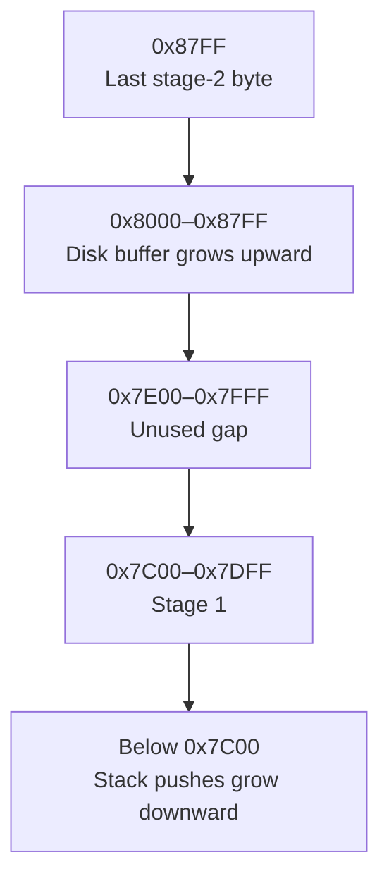

#### 8. Submit the prepared request

```asm
int 0x13
```

Only now do we enter the BIOS disk routine. That routine examines the register
values we prepared:

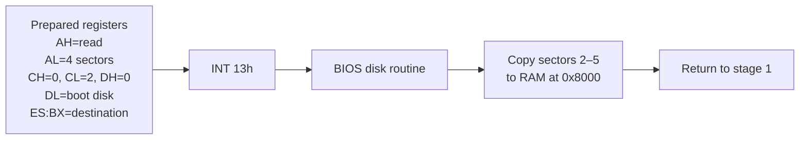

`INT 13h` identifies the group of BIOS disk services; `AH = 02h` identifies the
specific service inside that group. A useful way to read the pair is:

```text
INT 13h / AH=02h
│           └── operation: read sectors
└────────────── disk-service group
```

When BIOS returns, the Carry Flag tells us whether the operation succeeded. The
next part of stage 1 checks that flag before attempting to execute stage 2.

### What cylinder, head, and sector mean

The BIOS operation used here locates data with three numbers, abbreviated CHS:

- **Cylinder** selects a circular position across the disk surfaces.
- **Head** selects one disk surface.
- **Sector** selects one fixed-size piece along the chosen circular track.

This naming comes from physical floppy disks and hard disks. Our disk is only a
file, but QEMU presents it to BIOS as if it were a floppy holding 1,474,560
bytes. Its first
cylinder and first head begin like this:

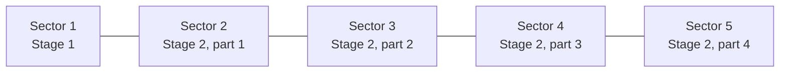

CHS sector numbers begin at 1, not 0. Therefore the boot sector is sector 1 and
stage 2 begins at sector 2.

### Why are we using this old addressing system?

We do not have to use CHS forever. A newer BIOS interface uses **Logical Block
Addressing**, abbreviated **LBA**. With LBA, sectors are numbered consecutively:
sector 0, sector 1, sector 2, and so on. The loader does not describe a cylinder,
head, and sector separately.

We use CHS for this one milestone because QEMU currently presents our image as a
floppy disk, and the original BIOS read operation lets us demonstrate the complete
disk-to-memory process with very little setup. This is an arbitrary teaching
choice, not a design requirement or the disk interface of our eventual kernel.

Using BIOS LBA requires us to construct a small data structure in memory that
describes the read request and first ask BIOS whether the newer operation is
available. We will introduce structures and capability checks before switching,
rather than place those unexplained mechanisms into this lesson.

## Choosing the destination with `ES:BX`

In 16-bit real mode, two numbers form a memory address. `ES:BX` means “use the
segment stored in `ES` and the offset stored in `BX`.” Lesson 1 introduced the
calculation:

```text
physical address = segment × 16 + offset
```

We set `ES` to `0` and `BX` to `0x8000`, so:

```text
0 × 16 + 0x8000 = 0x8000
```

BIOS therefore copies the four requested sectors to the address chosen for stage
2. Four sectors multiplied by 512 bytes per sector equals 2,048 bytes.

## Knowing whether the read worked

The CPU has a register named `FLAGS`. Instead of holding one ordinary number,
individual bits in it describe results and CPU state. One of those bits is the
**Carry Flag**, abbreviated `CF`.

When the BIOS disk routine returns:

- `CF = 0` means the read succeeded.
- `CF = 1` means the read failed.

The instruction `jc disk_error` means “jump to `disk_error` if the Carry Flag is
set.” If the read failed, our code prints `Disk read failed.` and stops. If it
succeeded, execution continues toward stage 2.

## Starting stage 2

Copying instructions into RAM does not execute them. The CPU normally continues
with the next instruction in stage 1, so we must explicitly change where it will
fetch its next instruction.

The pair `CS:IP` identifies the instruction being executed. `CS` is the code
segment and `IP` is the instruction pointer, meaning the offset of the next
instruction. This instruction replaces both values:

```asm
jmp 0x0000:0x8000
```

Because it supplies both a segment and an offset, it is called a **far jump**.
After the jump, the CPU fetches its next instruction from physical address
`0x8000`, which is the beginning of stage 2.

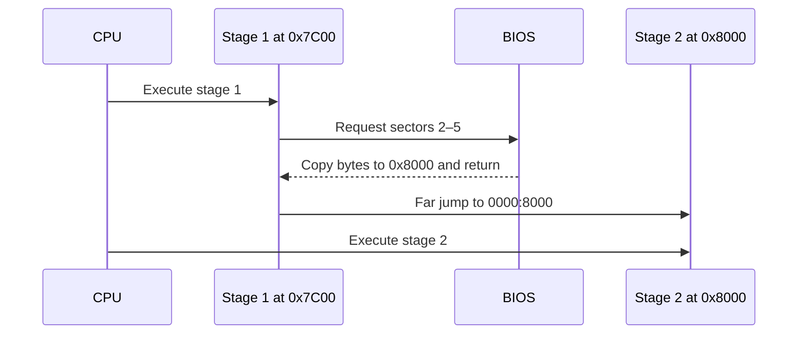

## How the disk image is assembled

A **disk image** is a regular file whose bytes are arranged exactly like the
bytes of a disk. “Raw” means the file has no additional wrapper or header.

### How two separate assembly files become one bootable system

`boot.asm` and `stage2.asm` are separate source files. NASM assembles them
separately:

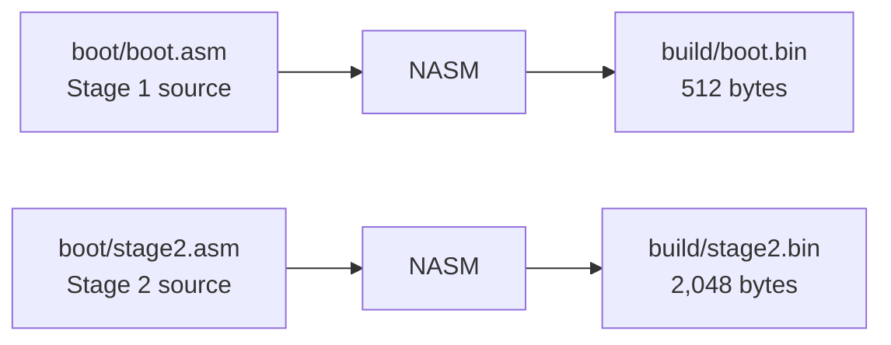

At this point, the two binary files are still separate. NASM does not connect
them, and stage 1 does not locate stage 2 by filename. A filename exists for our
build tools on the host computer; BIOS sees only numbered disk sectors.

The Makefile connects them by copying both binaries into specific positions in
one file named `os.img`:

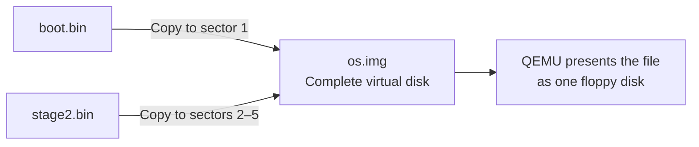

This operation does not merge the source code or create a normal function call
between the files. It gives the two programs a shared physical arrangement:

```text
os.img sector 1      = boot.bin
os.img sectors 2–5   = stage2.bin
```

At runtime, BIOS knows only the first part of that arrangement. It reads sector
1 into RAM at `0x7c00` and starts stage 1. Stage 1 knows the rest because we wrote
those assumptions into its instructions:

```text
stage 2 begins at disk sector 2
stage 2 occupies 4 sectors
stage 2 must be copied to RAM address 0x8000
```

Stage 2 is assembled with `ORG 0x8000`, which tells NASM to calculate its labels
for that same runtime address. This creates a manually defined agreement between
the files:

| Agreement | Stage 1 | Stage 2 / Makefile |
|---|---|---|
| Location on disk | Reads sectors 2–5 | Makefile writes `stage2.bin` to sectors 2–5 |
| Size on disk | Reads four sectors | NASM pads stage 2 to four sectors |
| Location in RAM | Loads and jumps to `0x8000` | `stage2.asm` uses `ORG 0x8000` |

The complete build-time and runtime path is therefore:

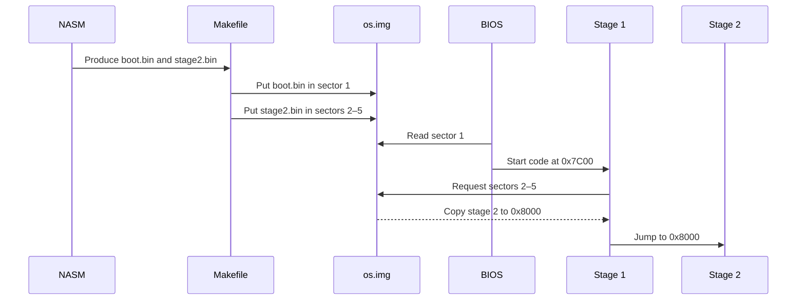

If either side of the agreement changes without the other, the boot fails. For
example, if the Makefile puts stage 2 in sector 3 while stage 1 still reads from
sector 2, stage 1 loads the wrong bytes. If stage 2 uses `ORG 0x9000` while stage
1 loads it at `0x8000`, stage 2 calculates incorrect addresses for its own labels.

### How stage 2 prepares `DS:SI`

Stage 2 prints its message with `LODSB`, which reads from the address `DS:SI`.
Both registers therefore need correct values. Stage 2 sets `DS` near its entry:

```asm
xor ax, ax ; AX becomes zero.
mov ds, ax ; DS receives that zero.
```

x86 does not provide a `mov ds, 0` instruction that copies an immediate constant
directly into a segment register. We use the ordinary register `AX` as an
intermediate step. After these instructions, `DS` remains zero until another
instruction explicitly changes it; executing later instructions does not reset
registers automatically.

Stage 2 then sets the other half of the address:

```asm
mov si, 0x8000 + (message - $$)
```

If NASM calculates that the message is at address `0x8040`, the state becomes:

```text
DS = 0x0000
SI = 0x8040

DS:SI address = DS × 16 + SI
              = 0 × 16 + 0x8040
              = 0x8040
```

`LODSB` uses this existing pair. It reads the byte at `DS:SI` into `AL`, then
increments `SI`. `DS` stays zero while `SI` advances through the message:

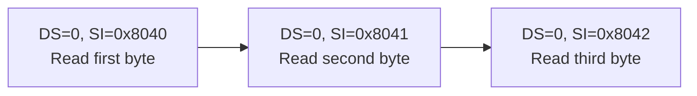

There is no need to set `DS` before every character because every message byte is
inside the same segment. We initialize the stable part (`DS`) once and advance
only the changing part (`SI`). Stage 2 also executes `CLD` once so that `LODSB`
moves `SI` forward rather than backward.

The Makefile performs three operations:

1. Create an empty 1,474,560-byte image filled with zero bytes.
2. Copy the 512-byte `boot.bin` into its first sector.
3. Copy the 2,048-byte `stage2.bin` into the following four sectors.

QEMU treats that image as the floppy disk inserted into our virtual computer.

## Build and observe

Run:

```sh
make clean
make
make run
```

The two messages prove two different facts:

```text
Stage 1: loading stage 2...
Stage 2: loaded successfully!
```

The first line proves BIOS executed stage 1. The second line can exist only if
stage 1 successfully read sectors 2–5 and redirected the CPU to address `0x8000`.

## Experiments using only this lesson

1. Change the stage-2 message, rebuild, and confirm that the new text appears.
2. Change `CL` from `2` to `3`. This makes BIOS begin one sector too late. Predict
   what will happen, try it, and then restore `CL` to `2`.
3. Run `wc -c build/boot.bin build/stage2.bin build/os.img`. Confirm that stage 1
   is 512 bytes and stage 2 is 2,048 bytes.
4. Run `xxd -g 1 -s 510 -l 6 build/os.img`. The first two displayed bytes should
   be the boot signature `55 aa`; the following bytes begin stage 2.

## What we learned—and no more

We now know how to copy sectors from a BIOS-managed disk into a chosen region of
memory and begin executing the copied instructions. We have not yet established
what all regions of memory may be used safely, and we have not changed the CPU
out of 16-bit real mode. Those are separate questions for later lessons, where
each required concept will be introduced before we use it.
