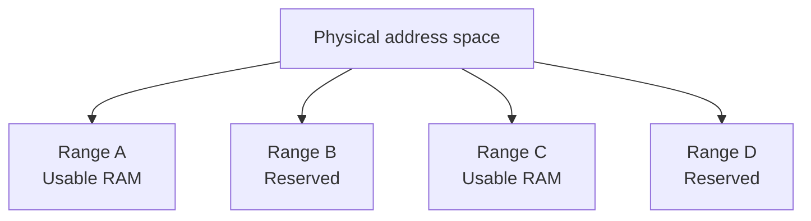
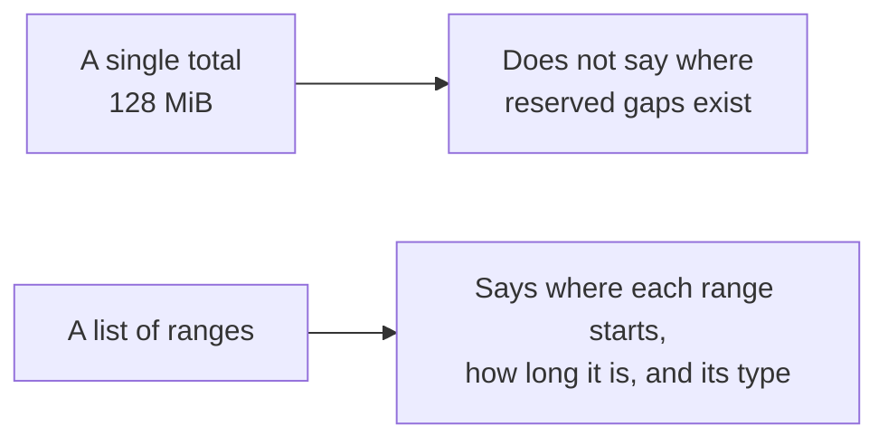
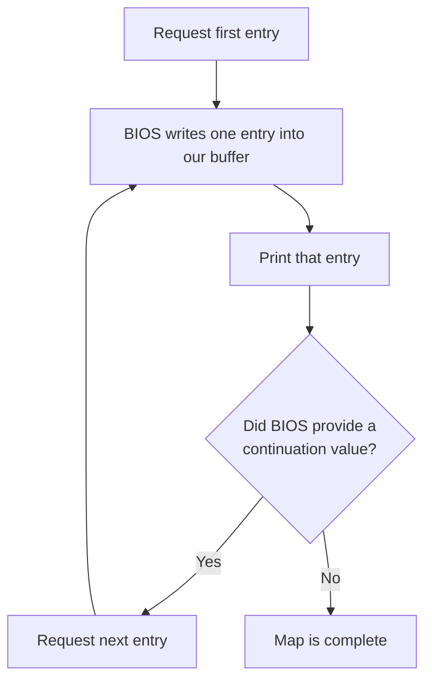
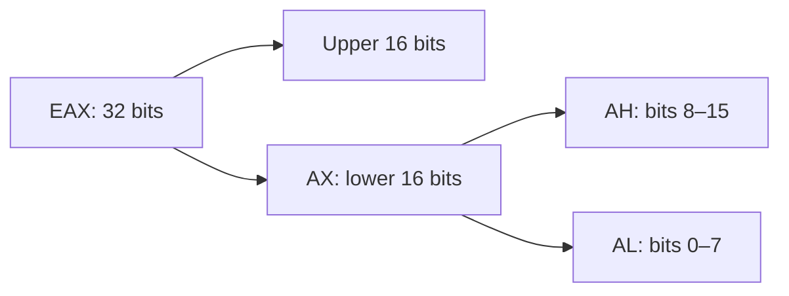
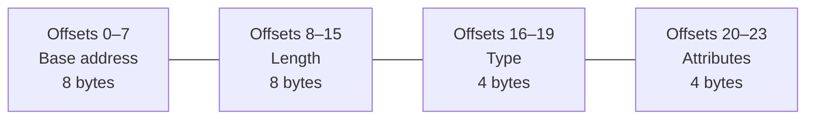
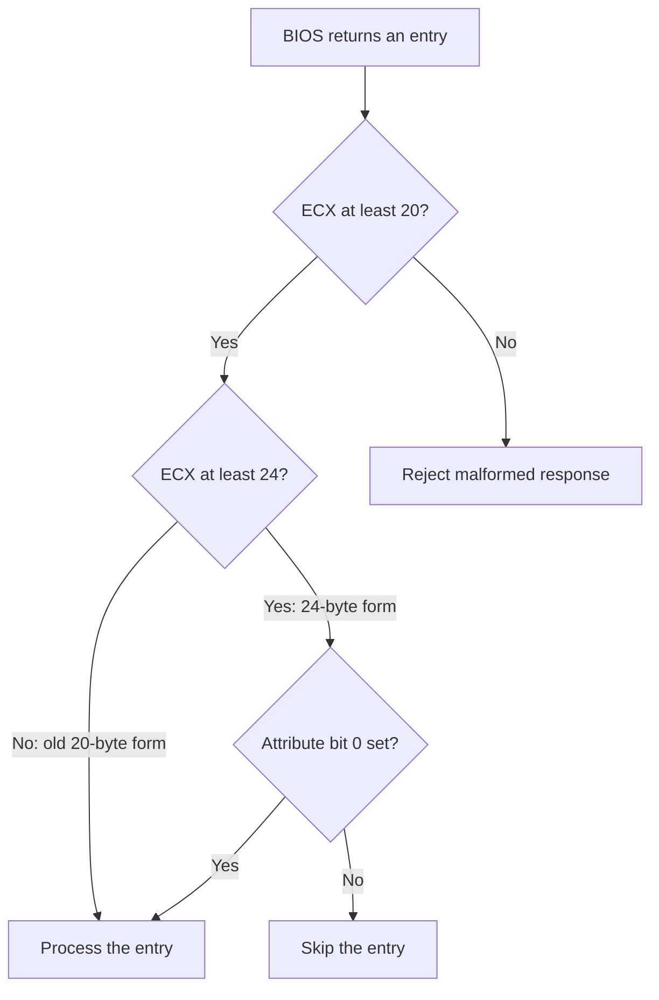
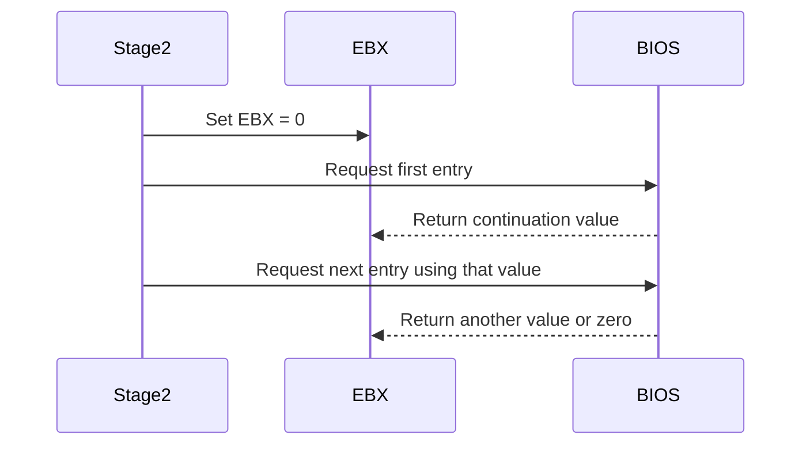
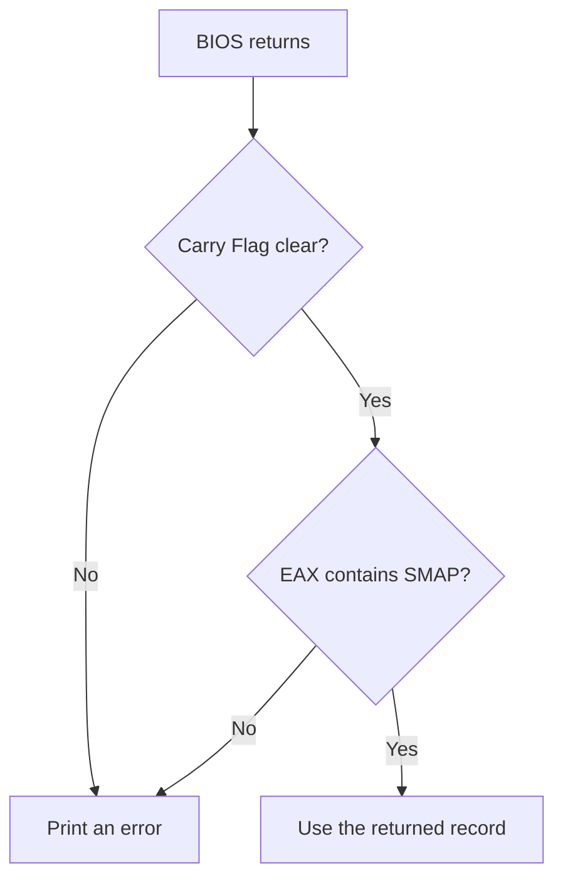

# Lesson 3 — Discovering the physical memory map

## Before starting

This chapter builds on:

- [Lesson 0](00-cpu-assembly-foundations.md), which introduced registers, RAM,
  addresses, flags, the stack, and hexadecimal;
- [Lesson 1](01-bios-boot-sector.md), which introduced BIOS and real-mode
  `segment:offset` addresses; and
- [Lesson 2](02-stage2-loader.md), which loaded stage 2 into RAM and transferred
  execution to it.

We will continue running stage 2 in 16-bit real mode. We are adding one ability:

> Ask BIOS which physical address ranges represent usable RAM and which ranges
> must not be treated as ordinary RAM.

## Code companion

Lesson 3 is implemented in [`boot/stage2.asm`](../boot/stage2.asm):

| Lesson concept | Stable marker in `stage2.asm` |
|---|---|
| Start the new behavior | `call print_memory_map` under `stage2_start:` |
| Prepare and repeat E820 calls | `print_memory_map:` and its `.next_entry:` |
| Print null-terminated text | `print_string:` |
| Preserve registers around BIOS video output | `print_character:` |
| Convert 32-bit values to hexadecimal | `print_hex32:` |
| Text used by the routines | `memory_map_heading` through `hex_digits` |
| 24-byte BIOS destination buffer | `e820_buffer:` |

Use [`CODE_READING_MAP.md`](../CODE_READING_MAP.md) to move between earlier
lessons and the code that remains in the same source files.

## 1. The problem with choosing addresses ourselves

So far, we selected these addresses:

```text
stack top:   0x7C00, growing downward
stage 1:     0x7C00–0x7DFF
stage 2:     0x8000–0x87FF
```

Those choices work for our small virtual machine, but an operating system will
eventually need much more memory. It cannot safely assume that every possible
address refers to usable RAM.

A **physical address** identifies a location in the address space presented by
the machine's hardware. Some physical addresses lead to ordinary RAM. Others are
reserved for firmware or hardware-related purposes. Some addresses may not lead
to installed memory at all.

The complete description of those ranges is called the **physical memory map**.



A **range** is a consecutive group of addresses. It can be described with two
numbers:

- its **base address**, meaning where it begins; and
- its **length**, meaning how many bytes it contains.

For example:

```text
base   = 0x00100000
length = 0x00010000
```

describes addresses beginning at `0x00100000` and continuing for `0x10000`
bytes. We do not need to calculate the final address in the bootloader yet;
printing the base and length exactly as BIOS reports them is enough for this
lesson.

## 2. Why reserved ranges matter

Writing to an address classified as usable RAM is ordinary memory storage.
Writing to a reserved address may overwrite information required by firmware or
interact with hardware in a way we did not intend.

Therefore, discovering installed memory is not just a matter of asking “how many
bytes are there?” Two machines with the same amount of RAM can have different
reserved gaps. We need the individual ranges.



Here, **MiB** means 1,048,576 bytes. It is a binary unit of measurement. We use
the term only to describe the virtual machine's approximate memory capacity; the
BIOS interface itself gives us exact byte counts.

## 3. Asking BIOS for the map

BIOS provides several groups of routines. Lesson 2 used `INT 13h` for disks.
`INT 15h` is a group containing miscellaneous system routines.

Inside that group, operation `E820h` returns physical-memory-map information:

```text
INT 15h / EAX=E820h
│           └── operation: return one physical-memory-map entry
└────────────── miscellaneous BIOS service group
```

`E820h` and `0xE820` are two ways to write the same hexadecimal number. The BIOS
interface's designers assigned this operation number; our program did not derive
or choose it.

One call returns one range, not the complete map. We repeatedly call BIOS until
it tells us that the final range has been returned.



## 4. Using 32-bit registers in 16-bit mode

We have used 16-bit registers such as `AX` and `BX`. x86 also provides wider
forms named `EAX` and `EBX`:



Changing `EAX` changes all 32 bits. Changing `AX` changes only the lower 16 bits
of `EAX`, and changing `AL` changes only its lowest eight bits.

We are still in 16-bit mode, but processors capable of running our future
x86-64 kernel also understand instructions that operate on the 32-bit registers.
NASM adds an extra instruction byte called an **operand-size prefix** when needed.
That prefix tells the processor that this particular instruction uses 32-bit
operands even though the current default is 16 bits.

We need the wider registers because the BIOS E820 interface defines several of
its inputs and outputs as 32-bit quantities.

## 5. Preparing a buffer

A **buffer** is a region of memory reserved so that data can be placed there. Our
stage 2 reserves 24 bytes:

```asm
e820_buffer:
    times 24 db 0
```

The label `e820_buffer` names the first byte. `TIMES 24 DB 0` emits 24 zero bytes.
When stage 2 is loaded, those bytes occupy RAM and BIOS can overwrite them with
one memory-map entry.

The fields have this layout:

| Offset from buffer start | Size | Meaning |
|---:|---:|---|
| 0 | 8 bytes | Base address of the region |
| 8 | 8 bytes | Length of the region |
| 16 | 4 bytes | Region-type number |
| 20 | 4 bytes | Additional attributes, when supported |

An **offset** here means a number of bytes from the beginning of the buffer.
`e820_buffer + 16` calculates the address where the type field begins. It does
not, by itself, state how many bytes to read. The destination register or an
explicit size keyword supplies that size. Our instruction is:

```asm
mov eax, [stage2_address(e820_buffer) + 16]
```

Because `EAX` is 32 bits, the instruction reads four bytes beginning at offset
16: offsets 16, 17, 18, and 19. Those four bytes collectively contain the
region-type number.

For comparison, if these forms addressed the same location:

```asm
mov al,  [address] ; Read 1 byte.
mov ax,  [address] ; Read 2 bytes.
mov eax, [address] ; Read 4 bytes.
```

Several related fields stored consecutively form a **record**. The buffer is the
memory space; the record is the organized data BIOS writes into that space.



## 6. Preparing one E820 request

Before every call, stage 2 prepares these registers:

```asm
mov eax, 0xe820
mov edx, 0x534d4150
mov ecx, 24
mov di, stage2_address(e820_buffer)
mov dword [stage2_address(e820_buffer) + 20], 1
int 0x15
```

We will examine them individually.

### `EAX`: select the operation

```asm
mov eax, 0xe820
```

This selects BIOS operation `E820h`, meaning “return one physical-memory-map
entry.” As with `AH=02h` in the disk lesson, setting the register only prepares
the request. `INT 15h` submits it later.

### `EDX`: provide the `SMAP` signature

```asm
mov edx, 0x534d4150
```

BIOS requires the 32-bit value `0x534D4150` as an additional identifier for this
operation. Its bytes correspond to the text characters `SMAP`, short for System
Memory Map:

| Character | Character code in hexadecimal |
|---|---:|
| `S` | `53` |
| `M` | `4D` |
| `A` | `41` |
| `P` | `50` |

This signature reduces the chance that software accidentally interprets a
response from an unsupported or different BIOS operation as a valid memory map.

### `ECX`: state the buffer capacity

```asm
mov ecx, 24
```

This tells BIOS that our buffer can receive 24 bytes. Some BIOS versions return
only the first 20 bytes; the first three fields still fit. BIOS reports the actual
returned size in `ECX`, although this lesson does not yet need to display it.

### `ES:DI`: provide the buffer address

```asm
mov di, stage2_address(e820_buffer)
```

This BIOS operation expects the destination as `ES:DI`. Near the beginning of
`stage2_start`, stage 2 already set `ES` to zero:

```asm
xor ax, ax ; Every bit XOR itself is zero, so AX becomes 0.
mov ds, ax ; Copy that zero into DS.
mov es, ax ; Copy that zero into ES.
```

`xor ax,ax` is therefore a compact way to manufacture the zero needed by the next
two instructions. It is not an E820 request by itself. x86 does not provide a
`mov es,0` instruction that copies an immediate constant directly into `ES`, so
we first place zero in the ordinary register `AX` and copy from there.

Afterward, `DI` receives the buffer's address, so `ES:DI` identifies the same RAM
location named by `e820_buffer`.

The register name `DI` means Destination Index. The name reflects its common use,
but the decisive reason we use it here is that the BIOS E820 contract requires
the buffer address in `ES:DI`.

### Initialize the optional attributes field

```asm
mov dword [stage2_address(e820_buffer) + 20], 1
```

`DWORD` means a double word: four bytes, or 32 bits. The brackets mean we write
to memory. These are the four bytes at offsets 20–23—the final field in our
24-byte buffer.

This field is optional because two E820 record forms exist:

| Size BIOS returns in `ECX` | Fields provided |
|---:|---|
| 20 bytes | Base, length, and type only |
| 24 bytes | Base, length, type, and extended attributes |

If BIOS supports only the older 20-byte form, it does not write offsets 20–23.
If it returns the newer 24-byte form, those four bytes contain individual flag
bits:

| Attribute bit | Meaning when the 24-byte field is present |
|---:|---|
| 0 | Entry is enabled. If this bit is zero, ignore the entry. |
| 1 | Region contains non-volatile memory—memory intended to retain data without ordinary power. |
| 2–31 | Reserved; our code must not invent meanings for them. |

Before each call we store 1, whose bit 0 is set. This preparation is required by
the extended E820 convention and also gives the optional bytes a known initial
state. After the call, BIOS returns the actual record size in `ECX`. Stage 2 then
checks:

```asm
cmp ecx, 20
jb .failed       ; Fewer than 20 bytes cannot hold the required fields.

cmp ecx, 24
jb .check_length ; A 20-byte entry has no attributes field to inspect.

test dword [stage2_address(e820_buffer) + 20], 1
jz .continue     ; A 24-byte entry with bit 0 clear must be ignored.
```

`JB` means “jump if below” for an unsigned comparison. The code does not print
the attributes yet because this lesson needs only their validity rule. The bytes
are nevertheless accounted for: reserved before the call, optionally written by
BIOS, and checked when BIOS reports that the field is present.



### Enter BIOS

```asm
int 0x15
```

BIOS reads the prepared registers, writes one record into `e820_buffer`, updates
output registers, and returns to the instruction after `INT`.

## 7. The continuation value in `EBX`

Before requesting the first entry, we execute:

```asm
xor ebx, ebx
```

This makes `EBX = 0`. For E820, zero means “begin with the first entry.”

After a successful call, BIOS changes `EBX`:

- a nonzero `EBX` is a continuation value to send back on the next call;
- zero means the entry just returned was the final entry.

The continuation value is an opaque value. **Opaque** means our program must
preserve and return it but does not need to interpret its internal meaning. It is
not necessarily an entry number.



After printing an entry, stage 2 checks:

```asm
test ebx, ebx
jnz .next_entry
```

`TEST EBX,EBX` sets the Zero Flag when `EBX` is zero. `JNZ` means “jump if not
zero.” Therefore the loop repeats only when BIOS supplied another continuation
value.

## 8. Validating the BIOS response

Calling BIOS does not guarantee success. We check two results:

```asm
jc .failed
cmp eax, 0x534d4150
jne .failed
```

`JC` means “jump if the Carry Flag is set.” BIOS uses a set Carry Flag to report
that the request failed.

On success, BIOS must return the `SMAP` signature in `EAX`. `CMP` compares two
values by setting flags as if a subtraction occurred, without storing the
subtraction result. `JNE` means “jump if not equal.” If `EAX` does not contain the
expected signature, we reject the response.

Both checks protect the same boundary:



## 9. Skipping empty entries

The length is an eight-byte, or 64-bit, value. We are not yet executing 64-bit
instructions, so we inspect it as two 32-bit halves:

```asm
mov eax, [stage2_address(e820_buffer) + 8]
or eax, [stage2_address(e820_buffer) + 12]
jz .continue
```

The first instruction loads the lower half of the length. `OR` combines it with
the upper half. The result is zero only if both halves were zero. `JZ` skips the
entry in that case because a region containing zero bytes describes no usable
addresses.

## 10. Printing a 64-bit value using 32-bit pieces

Both the base address and length occupy 64 bits. We print each as two groups of
eight hexadecimal digits:

```text
high 32 bits followed by low 32 bits
```

For the base address:

```asm
mov eax, [stage2_address(e820_buffer) + 4]
call print_hex32
mov eax, [stage2_address(e820_buffer)]
call print_hex32
```

Offsets 0–3 contain the low half, and offsets 4–7 contain the high half. We print
the high half first because humans normally write the most significant digits on
the left.

For example:

```text
high half = 0x00000001
low half  = 0x23456789

displayed = 0x0000000123456789
```

## 11. Converting one 32-bit number to hexadecimal text

`print_hex32` must convert eight groups of four bits into eight characters. The
string below acts as a lookup table:

```asm
hex_digits db '0123456789ABCDEF'
```

If a four-bit group has numeric value 10, we use it as offset 10 into the table
and retrieve character `A`.

The routine repeats this process eight times:

```asm
rol edx, 4
mov ebx, edx
and ebx, 0x0f
mov si, stage2_address(hex_digits)
add si, bx
mov al, [si]
call print_character
```

- `ROL EDX,4` rotates the bits left by four positions, bringing the next
  hexadecimal digit into the lowest four bits.
- `AND EBX,0x0F` clears every bit except those lowest four.
- Adding that number to the table address selects the corresponding character.
- The character is loaded into `AL` and printed.

The original value is copied from `EAX` into `EDX` before the loop. This separation
matters because `AL` is part of `EAX`; using `AL` for the output character would
otherwise corrupt the number whose remaining digits we still need to convert.

This was caught by our QEMU test: the first version rotated `EAX` and then placed
each character in `AL`, causing later digits to be wrong. Keeping the rotating
number in `EDX` makes each register's responsibility unambiguous.

## 12. Interpreting the displayed type

The third field is a number describing the region. Values defined for this BIOS
interface include:

| Type | Meaning for our current understanding |
|---:|---|
| 1 | Available RAM |
| 2 | Reserved; do not use as ordinary RAM |
| 3 | Reclaimable later, after learning the rules associated with it |
| 4 | Must be preserved for firmware-related use |
| 5 | Defective memory; do not use |

For safety, our future code will initially treat only type 1 as available. A type
we do not recognize will be treated as reserved rather than guessed to be safe.

Lesson 3 prints numeric types instead of turning them into names. That keeps the
new mechanism focused on obtaining and validating the records; translating type
numbers into friendly text can be added without changing the BIOS interaction.

## 13. Build and observe

Run:

```sh
make clean
make
make run
```

Or use terminal-only output:

```sh
make run-headless
```

One tested QEMU configuration reports:

```text
Stage 1: loading stage 2...
Stage 2: loaded successfully!
Physical memory map:
  base=0x0000000000000000 length=0x000000000009FC00 type=0x00000001
  base=0x000000000009FC00 length=0x0000000000000400 type=0x00000002
  base=0x00000000000F0000 length=0x0000000000010000 type=0x00000002
  base=0x0000000000100000 length=0x0000000007EE0000 type=0x00000001
  base=0x0000000007FE0000 length=0x0000000000020000 type=0x00000002
  base=0x00000000FFFC0000 length=0x0000000000040000 type=0x00000002
```

Your exact map may differ if the virtual machine's configuration changes. That
variation is the reason we ask BIOS rather than embedding one expected map.

## 14. What this code still does not do

The program displays the map but does not yet allocate or overwrite any reported
region. It also does not resolve overlapping entries, reorder them, or permanently
store the entire list. Those are separate jobs. Printing the raw reports first
lets us verify that we understand the BIOS exchange before building decisions on
top of it.

We also have not changed processor mode. The fact that E820 fields can contain
64-bit addresses does not mean the processor is executing 64-bit instructions.
Data width and current instruction mode are related concepts, but they are not the
same thing.

## Exercises using only this lesson

1. Change QEMU's memory amount by adding `-m 64M` temporarily to the run command.
   Compare the reported type-1 ranges with the original output.
2. Change the printed type prefix and confirm that only presentation changes; the
   values returned by BIOS do not.
3. On paper, split `0x0000000123456789` into the high and low 32-bit halves used
   by `print_hex32`.
4. Explain why `test ebx,ebx` occurs after processing the returned entry rather
   than before the first BIOS call.

Worked observations and answers are available in
[`exercise-results/03-physical-memory-map.md`](../exercise-results/03-physical-memory-map.md).

## What we learned

We can now explain:

- why a total RAM size is insufficient;
- how base address and length describe a physical-memory range;
- why our loader must distinguish usable and reserved ranges;
- how a buffer holds a record written by BIOS;
- how 32-bit register forms can be used while the CPU remains in 16-bit mode;
- how `INT 15h`, operation `E820h`, returns one map entry at a time;
- how `EBX` carries the enumeration from one call to the next;
- how the Carry Flag and `SMAP` signature validate a response; and
- how two 32-bit halves can display a 64-bit value.

We have discovered candidate RAM without using it. The next lesson will address a
historical address-line behavior that must be handled before our loader safely
uses memory beyond the first 1,048,576 bytes: [Lesson 4 — Accessing memory beyond
the first MiB](04-a20-line.md).
