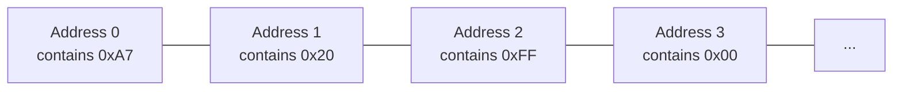
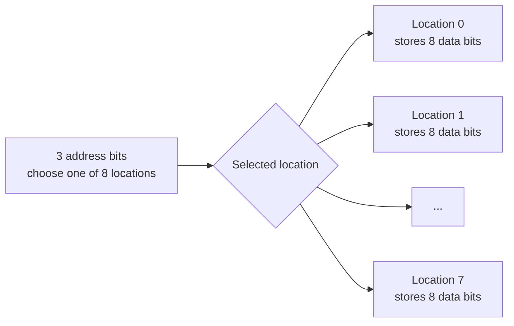
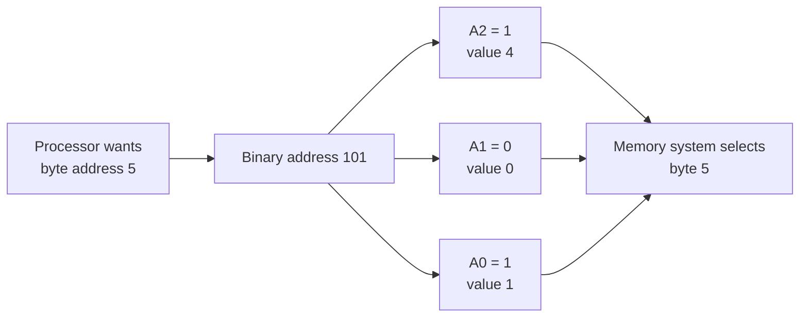
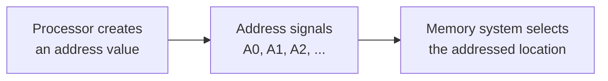
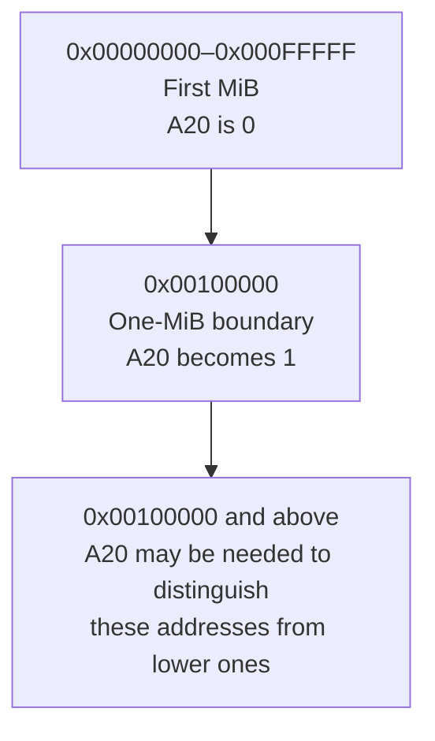
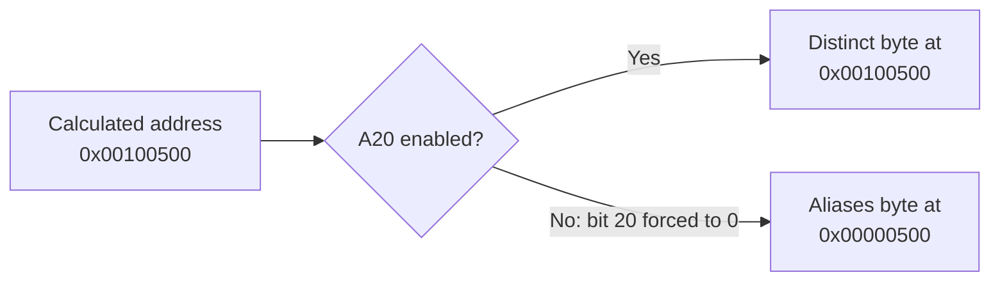
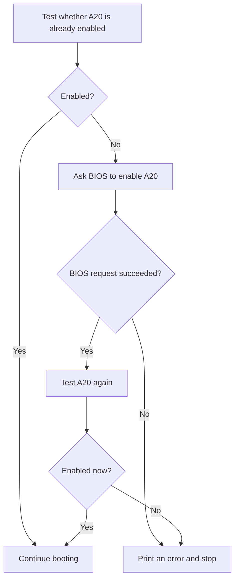
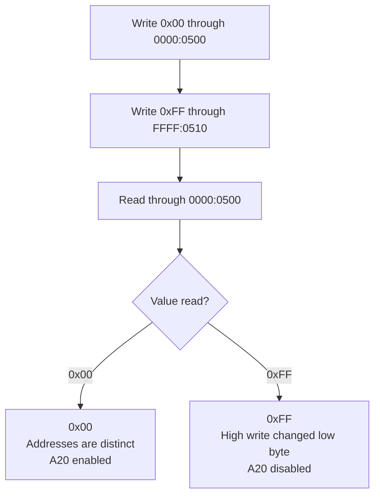

# Lesson 4 — Accessing memory beyond the first MiB

## Before starting

This chapter builds on:

- [Lesson 0](00-cpu-assembly-foundations.md), which introduced bits, registers,
  flags, memory addresses, the stack, and `CALL`/`RET`;
- [Lesson 1](01-bios-boot-sector.md), which introduced real-mode segment-address
  calculations;
- [Lesson 2](02-stage2-loader.md), which placed stage 2 in RAM; and
- [Lesson 3](03-physical-memory-map.md), which discovered that usable RAM exists
  both below and above address `0x00100000`.

Lesson 3 reported higher RAM, but reporting an address and successfully accessing
that address are different things. This lesson solves one narrow problem:

> Verify that address bit 20 is available, and ask BIOS to enable it if necessary.

That bit is historically known as the **A20 line**.

## Code companion

Lesson 4 is implemented in [`boot/stage2.asm`](../boot/stage2.asm):

| Lesson concept | Stable marker in `stage2.asm` |
|---|---|
| Require A20 before continuing | `call ensure_a20` under `stage2_start:` |
| Test, request, and verify | `ensure_a20:` |
| Compare addresses one MiB apart | `check_a20:` |
| Stop when A20 cannot be enabled | `a20_failure:` |
| User-visible status | `a20_ready_message` and `a20_error_message` |

The complete project index is in
[`CODE_READING_MAP.md`](../CODE_READING_MAP.md).

## 1. What is an address line?

### Begin with byte-addressed memory

Lesson 0 modeled RAM as many storage locations. Each location can hold one byte,
and each location is identified by a different number called its **address**.

The address and the stored byte are separate:

- the **address** answers “which location?”;
- the **content** answers “which byte is currently stored there?”

For example, memory could currently contain:



Here, address 0 is the numeric identifier of the first illustrated location; the
byte stored there happens to be `0xA7`. Address 1 identifies the following
location; its content happens to be `0x20`. Writing a new byte changes the
content, not the address:

```text
before: address 1 contains 0x20
write:  store 0x55 at address 1
after:  address 1 contains 0x55
```

This is called **byte-addressed memory**: every distinct address selects one
byte-sized location. The addresses count locations, not bits. A multi-byte value
occupies several consecutive addresses. For example, a four-byte value beginning
at address 100 occupies addresses 100, 101, 102, and 103.

The row is a teaching diagram, not a claim that RAM is physically built as one
long row. It models the behavior visible to software: supply an address and read
or write the byte associated with that address.

When the processor wants to read or write memory, it must communicate three
ideas to the memory system:

1. the address of the desired byte;
2. whether the operation is a read or a write; and
3. for a write, the data to store.

This lesson focuses only on the first item: communicating the address.

### An address is a collection of bits

An address is a number, and the processor represents that number in binary. We
must keep two independent quantities separate:

```text
data width:
    how many bits one location stores
    one byte = 8 bits

address width:
    how many bits are used to choose a location
```

A hexadecimal digit represents 4 bits. A four-bit group is sometimes called a
**nibble**. A byte is twice that size:

```text
1 hexadecimal digit = 4 bits = one nibble
2 hexadecimal digits = 8 bits = one byte

example byte: 0xA7 = binary 10100111
```

Now imagine a deliberately tiny machine with **three address bits**. The three
bits do not describe the size of a byte. They only choose which byte-sized
location to access. Every selected location still holds eight data bits.

```text
3-bit address    selected 8-bit storage location
-------------    -------------------------------
000              byte location 0
001              byte location 1
010              byte location 2
011              byte location 3
100              byte location 4
101              byte location 5
110              byte location 6
111              byte location 7
```



Three address bits produce eight patterns, so they can select eight byte
locations. The total storage described by this imaginary system is therefore:

```text
8 locations × 1 byte per location = 8 bytes
```

The general address-count rule from Lesson 0 is:

```text
n address bits can form 2ⁿ different addresses
```

If address zero is included, the range is:

```text
0 through 2ⁿ − 1
```

For three bits:

```text
2³ = 8 addresses
addresses 0 through 7
```

### From address bits to address lines

In the traditional hardware model, the processor communicates each address bit
using an electrical signal called an **address line**. A line can carry one of
two logical states, representing binary 0 or binary 1. A group of address lines
is often called an **address bus**.

The word “line” historically refers to a physical electrical connection. Modern
processors and memory systems contain additional layers and are not literally as
simple as the diagrams in this lesson. Nevertheless, the A20 compatibility
behavior is named after this traditional visible model, so it is the correct
starting abstraction.

Address lines are named `A0`, `A1`, `A2`, and so forth. The `A` means address;
the number identifies the bit position:

```text
A0  carries address bit 0, whose place value is 2⁰ = 1
A1  carries address bit 1, whose place value is 2¹ = 2
A2  carries address bit 2, whose place value is 2² = 4
...
A20 carries address bit 20, whose place value is 2²⁰ = 1,048,576
```

The numbering begins at zero because bit positions are conventionally numbered
from the least significant bit. Consequently, A20 is the **twenty-first** line:
A0 is first, A1 is second, and A20 is twenty-first.

Consider binary address `101` on our three-bit machine:

```text
A2 = 1 → contributes 1 × 4 = 4
A1 = 0 → contributes 0 × 2 = 0
A0 = 1 → contributes 1 × 1 = 1
                             ───
address                          5
```



Changing A0 changes an address by 1. Changing A1 changes it by 2. Changing A2
changes it by 4. In general, bit `n` contributes `2ⁿ` to the address when that
bit is 1.



Modern hardware is more complicated than this simple wiring model, but the
visible compatibility behavior still acts as though address bit 20 can be forced
to zero during early boot.

## 2. Why bit 20 marks the first MiB boundary

### First define KiB and MiB

Memory capacities are often grouped in powers of two because binary address bits
naturally produce powers of two.

A **kibibyte**, abbreviated **KiB**, is:

```text
1 KiB = 2¹⁰ bytes = 1,024 bytes
```

A **mebibyte**, abbreviated **MiB**, is:

```text
1 MiB = 2²⁰ bytes = 1,048,576 bytes
      = 1,024 KiB
```

The unusual words “kibibyte” and “mebibyte” make the binary meaning explicit.
They are different from the decimal SI units:

| Unit | Exact size |
|---|---:|
| 1 kB or KB | 1,000 bytes |
| 1 KiB | 1,024 bytes |
| 1 MB | 1,000,000 bytes |
| 1 MiB | 1,048,576 bytes |

People sometimes say “megabyte” informally when they mean `2²⁰` bytes. This book
uses **MiB** whenever the exact binary quantity is intended.

### Connect 1 MiB to address bit 20

One MiB is:

```text
1 MiB = 1,048,576 = 2²⁰ = 0x00100000
```

With 20 address bits—A0 through A19—the machine can form `2²⁰` different
patterns. Because address numbering begins at zero, those patterns select:

```text
first address: 0
last address:  2²⁰ − 1 = 1,048,575
```

In hexadecimal:

```text
lowest address in first MiB:  0x00000000
highest address in first MiB: 0x000FFFFF
first address after it:        0x00100000
```

The first MiB therefore contains addresses `0x00000000` through `0x000FFFFF`.
It contains exactly 1,048,576 bytes even though its final address is 1,048,575,
because address zero counts as the first byte.

At `0x00100000`, bits A0 through A19 are all zero and A20 becomes one:

```text
0x000FFFFF → highest address with A20 = 0
0x00100000 → first address with A20 = 1
```

That is why A20 determines whether an address can be distinguished from the
corresponding address exactly one MiB lower.

### See the same addresses in binary

Hexadecimal is compact because every hex digit represents exactly four bits. To
convert a hexadecimal address, replace each digit independently:

```text
hex digit:  0    1    2    3    4    5    6    7
bits:      0000 0001 0010 0011 0100 0101 0110 0111

hex digit:  8    9    A    B    C    D    E    F
bits:      1000 1001 1010 1011 1100 1101 1110 1111
```

The first MiB boundary is:

```text
hex:             0x100000
binary, 21 bits: 1 0000 0000 0000 0000 0000
                 ^
                 A20 = 1
```

This is the shortest binary display that includes A20: one bit for A20 and twenty
bits below it. The spaces group bits so we can read them; they do not add bits.
Counting from the right, the rightmost bit is A0:

```text
bit positions: A20 | A19 ... A16 | A15 ... A12 | A11 ... A8 | A7 ... A4 | A3 ... A0
binary:           1 |    0000    |    0000    |    0000   |    0000   |   0000
                  ^
                  A20
```

Sometimes the same number is written in a fixed 32-bit display:

```text
0x00100000
0000 0000 0001 0000 0000 0000 0000 0000
└─────── leading zero padding ─────────┘
```

That display has 32 positions because we chose to show the number in a 32-bit
container. The leading zeros do not mean the address uses 32 meaningful bits.
The first `1` is still A20; bits A21 through A31 are all zero.

The four-bit table above is also not a 32-bit address. It only teaches the local
conversion rule for one hexadecimal digit. For example:

```text
hex digit F → binary 1111
hex digit 0 → binary 0000
hex digit 1 → binary 0001
```

Two hexadecimal digits represent one byte, but an address can contain many bytes'
worth of digits. The number of address bits is determined by the address itself
and the processor's address width, not by the fact that memory locations store
one-byte values.

The 20 bits **below** A20 are A0 through A19—not “bits 1 through 19.” There are
twenty of them because zero is included in the count:

```text
A0, A1, A2, ..., A18, A19  → 20 lower bits
A20                         → the next, twenty-first bit
```

### See the carry in the historical example

The real-mode address `FFFF:FFFF` is calculated as:

```text
0xFFFF × 16 + 0xFFFF
= 0x0FFFF0   + 0x00FFFF
= 0x10FFEF
```

Now show the same addition in binary. We align the four-bit groups:

```text
hex:    0x0FFFF0
binary: 0000 1111 1111 1111 1111 0000

hex:    0x00FFFF
binary: 0000 0000 1111 1111 1111 1111
        ──────────────────────────────
sum:    0x10FFEF
binary: 0001 0000 1111 1111 1110 1111
        ^
        A20 = 1
```

The result has 21 significant bits. Reading the result from right to left:

```text
bit 0  through bit 3  → final group 1111
bit 4  through bit 7  → group 1110
bit 8  through bit 11 → group 1111
bit 12 through bit 15 → group 1111
bit 16 through bit 19 → group 0000
bit 20                → leftmost 1
```

An original 8086 could calculate this number internally from its segment and
offset, but it could communicate only bits A0 through A19 to memory hardware.
The result after dropping A20 is visible in binary:

```text
calculated:  0001 0000 1111 1111 1110 1111  (0x10FFEF)
drop A20:    0000 0000 1111 1111 1110 1111  (0x0FFEF)
```

That is the wraparound: the high A20 bit disappears, leaving an address in the
first MiB.

### See the two test addresses in binary

Our test uses `0000:0500` and `FFFF:0510`:

```text
0000:0500 = 0x00000500
           = 0000 0000 0000 0000 0000 0101 0000 0000

FFFF:0510 = 0x00100500
           = 0000 0000 0001 0000 0000 0101 0000 0000
                         ^
                         only A20 differs
```

With A20 enabled, those differing bits select different bytes. With A20
disabled, the A20 `1` in the second address is forced to `0`, so both addresses
select the same physical byte:

```text
0x00100500 with A20 forced to 0
= 0x00000500
```



## 3. The historical compatibility problem

The **Intel 8086** was an early processor in the x86 family, introduced long
before modern x86-64 processors. Real mode preserves much of its programming
model, which is why behavior from that processor still matters during our BIOS
boot path.

The 8086 had 20 address lines, A0 through A19. It could therefore communicate
only the lowest 20 bits of an address and distinguish `2²⁰` byte addresses:
exactly one MiB.

Real-mode segment arithmetic, however, can calculate a slightly larger number.
For example:

```text
FFFF:FFFF
= 0xFFFF × 16 + 0xFFFF
= 0xFFFF0 + 0xFFFF
= 0x10FFEF
```

The result contains bit 20, but the original processor had no A20 line with which
to communicate that bit. Only the lowest 20 bits reached the memory system.

For `0x10FFEF`, removing bit 20 leaves:

```text
calculated address: 0x10FFEF
bit 20 contribution: 0x100000
address that remains: 0x00FFEF
```

The address therefore returns to, or **wraps around into**, the first MiB. The
idea is similar to a counter that can display only three decimal digits: after
`999`, adding one produces `000` because there is no fourth digit available.

Some old software came to depend on that wrapping behavior. Later x86 processors
could address more memory, but immediately exposing A20 would have changed how
those old programs behaved. **Backward compatibility** means allowing newer
machines to continue running software written for older machines. To preserve
that compatibility, PC designers added a control that could force A20 to zero
and reproduce the older wraparound behavior.

When A20 is disabled:

```text
address 0x00100500 behaves like address 0x00000500
```

Those two different calculated addresses then refer to the same byte. This is
called **aliasing**: more than one address identifies the same storage location.
Changing the byte through either alias changes what is observed through the
other, because there is only one underlying byte.



This compatibility control is called the **A20 gate**. The word “gate” means the
bit is conceptually either allowed through or blocked:

```text
A20 gate enabled  → address bit 20 is used
A20 gate disabled → address bit 20 is forced to zero
```

It is not a gate through which program bytes travel. It controls whether one bit
of the calculated address affects the selected memory location.

## 4. Why we test instead of enabling blindly

Firmware may already have enabled A20 before starting us. Our tested QEMU BIOS
does. Other firmware may leave it disabled.

Therefore, stage 2 follows three steps:



Verifying after the request is important. A successful request means BIOS
accepted the operation; a direct address test tells us whether the required
machine behavior is actually present.

## 5. Choosing two test addresses

To test A20, we need two calculated addresses that differ only by `0x00100000`,
exactly one MiB. We use:

```text
0000:0500
FFFF:0510
```

Calculate the first:

```text
0000:0500
= 0x0000 × 16 + 0x0500
= 0x00000500
```

Calculate the second:

```text
FFFF:0510
= 0xFFFF × 16 + 0x0510
= 0x000FFFF0 + 0x0510
= 0x00100500
```

Their difference is:

```text
0x00100500 - 0x00000500 = 0x00100000 = 1 MiB
```

If A20 is enabled, they identify two different bytes. If it is disabled, bit 20
is forced to zero and both identify the lower byte at `0x00000500`.

## 6. Preparing the two segment-address pairs

The test routine assigns the low address to `ES:DI`:

```asm
xor ax, ax
mov es, ax
mov di, 0x0500
```

This produces:

```text
ES:DI = 0000:0500 = physical address 0x00000500
```

It assigns the high address to `DS:SI`:

```asm
mov ax, 0xffff
mov ds, ax
mov si, 0x0510
```

This produces the calculated address:

```text
DS:SI = FFFF:0510 = 0x00100500
```

The use of `DS:SI` and `ES:DI` is convenient because one instruction can then
refer clearly to either test byte:

```asm
[es:di] ; Content at the low test address.
[ds:si] ; Content at the high test address.
```

## 7. Preserve the bytes before testing

The addresses may already contain data. A diagnostic must not permanently destroy
that data, so we save both bytes:

```asm
mov bl, [es:di]
mov bh, [ds:si]
```

`BL` holds the original low-address byte and `BH` holds the original high-address
byte. They are halves of `BX`, but each independently stores one byte here.

We also preserve the registers whose values the caller expects to survive:

```asm
pushf
cli
push bx
push ds
push es
push si
push di
```

`PUSHF` saves the `FLAGS` register. `CLI` then blocks ordinary maskable hardware
interrupts during the short interval in which the test bytes contain temporary
values and our usual data segment is replaced. At the end, `POPF` restores the
original flags—including whether those interrupts were enabled before the call.

## 8. Perform the alias test

We write different values to the two calculated addresses:

```asm
mov byte [es:di], 0x00
mov byte [ds:si], 0xff
```

Then we inspect the low address:

```asm
cmp byte [es:di], 0xff
```

There are two outcomes.

### A20 enabled

The addresses are distinct:

```text
low address receives  0x00
high address receives 0xFF
reading low returns   0x00
```

### A20 disabled

The addresses alias the same byte:

```text
write 0x00 through the low address
write 0xFF through the high alias to the same byte
reading low now returns 0xFF
```



The code defaults `AX` to zero and changes it to one only when the low address
did not become `0xFF`:

```asm
xor ax, ax
cmp byte [es:di], 0xff
je .restore
mov ax, 1
```

Thus the routine's return value is:

```text
AX = 0 → A20 disabled
AX = 1 → A20 enabled
```

## 9. Restore memory and registers

The temporary writes are reversed before returning:

```asm
mov [ds:si], bh
mov [es:di], bl
```

When A20 is enabled, these restore two distinct bytes. When A20 is disabled, both
addresses alias one byte; both saved values were originally read from that same
byte, so the final restoration still returns it to its original value.

The routine then restores registers in reverse order:

```asm
pop di
pop si
pop es
pop ds
pop bx
popf
ret
```

The reverse order follows the stack's last-in, first-out rule from Lesson 0.

## 10. Asking BIOS to enable A20

If the first test returns zero, stage 2 executes:

```asm
mov ax, 0x2401
int 0x15
```

Within the BIOS `INT 15h` service group, `AX=2401h` is the assigned operation for
requesting that A20 be enabled:

```text
INT 15h / AX=2401h
│           └── operation: enable A20
└────────────── miscellaneous BIOS service group
```

The number is part of the BIOS interface, not something our code chose.

We preserve `DS` and `ES` around the firmware call:

```asm
push ds
push es
mov ax, 0x2401
int 0x15
pop es
pop ds
```

The Carry Flag reports whether BIOS accepted the request. If it reports success,
we call `check_a20` again. We trust the direct verification, not the request alone.

## 11. Why we do not add every alternative yet

There are other historical ways to control A20, including direct communication
with keyboard-controller hardware and a faster system-control port. Different
machines and firmware may require fallbacks.

This lesson uses the BIOS operation because we are still in the BIOS-controlled
part of startup and it introduces the smallest new mechanism. If a future target
does not support this path, we can add and explain one fallback at a time. The
direct `check_a20` routine remains useful regardless of which enabling method is
attempted.

## 12. Build and observe

Run:

```sh
make clean
make
make run
```

The tested QEMU BIOS already has A20 enabled, producing:

```text
Stage 1: loading stage 2...
Stage 2: loaded successfully!
A20: addresses above 1 MiB are accessible.
Physical memory map:
...
```

The message proves that `check_a20` observed distinct bytes one MiB apart. It does
not tell us whether firmware enabled A20 earlier or our BIOS request enabled it;
the current code intentionally reports the final verified state.

## Exercises using only this lesson

1. Calculate the physical addresses for `0000:0600` and `FFFF:0610`. Confirm that
   they are also exactly one MiB apart.
2. Explain why writing the same value to both test addresses would fail to reveal
   whether they alias.
3. Trace the saved stack values from `PUSHF` through `POPF` and verify that every
   push has a matching pop in reverse order.
4. Explain why accepting a clear Carry Flag from `INT 15h` without calling
   `check_a20` again would provide weaker evidence.

## What we learned

We can now explain:

- how address bits distinguish memory locations;
- why bit 20 corresponds to the one-MiB boundary;
- why old wraparound behavior created an A20 compatibility control;
- what it means for two addresses to alias;
- how two segment-address pairs can test that behavior without losing data;
- why the test preserves flags, registers, and original memory bytes;
- how BIOS operation `INT 15h / AX=2401h` requests A20 enablement; and
- why hardware state is verified after a firmware request.

Stage 2 can now distinguish addresses above the first MiB. We have not yet changed
the processor's execution mode. The next lesson will introduce the table and
processor control bit required to leave 16-bit real mode and enter 32-bit
protected mode.
