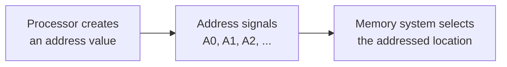
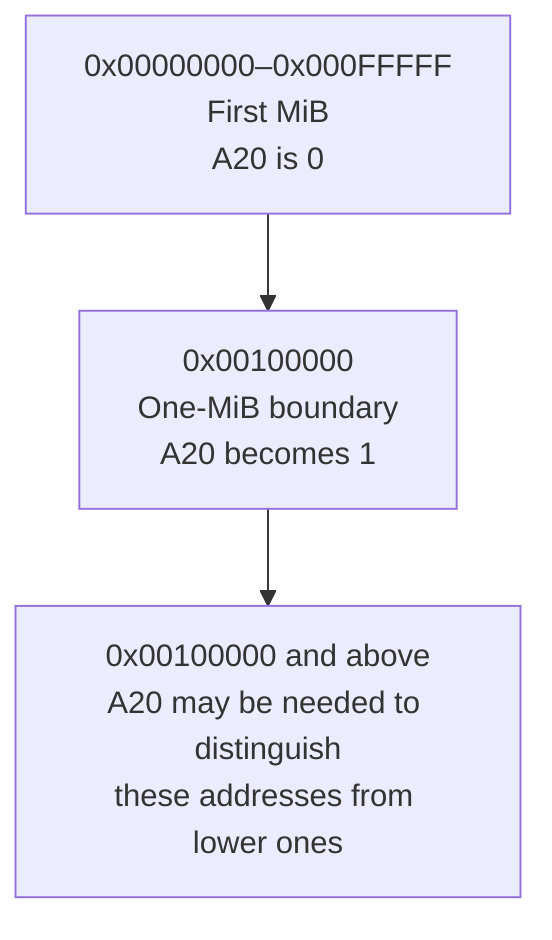
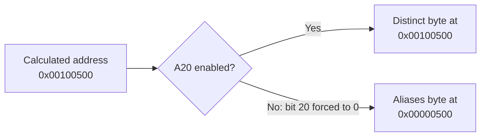
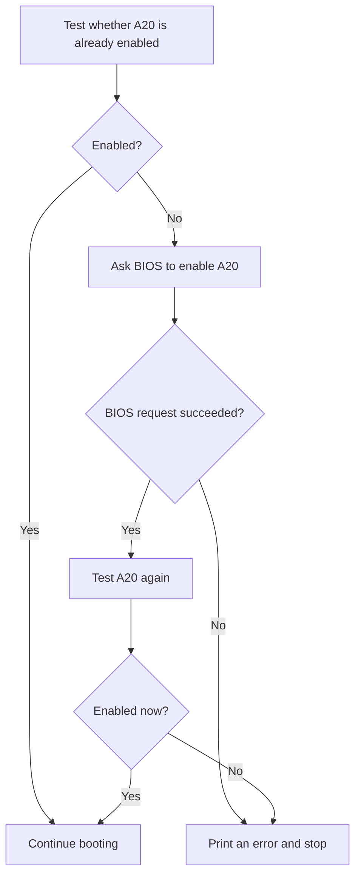
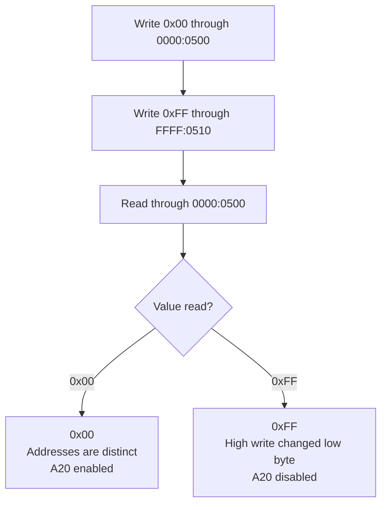

# Lesson 4 — Accessing memory beyond the first MiB

## Before starting

This chapter builds on:

- [Lesson 0](00-cpu-assembly-foundations.md), which introduced bits, registers,
  flags, memory addresses, the stack, and `CALL`/`RET`;
- [Lesson 1](01-bios-boot-sector.md), which introduced real-mode segment-address
  calculations;
- [Lesson 2](02-stage2-loader.md), which placed stage 2 in RAM; and
- [Lesson 3](03-physical-memory-map.md), which discovered that usable RAM exists
  both below and above address `0x00100000`.

Lesson 3 reported higher RAM, but reporting an address and successfully accessing
that address are different things. This lesson solves one narrow problem:

> Verify that address bit 20 is available, and ask BIOS to enable it if necessary.

That bit is historically known as the **A20 line**.

## Code companion

Lesson 4 is implemented in [`boot/stage2.asm`](../boot/stage2.asm):

| Lesson concept | Stable marker in `stage2.asm` |
|---|---|
| Require A20 before continuing | `call ensure_a20` under `stage2_start:` |
| Test, request, and verify | `ensure_a20:` |
| Compare addresses one MiB apart | `check_a20:` |
| Stop when A20 cannot be enabled | `a20_failure:` |
| User-visible status | `a20_ready_message` and `a20_error_message` |

The complete project index is in
[`CODE_READING_MAP.md`](../CODE_READING_MAP.md).

## 1. What is an address line?

Inside the machine, an address is represented as bits. Conceptually, the
processor communicates those bits to memory hardware through signals called
**address lines**. Each line corresponds to one bit position:

```text
A0  carries address bit 0
A1  carries address bit 1
A2  carries address bit 2
...
A20 carries address bit 20
```

Changing bit 0 changes an address by 1. Changing bit 1 changes it by 2. In
general, bit `n` contributes `2ⁿ` to the address.



Modern hardware is more complicated than this simple wiring model, but the
visible compatibility behavior still acts as though address bit 20 can be forced
to zero during early boot.

## 2. Why bit 20 marks the first MiB boundary

One **MiB** is 1,048,576 bytes. That number is:

```text
1 MiB = 1,048,576 = 2²⁰ = 0x00100000
```

Addresses below that boundary can be represented with bits 0 through 19:

```text
lowest address below 1 MiB: 0x00000000
highest address below 1 MiB: 0x000FFFFF
first address at 1 MiB:      0x00100000
```

The hexadecimal digit change at `0x00100000` is bit 20 becoming 1.



## 3. The historical compatibility problem

The original 8086 processor had 20 address lines, A0 through A19. It could
distinguish `2²⁰` byte addresses: exactly one MiB.

Real-mode segment arithmetic, however, can calculate a slightly larger number.
For example:

```text
FFFF:FFFF
= 0xFFFF × 16 + 0xFFFF
= 0xFFFF0 + 0xFFFF
= 0x10FFEF
```

The result contains bit 20, but the original processor had no A20 line with which
to communicate that bit. The extra bit was lost, so the address wrapped into the
lowest MiB.

Some old software came to depend on that wrapping behavior. Later x86 processors
could address more memory, but immediately exposing A20 would have changed how
those old programs behaved. PC designers therefore added a compatibility control
that could force A20 to zero.

When A20 is disabled:

```text
address 0x00100500 behaves like address 0x00000500
```

Those two different calculated addresses then refer to the same byte. This is
called **aliasing**: more than one address identifies the same storage location.



This compatibility behavior is called the **A20 gate**. “Opening” or “enabling”
the gate means allowing bit 20 to participate in address selection.

## 4. Why we test instead of enabling blindly

Firmware may already have enabled A20 before starting us. Our tested QEMU BIOS
does. Other firmware may leave it disabled.

Therefore, stage 2 follows three steps:



Verifying after the request is important. A successful request means BIOS
accepted the operation; a direct address test tells us whether the required
machine behavior is actually present.

## 5. Choosing two test addresses

To test A20, we need two calculated addresses that differ only by `0x00100000`,
exactly one MiB. We use:

```text
0000:0500
FFFF:0510
```

Calculate the first:

```text
0000:0500
= 0x0000 × 16 + 0x0500
= 0x00000500
```

Calculate the second:

```text
FFFF:0510
= 0xFFFF × 16 + 0x0510
= 0x000FFFF0 + 0x0510
= 0x00100500
```

Their difference is:

```text
0x00100500 - 0x00000500 = 0x00100000 = 1 MiB
```

If A20 is enabled, they identify two different bytes. If it is disabled, bit 20
is forced to zero and both identify the lower byte at `0x00000500`.

## 6. Preparing the two segment-address pairs

The test routine assigns the low address to `ES:DI`:

```asm
xor ax, ax
mov es, ax
mov di, 0x0500
```

This produces:

```text
ES:DI = 0000:0500 = physical address 0x00000500
```

It assigns the high address to `DS:SI`:

```asm
mov ax, 0xffff
mov ds, ax
mov si, 0x0510
```

This produces the calculated address:

```text
DS:SI = FFFF:0510 = 0x00100500
```

The use of `DS:SI` and `ES:DI` is convenient because one instruction can then
refer clearly to either test byte:

```asm
[es:di] ; Content at the low test address.
[ds:si] ; Content at the high test address.
```

## 7. Preserve the bytes before testing

The addresses may already contain data. A diagnostic must not permanently destroy
that data, so we save both bytes:

```asm
mov bl, [es:di]
mov bh, [ds:si]
```

`BL` holds the original low-address byte and `BH` holds the original high-address
byte. They are halves of `BX`, but each independently stores one byte here.

We also preserve the registers whose values the caller expects to survive:

```asm
pushf
cli
push bx
push ds
push es
push si
push di
```

`PUSHF` saves the `FLAGS` register. `CLI` then blocks ordinary maskable hardware
interrupts during the short interval in which the test bytes contain temporary
values and our usual data segment is replaced. At the end, `POPF` restores the
original flags—including whether those interrupts were enabled before the call.

## 8. Perform the alias test

We write different values to the two calculated addresses:

```asm
mov byte [es:di], 0x00
mov byte [ds:si], 0xff
```

Then we inspect the low address:

```asm
cmp byte [es:di], 0xff
```

There are two outcomes.

### A20 enabled

The addresses are distinct:

```text
low address receives  0x00
high address receives 0xFF
reading low returns   0x00
```

### A20 disabled

The addresses alias the same byte:

```text
write 0x00 through the low address
write 0xFF through the high alias to the same byte
reading low now returns 0xFF
```



The code defaults `AX` to zero and changes it to one only when the low address
did not become `0xFF`:

```asm
xor ax, ax
cmp byte [es:di], 0xff
je .restore
mov ax, 1
```

Thus the routine's return value is:

```text
AX = 0 → A20 disabled
AX = 1 → A20 enabled
```

## 9. Restore memory and registers

The temporary writes are reversed before returning:

```asm
mov [ds:si], bh
mov [es:di], bl
```

When A20 is enabled, these restore two distinct bytes. When A20 is disabled, both
addresses alias one byte; both saved values were originally read from that same
byte, so the final restoration still returns it to its original value.

The routine then restores registers in reverse order:

```asm
pop di
pop si
pop es
pop ds
pop bx
popf
ret
```

The reverse order follows the stack's last-in, first-out rule from Lesson 0.

## 10. Asking BIOS to enable A20

If the first test returns zero, stage 2 executes:

```asm
mov ax, 0x2401
int 0x15
```

Within the BIOS `INT 15h` service group, `AX=2401h` is the assigned operation for
requesting that A20 be enabled:

```text
INT 15h / AX=2401h
│           └── operation: enable A20
└────────────── miscellaneous BIOS service group
```

The number is part of the BIOS interface, not something our code chose.

We preserve `DS` and `ES` around the firmware call:

```asm
push ds
push es
mov ax, 0x2401
int 0x15
pop es
pop ds
```

The Carry Flag reports whether BIOS accepted the request. If it reports success,
we call `check_a20` again. We trust the direct verification, not the request alone.

## 11. Why we do not add every alternative yet

There are other historical ways to control A20, including direct communication
with keyboard-controller hardware and a faster system-control port. Different
machines and firmware may require fallbacks.

This lesson uses the BIOS operation because we are still in the BIOS-controlled
part of startup and it introduces the smallest new mechanism. If a future target
does not support this path, we can add and explain one fallback at a time. The
direct `check_a20` routine remains useful regardless of which enabling method is
attempted.

## 12. Build and observe

Run:

```sh
make clean
make
make run
```

The tested QEMU BIOS already has A20 enabled, producing:

```text
Stage 1: loading stage 2...
Stage 2: loaded successfully!
A20: addresses above 1 MiB are accessible.
Physical memory map:
...
```

The message proves that `check_a20` observed distinct bytes one MiB apart. It does
not tell us whether firmware enabled A20 earlier or our BIOS request enabled it;
the current code intentionally reports the final verified state.

## Exercises using only this lesson

1. Calculate the physical addresses for `0000:0600` and `FFFF:0610`. Confirm that
   they are also exactly one MiB apart.
2. Explain why writing the same value to both test addresses would fail to reveal
   whether they alias.
3. Trace the saved stack values from `PUSHF` through `POPF` and verify that every
   push has a matching pop in reverse order.
4. Explain why accepting a clear Carry Flag from `INT 15h` without calling
   `check_a20` again would provide weaker evidence.

## What we learned

We can now explain:

- how address bits distinguish memory locations;
- why bit 20 corresponds to the one-MiB boundary;
- why old wraparound behavior created an A20 compatibility control;
- what it means for two addresses to alias;
- how two segment-address pairs can test that behavior without losing data;
- why the test preserves flags, registers, and original memory bytes;
- how BIOS operation `INT 15h / AX=2401h` requests A20 enablement; and
- why hardware state is verified after a firmware request.

Stage 2 can now distinguish addresses above the first MiB. We have not yet changed
the processor's execution mode. The next lesson will introduce the table and
processor control bit required to leave 16-bit real mode and enter 32-bit
protected mode.
