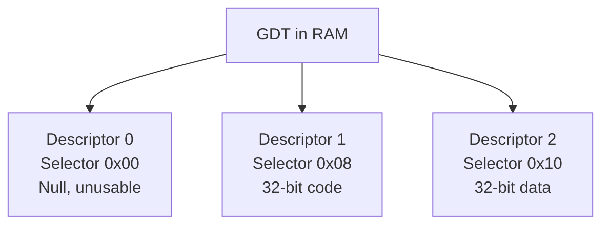
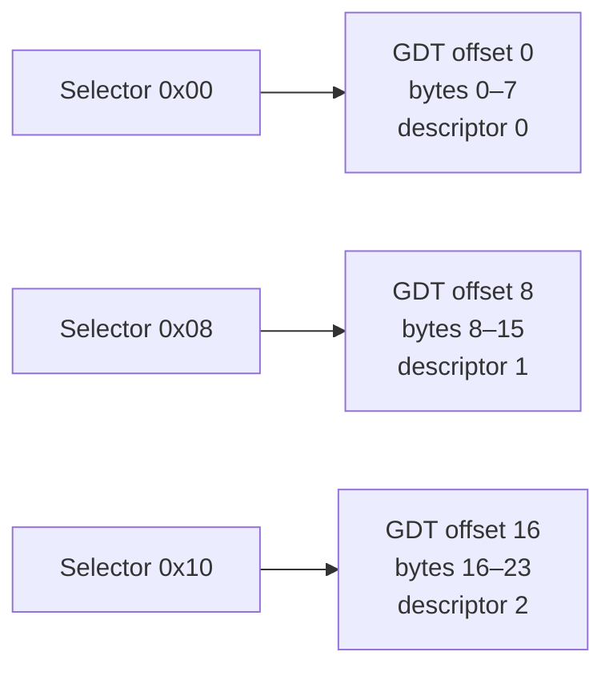
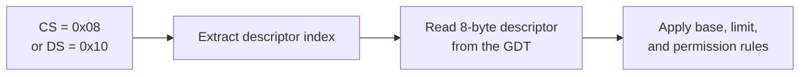
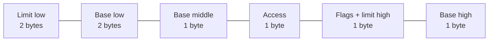
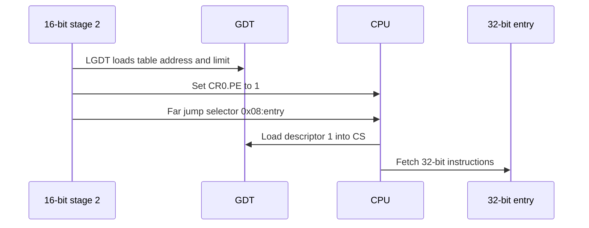
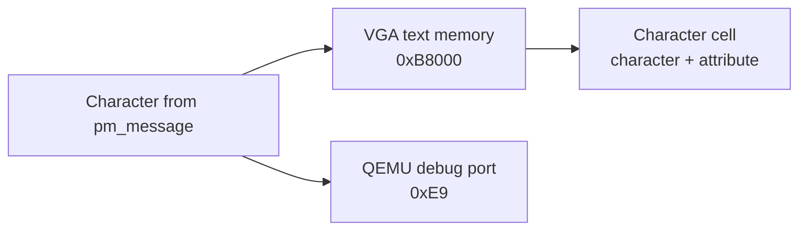
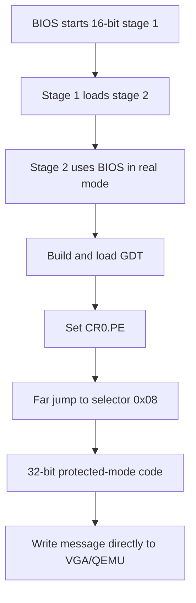
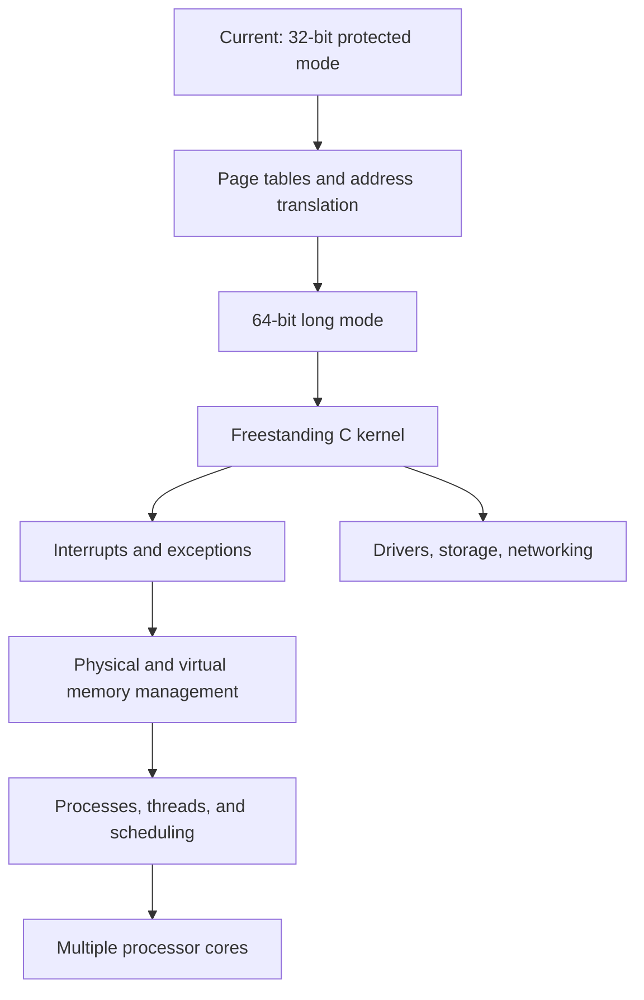

# Lesson 5 — Entering 32-bit protected mode

## Before starting

This chapter builds on:

- [Lesson 0](00-cpu-assembly-foundations.md), which introduced registers,
  instructions, flags, the stack, labels, and hexadecimal;
- [Lesson 1](01-bios-boot-sector.md), which introduced BIOS and real mode;
- [Lesson 2](02-stage2-loader.md), which loaded stage 2 into memory;
- [Lesson 3](03-physical-memory-map.md), which discovered usable physical RAM;
  and
- [Lesson 4](04-a20-line.md), which made addresses above the first MiB
  distinguishable.

Our goal is now:

> Change the processor from 16-bit real mode to 32-bit protected mode, then prove
> that 32-bit code is executing.

This is an important transition, but it is not yet the final 64-bit transition.
The route remains:


### Do not confuse bits in data with processor modes

A **byte** contains 8 bits. That describes the size of a data value or memory
location; it does not mean that the processor is running in “8-bit mode.” The
three execution modes in our roadmap are 16-bit real mode, 32-bit protected mode,
and 64-bit long mode.

```text
data width:       one byte = 8 bits
execution mode:   real mode = 16-bit instruction defaults
                  protected mode = 32-bit instruction defaults
                  long mode = 64-bit instruction defaults
```

Our complete transition path is therefore:


## Code companion

Lesson 5 is implemented in [`boot/stage2.asm`](../boot/stage2.asm):

| Lesson concept | Stable marker in `stage2.asm` |
|---|---|
| Start the transition | `call enter_protected_mode` |
| Load the descriptor table | `enter_protected_mode:` and `lgdt` |
| Enable protected mode | `mov cr0, eax` after setting bit 0 |
| Reload the code segment | `jmp dword 0x08:stage2_address(protected_mode_entry)` |
| Descriptor table bytes | `gdt_start:` through `gdt_end:` |
| 32-bit entry point | `protected_mode_entry:` |
| Establish the 32-bit stack | `mov esp, 0x00090000` |
| Replace BIOS text output | `pm_print_string:` |

The complete source index is in
[`CODE_READING_MAP.md`](../CODE_READING_MAP.md).

## 1. What is a processor mode?

A processor **mode** is a set of rules the CPU uses when interpreting addresses,
registers, instructions, and privilege information. The same physical processor
can support several modes so that new software can coexist with old software.

We began in **real mode**, the startup mode chosen by legacy BIOS. Real mode has
the segment arithmetic we have practiced:

```text
physical address = segment × 16 + offset
```

It also exposes BIOS services through software interrupts such as `INT 10h` and
`INT 13h`.

**Protected mode** changes the meaning of segment registers. Instead of treating a
segment register directly as a number to multiply by 16, the processor treats it
as a reference to a descriptor in a table we provide. That table can describe
segment size, permissions, and privilege information.

This lesson uses protected mode with simple, flat segments. “Flat” means the
segments all begin at address zero and cover a large continuous range. We are
learning the transition mechanism first; we are not yet using every protection
feature.

## 2. Why leave real mode?

Real mode is useful for talking to BIOS, but it is an old compatibility environment
with limited addressing and no built-in separation between trusted kernel code and
ordinary application code.

Protected mode gives the CPU a structure for:

- using 32-bit instruction and register forms;
- describing the valid range and kind of a segment; and
- later separating code with different privilege levels.

We will not yet create user programs or privilege boundaries. Those features need
additional lessons. For now, protected mode is the necessary stepping stone toward
the 64-bit mode our kernel will eventually use.

## 3. The Global Descriptor Table

The **Global Descriptor Table**, abbreviated **GDT**, is an array in RAM containing
segment descriptions. An **array** is an ordered sequence of same-sized items.
Each GDT item is called a **descriptor** and occupies eight bytes.

Our table has three descriptors:



The first descriptor must be all zeroes. It is not a usable code or data segment;
its presence catches some invalid segment selections. The two usable descriptors
are:

```text
descriptor 1 starts at GDT + 1 × 8 = GDT + 8 bytes
descriptor 2 starts at GDT + 2 × 8 = GDT + 16 bytes
```

The selector values `0x08` and `0x10` are therefore connected to the descriptor
positions. A **selector** is the value placed in a segment register to select a
descriptor. In this simple table, the selector's index is the descriptor index
multiplied by eight:

```text
0x00 / 8 = 0 → null descriptor
0x08 / 8 = 1 → code descriptor
0x10 / 8 = 2 → data descriptor
```

Real selectors contain a few additional bits for table choice and privilege level.
We leave those bits zero in this lesson, so the simple division explains the
values we use.

### Descriptors are eight-byte records

Yes: each descriptor occupies exactly eight bytes. The GDT is therefore an array
of eight-byte records laid next to one another in memory:

```text
GDT byte offset 0–7    → descriptor 0: null descriptor
GDT byte offset 8–15   → descriptor 1: code descriptor
GDT byte offset 16–23  → descriptor 2: data descriptor
```

If the GDT begins at address `GDT_BASE`, the records begin at:

```text
descriptor 0 address = GDT_BASE + 0
descriptor 1 address = GDT_BASE + 8
descriptor 2 address = GDT_BASE + 16
```

The selector is not the physical address of the descriptor. It is an encoded
reference. In the simple selectors used here, the number is chosen to match the
descriptor's byte offset:



The CPU knows the GDT's starting address because `LGDT` loaded it earlier. It
then uses the selector's index to find the corresponding eight-byte record.

### Why divide by eight?

The selector reserves its lowest three bits for other information. The remaining
upper bits contain the descriptor index. In binary, our selectors are:

```text
0x00 = 0000 0000 0000 0000
0x08 = 0000 0000 0000 1000
0x10 = 0000 0000 0001 0000
```

Dividing by eight is equivalent to shifting right by three bits:

```text
0x08 >> 3 = 0x01 → descriptor index 1
0x10 >> 3 = 0x02 → descriptor index 2
```

Those three low bits are structured as:

```text
selector bits:  [descriptor index ...][TI][RPL][RPL]
                                  bit2  bit1 bit0
```

- `TI` chooses between the Global Descriptor Table and another table. We use
  `TI=0`, meaning the GDT.
- `RPL` is the requested privilege level. We use `RPL=00`, the most privileged
  level, for this early kernel code.

Because our three low bits are all zero, the selector is numerically eight times
the descriptor index:

```text
0x00 / 8 = 0 → descriptor 0
0x08 / 8 = 1 → descriptor 1
0x10 / 8 = 2 → descriptor 2
```

The division is therefore a way for us to see the index in this simple case. The
CPU performs the equivalent bit-field extraction while loading a segment register.

### What does a descriptor describe?

A descriptor does not merely say “these eight bytes of the GDT exist.” The eight
bytes are metadata—a description used by the CPU. They describe a segment's:

```text
base address       → where the segment begins
limit              → largest permitted offset
access permissions → code or data, readable or writable, present or not
flags              → operand size and limit units
```

For our flat descriptors, the base is zero and the effective limit is nearly 4
GiB. Therefore selector `0x08` means:

> Use descriptor 1 as the current code-segment description.

Selector `0x10` means:

> Use descriptor 2 as the current data-and-stack-segment description.

The selector chooses the descriptor; the descriptor describes the memory range
and permissions. These are two different objects:



## 4. What one descriptor describes

A descriptor tells the processor how to interpret a segment. The fields we use
are:

| Field | Meaning |
|---|---|
| Base | Address where the segment begins |
| Limit | Largest offset allowed, subject to the granularity setting |
| Access byte | Whether the segment is present, executable, readable, or writable |
| Flags | Operand-size and limit-granularity choices |

Our code and data descriptors both use:

```text
base  = 0x00000000
limit = 0xFFFFFFFF effectively
```

With base zero, an offset of `0x00002000` refers to physical address
`0x00002000`. This resembles the direct addresses we used in real mode, but the
processor is now checking the descriptor rules.

### The code descriptor

The source constructs it with these bytes:

```asm
dw 0xffff
dw 0x0000
db 0x00
db 10011010b
db 11001111b
db 0x00
```

The eight bytes are laid out as:



`10011010b` is binary for `0x9A`. Its important bits say:

```text
present      = 1  → descriptor is valid
ring 0       = 00 → highest kernel privilege level for now
code/data    = 1  → this is a code/data descriptor type
executable   = 1  → CPU may fetch instructions from it
readable     = 1  → code bytes may also be read
```

The exact bit layout is part of the x86 descriptor format. We show the binary
form because each bit has a separate meaning; treating `0x9A` as a magic number
would hide that structure.

### The data descriptor

The data descriptor is almost identical, but its access byte is:

```asm
db 10010010b                 ; 0x92
```

The executable bit is zero and the writable-data bit is set. This tells the
processor that the selector may be used for data and stack accesses, not for
fetching instructions.

### The flags byte and a larger limit

The value `11001111b` is `0xCF`. Its high four bits contain flags, and its low
four bits contain the high part of the segment limit:

```text
1100 1111
││││ └──┴── high limit bits = 0xF
││└─────── default operation size = 32 bits
└└──────── granularity = 4 KiB units
```

With 4 KiB granularity, the limit value `0xFFFFF` describes nearly 4 GiB:

```text
(0xFFFFF + 1) × 0x1000 = 0x100000000 bytes = 4 GiB
```

The arithmetic is not a new runtime calculation in our code; it explains why
these descriptor bytes create a flat, wide 32-bit segment.

## 5. Telling the CPU where the GDT is

The CPU needs a small six-byte description of the GDT itself. Our source calls it
`gdt_descriptor`:

```asm
gdt_descriptor:
    dw gdt_end - gdt_start - 1
    dd stage2_address(gdt_start)
```

It contains:

```text
first 2 bytes → GDT limit: size in bytes minus 1
next 4 bytes  → GDT base: physical address of the first descriptor
```

If the GDT occupies 24 bytes, the limit is 23 (`0x17`) because valid offsets run
from 0 through 23. The CPU uses the limit to reject a selector that would point
past the table.

`LGDT` loads this six-byte description into the CPU:

```asm
lgdt [stage2_address(gdt_descriptor)]
```

The brackets mean “read the six descriptor bytes from memory.” `LGDT` does not
activate a new code segment by itself; it only tells the CPU where the table is.

## 6. Enabling protected mode in CR0

`CR0` is a control register: a CPU register whose bits enable major processor
features. Bit zero of `CR0` is named **PE**, for Protection Enable.

The transition code performs a read-modify-write:

```asm
mov eax, cr0
or eax, 0x00000001
mov cr0, eax
```

Step by step:

1. Copy the current `CR0` value into `EAX`.
2. `OR` bit 0 with 1, leaving all other bits unchanged.
3. Write the result back to `CR0`.

Using `OR` rather than replacing `CR0` preserves control bits that the processor
or firmware may already have set. After the final instruction, the PE bit is 1,
so the CPU is in protected mode—but the code segment still needs to be reloaded.

## 7. Why the far jump is mandatory

Immediately after enabling PE, the CPU is still using the old cached meaning of
`CS` for instruction fetching. A **far jump** supplies both a selector and an
instruction offset:

```asm
jmp dword 0x08:stage2_address(protected_mode_entry)
```

The two parts mean:

```text
0x08                         → select GDT descriptor 1, the code descriptor
stage2_address(...)          → offset of the 32-bit entry point
```

The jump reloads `CS` from the GDT and begins fetching at the protected-mode entry
point. It also discards any already-fetched instructions that belonged to the old
interpretation of `CS`.



The assembler directive also changes at this boundary:

```asm
bits 32
protected_mode_entry:
```

`BITS 32` tells NASM how to encode the instructions that follow. It does not
change the CPU. The CPU changes mode because of `CR0.PE` and the far jump; NASM's
directive merely ensures the bytes at the destination are encoded appropriately.

## 8. Reloading the data and stack segments

The far jump reloads `CS`, but `DS`, `ES`, `FS`, `GS`, and `SS` still contain the
old real-mode-style values. We load the data selector `0x10` into each register:

```asm
mov ax, 0x10
mov ds, ax
mov es, ax
mov fs, ax
mov gs, ax
mov ss, ax
```

`0x10` selects GDT descriptor 2, the data descriptor. The segment registers now
refer to protected-mode descriptors rather than direct real-mode segment numbers.

The stack pointer also changes form:

```asm
mov esp, 0x00090000
```

`ESP` is the 32-bit stack-pointer register. We choose `0x90000` because Lesson 3
reported the low range below `0x9FC00` as available in our test machine. The stack
grows downward from that boundary. Before using a stack in a new mode, we must
configure both its segment (`SS`) and pointer (`ESP`).

## 9. BIOS output is no longer available

In real mode, we printed characters using:

```asm
int 0x10
```

That enters a BIOS video routine. BIOS expects to be called under its real-mode
contract, so we do not use that service after switching to protected mode.

Instead, we write directly to the VGA text buffer. VGA is the traditional PC
display hardware. In its ordinary text layout, each screen cell occupies two
bytes:

```text
first byte  → character code
second byte → color attribute
```

The text buffer begins at physical address `0xB8000`:

```asm
mov edi, 0x000b8000
mov ah, 0x07
```

For every character, `pm_print_string` writes:

```asm
mov [edi], al
mov [edi + 1], ah
add edi, 2
```

The routine also writes to QEMU's debug port `0xE9`, so `make run-headless` can
observe the message even without a graphical display. That port is a QEMU testing
feature, not a general PC display interface.



## 10. What the running output proves

The output now has a new final line:

```text
Protected mode: 32-bit code is running!
```

That line is not printed by BIOS. It is produced by `pm_print_string`, which
writes directly to VGA memory and QEMU's debug port after the far jump.



## 11. What this lesson has not done

Protected mode does not automatically mean:

- paging is enabled;
- virtual memory exists;
- applications are isolated;
- user mode exists; or
- the processor is executing 64-bit instructions.

We currently use ring-0 descriptors, flat base-zero segments, no page tables, and
one stack. Those later mechanisms will be introduced when each solves a concrete
problem.

## Exercises using only this lesson

1. Why must descriptor 0 be all zeroes? What would selector `0x00` select?
2. Compute the descriptor selected by `0x08` and `0x10` using the eight-byte
   descriptor size.
3. Explain why `BITS 32` alone cannot change the CPU's mode.
4. What would happen if we set `CR0.PE` but did not perform the far jump?
5. Calculate the two bytes written for the character `A` when the attribute is
   `0x07`.
6. Why is `INT 10h` used before the transition but direct VGA memory used after it?

## What we learned

We can now explain:

- what protected mode changes compared with real mode;
- how a GDT stores segment descriptors;
- why the first GDT descriptor is null;
- how selectors `0x08` and `0x10` identify code and data descriptors;
- how descriptor bytes encode permissions and a flat 32-bit range;
- how `LGDT` tells the CPU where the table is;
- how `CR0.PE` enables protected mode;
- why a far jump reloads `CS` and starts 32-bit instruction fetching;
- why all data and stack segment registers must be reloaded; and
- how direct VGA output replaces BIOS video services after the transition.

The processor is now executing 32-bit protected-mode code. The next lesson will
introduce the page-table structures needed to enter 64-bit long mode. The
longer-term path is:


