# Lesson 5 — Entering 32-bit protected mode

## Before starting

This chapter builds on:

- [Lesson 0](00-cpu-assembly-foundations.md), which introduced registers,
  instructions, flags, the stack, labels, and hexadecimal;
- [Lesson 1](01-bios-boot-sector.md), which introduced BIOS and real mode;
- [Lesson 2](02-stage2-loader.md), which loaded stage 2 into memory;
- [Lesson 3](03-physical-memory-map.md), which discovered usable physical RAM;
  and
- [Lesson 4](04-a20-line.md), which made addresses above the first MiB
  distinguishable.

Our goal is now:

> Change the processor from 16-bit real mode to 32-bit protected mode, then prove
> that 32-bit code is executing.

This is an important transition, but it is not yet the final 64-bit transition.
The route remains:

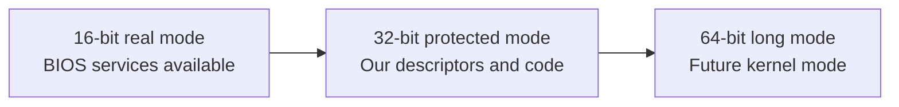

### Do not confuse bits in data with processor modes

A **byte** contains 8 bits. That describes the size of a data value or memory
location; it does not mean that the processor is running in “8-bit mode.” The
three execution modes in our roadmap are 16-bit real mode, 32-bit protected mode,
and 64-bit long mode.

```text
data width:       one byte = 8 bits
execution mode:   real mode = 16-bit instruction defaults
                  protected mode = 32-bit instruction defaults
                  long mode = 64-bit instruction defaults
```

Our complete transition path is therefore:


## Code companion

Lesson 5 is implemented in [`boot/stage2.asm`](../boot/stage2.asm):

| Lesson concept | Stable marker in `stage2.asm` |
|---|---|
| Start the transition | `call enter_protected_mode` |
| Load the descriptor table | `enter_protected_mode:` and `lgdt` |
| Enable protected mode | `mov cr0, eax` after setting bit 0 |
| Reload the code segment | `jmp dword 0x08:stage2_address(protected_mode_entry)` |
| Descriptor table bytes | `gdt_start:` through `gdt_end:` |
| 32-bit entry point | `protected_mode_entry:` |
| Establish the 32-bit stack | `mov esp, 0x00090000` |
| Replace BIOS text output | `pm_print_string:` |

The complete source index is in
[`CODE_READING_MAP.md`](../CODE_READING_MAP.md).

## 1. What is a processor mode?

A processor **mode** is a set of rules the CPU uses when interpreting addresses,
registers, instructions, and privilege information. The same physical processor
can support several modes so that new software can coexist with old software.

We began in **real mode**, the startup mode chosen by legacy BIOS. Real mode has
the segment arithmetic we have practiced:

```text
physical address = segment × 16 + offset
```

It also exposes BIOS services through software interrupts such as `INT 10h` and
`INT 13h`.

**Protected mode** changes the meaning of segment registers. Instead of treating a
segment register directly as a number to multiply by 16, the processor treats it
as a reference to a descriptor in a table we provide. That table can describe
segment size, permissions, and privilege information.

This lesson uses protected mode with simple, flat segments. “Flat” means the
segments all begin at address zero and cover a large continuous range. We are
learning the transition mechanism first; we are not yet using every protection
feature.

### What actually switches protected mode on?

Loading the GDT alone does **not** switch modes. It only tells the processor
where our descriptor table is located. The transition has four distinct steps:

```text
1. LGDT      → load the GDT address and size into the CPU's GDTR register
2. CR0.PE=1  → set the Protection Enable bit; request protected mode
3. far jump  → load CS as a protected-mode selector and discard old fetched
               instructions
4. load DS…  → load the other segment registers with protected-mode selectors
```

After step 2, the CPU is in protected mode, but the far jump in step 3 is
essential housekeeping. It loads the new code-segment descriptor into `CS` and
starts execution at the 32-bit entry point. The following `DS`, `ES`, `FS`,
`GS`, and `SS` loads select the data descriptor for ordinary memory and stack
accesses.

Once this is complete, a segment register no longer means “multiply this number
by 16.” It contains a selector. The CPU uses that selector to find a descriptor
and applies the descriptor's base, limit, type, and privilege checks to the
access. Paging is a separate later mechanism; it is still disabled in this
lesson.

## 2. Why leave real mode?

Real mode is useful for talking to BIOS, but it is an old compatibility environment
with limited addressing and no built-in separation between trusted kernel code and
ordinary application code.

Protected mode gives the CPU a structure for:

- using 32-bit instruction and register forms;
- describing the valid range and kind of a segment; and
- later separating code with different privilege levels.

We will not yet create user programs or privilege boundaries. Those features need
additional lessons. For now, protected mode is the necessary stepping stone toward
the 64-bit mode our kernel will eventually use.

## 3. The Global Descriptor Table

The **Global Descriptor Table**, abbreviated **GDT**, is an array in RAM containing
segment descriptions. An **array** is an ordered sequence of same-sized items.
Each GDT item is called a **descriptor** and occupies eight bytes.

Our table has three separate descriptors. A descriptor is one complete 8-byte
record. “Null,” “code,” and “data” describe the roles of those three records;
they are not three pieces of one descriptor:

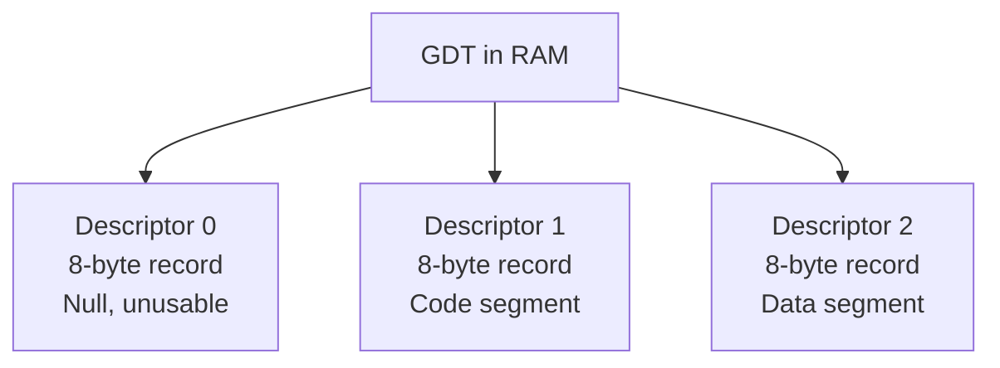

The first descriptor must be all zeroes. It is a complete 8-byte record, but it is
not a usable code or data segment. Its presence catches some invalid segment
selections. The three complete records occupy these byte ranges:

```text
GDT byte offset 0–7    → complete descriptor 0: null
GDT byte offset 8–15   → complete descriptor 1: code
GDT byte offset 16–23  → complete descriptor 2: data
```

The selector values `0x08` and `0x10` are therefore connected to the descriptor
positions. A **selector** is the value placed in a segment register to select a
descriptor. In this simple table, the selector's index is the descriptor index
multiplied by eight:

```text
0x00 / 8 = 0 → choose the complete 8-byte record at GDT offset 0:  null
0x08 / 8 = 1 → choose the complete 8-byte record at GDT offset 8:  code
0x10 / 8 = 2 → choose the complete 8-byte record at GDT offset 16: data
```

Real selectors contain a few additional bits for table choice and privilege level.
We leave those bits zero in this lesson, so the simple division explains the
values we use.

### Descriptors are eight-byte records

Yes: each descriptor occupies exactly eight bytes. The GDT is therefore an array
of eight-byte records laid next to one another in memory:

```text
GDT byte offset 0–7    → descriptor 0: null descriptor
GDT byte offset 8–15   → descriptor 1: code descriptor
GDT byte offset 16–23  → descriptor 2: data descriptor
```

If the GDT begins at address `GDT_BASE`, the records begin at:

```text
descriptor 0 address = GDT_BASE + 0
descriptor 1 address = GDT_BASE + 8
descriptor 2 address = GDT_BASE + 16
```

The selector is not the physical address of the descriptor. It is an encoded
reference. In the simple selectors used here, the number is chosen to match the
descriptor's byte offset:

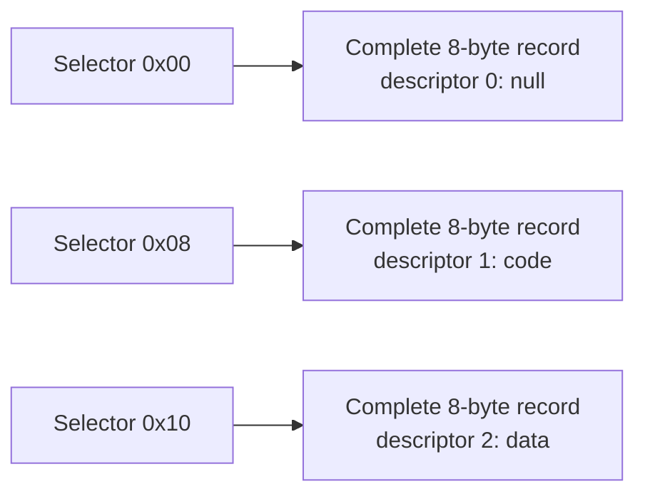

The CPU knows the GDT's starting address because `LGDT` loaded it earlier. It
then uses the selector's index to find the corresponding eight-byte record.

### Why divide by eight?

The descriptors do not overlap. They remain independent records at different
locations in the GDT. The division by eight concerns only the *encoding of a
selector*; it does not divide or modify the descriptors themselves.

Think of the process in two separate steps:

```text
1. Decode the selector to obtain a descriptor index.
2. Use that index to locate one complete 8-byte record in the GDT.
```

The selector reserves its lowest three bits for other information. The remaining
upper bits contain the descriptor index. In binary, our selectors are:

```text
0x00 = 0000 0000 0000 0000
0x08 = 0000 0000 0000 1000
0x10 = 0000 0000 0001 0000
```

Dividing by eight is equivalent to shifting right by three bits:

```text
0x08 >> 3 = 0x01 → descriptor index 1
0x10 >> 3 = 0x02 → descriptor index 2
```

Those three low bits are structured as:

```text
selector bits:  [descriptor index ...][TI][RPL][RPL]
                                  bit2  bit1 bit0
```

- `TI` chooses between the Global Descriptor Table and another table. We use
  `TI=0`, meaning the GDT.
- `RPL` is the requested privilege level. We use `RPL=00`, the most privileged
  level, for this early kernel code.

Because our three low bits are all zero, the selector is numerically eight times
the descriptor index:

```text
0x00 / 8 = 0 → descriptor 0: the complete null record
0x08 / 8 = 1 → descriptor 1: the complete code record
0x10 / 8 = 2 → descriptor 2: the complete data record
```

The division is therefore a way for us to see the index in this simple case. The
CPU performs the equivalent bit-field extraction while loading a segment register.

The decoded index then selects one record by multiplying the index by the
descriptor size:

```text
selector 0x08
    >> 3 = index 1
    1 × 8 = GDT byte offset 8
    use bytes 8–15: the complete code descriptor

selector 0x10
    >> 3 = index 2
    2 × 8 = GDT byte offset 16
    use bytes 16–23: the complete data descriptor
```

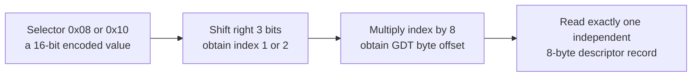

For example, `0x08` and `0x10` do not point into the same descriptor:

```text
0x08 → GDT bytes 8–15  → descriptor 1
0x10 → GDT bytes 16–23 → descriptor 2
```

They are separate because their decoded indices are different. The lowest three
selector bits affect how the selector is interpreted, but they do not consume
space inside, or overlap, any GDT descriptor.

### What does a descriptor describe?

A descriptor does not merely say “these eight bytes of the GDT exist.” The eight
bytes are metadata—a description used by the CPU. They describe a segment's:

```text
base address       → where the segment begins
limit              → largest permitted offset
access permissions → code or data, readable or writable, present or not
flags              → operand size and limit units
```

For our flat descriptors, the base is zero and the effective limit is nearly 4
GiB. Therefore selector `0x08` means:

> Use descriptor 1 as the current code-segment description.

Selector `0x10` means:

> Use descriptor 2 as the current data-and-stack-segment description.

The selector chooses the descriptor; the descriptor describes the memory range
and permissions. These are two different objects:

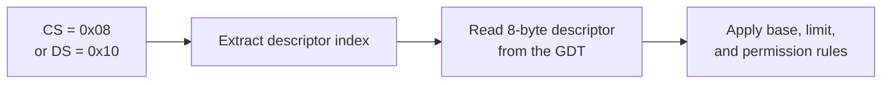

### Descriptors do not allocate memory

This is an important distinction:

```text
descriptor  → defines the broad rules for a segment
allocator   → chooses which free bytes a program receives
program     → uses the bytes that the allocator returned
```

A descriptor is therefore more like a **fence and a sign** than a reservation
of every byte inside the fence. For example, our data descriptor says, in
effect:

> Data and stack accesses may use offsets in this permitted range, and those
> accesses may be writable.

It does not say that one program owns the entire range, nor does it decide
whether a program needs 20 bytes or 20 MiB. Later, a program will request
memory through an operating-system interface. The kernel's memory allocator
will find free space, record who owns it, and return a particular block:

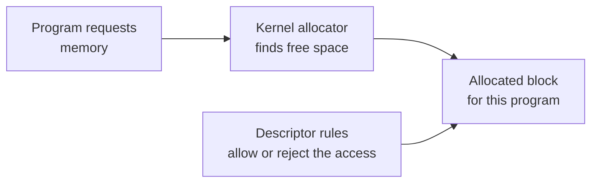

In this first protected-mode experiment, the code and data descriptors both
cover almost the entire 4-GiB address range. That makes the transition easy to
understand, but it is intentionally broad: it is not yet strong protection
between programs. We will later add **paging**, where memory is divided into
small pages and page tables can map each program's virtual addresses to chosen
physical pages with separate read/write and user/kernel permissions. An
allocator chooses the pages; the page tables and descriptors enforce the
processor's access rules.

### Could we give one program 2 GiB of code and 6 GiB of writable data?

Not with one ordinary 32-bit address space. In 32-bit protected mode, a
program's linear addresses are 32 bits wide:

```text
2^32 addresses = 4 GiB of addressable virtual space
```

The requested layout would need:

```text
2 GiB code + 6 GiB data = 8 GiB
```

That is larger than the available 4-GiB address range. A descriptor can limit a
code segment to a 2-GiB range, but it cannot make a 32-bit offset name 6 GiB of
data. Also, a segment limit describes an allowed address range; it does not
promise that all bytes in that range have physical RAM behind them.

With 64-bit addressing, an operating system can give a process a much larger
virtual address space. It would normally use paging to map the requested code
and data regions, mark code pages non-writable, and mark writable data pages
non-executable. The allocator chooses the regions; the page tables make the
choices enforceable. This is why our broad descriptors are only a first step,
not the final memory-protection design.

### Why this arrangement is transitional for our project

When we later enter x86-64 long mode, ordinary `CS`, `DS`, `ES`, and `SS`
segments are normally configured as **flat** segments: their base is zero and
their useful boundary is no longer used to divide a process into a small code
area and a small data area. The GDT still exists because the CPU still uses
descriptors for code-segment type, privilege level, and other control
information. The special `FS` and `GS` segments can also still have meaningful
bases.

The flexible memory layout then comes mainly from paging:

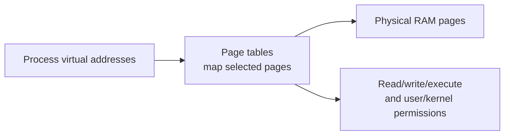

So “use memory more freely” means that a process can request and release
separate virtual regions as it needs them, rather than that every byte becomes
unrestricted. The allocator still tracks ownership, and the page tables still
enforce access rules. Our 32-bit descriptors are transitional because they
teach the protected-mode mechanism and get us safely to the paging and
64-bit stages; they are not the final memory-allocation model.

### If the descriptor really reserves separate ranges

Suppose, purely as a segmentation example, that we created non-overlapping
ranges like this:

```text
code descriptor: 0 GiB through 5 GiB
data descriptor: 5 GiB through 9 GiB
```

If the program actually used only 2 GiB of code, the remaining 3 GiB would
still be inside the code segment. A data access using the data selector could
not automatically borrow that space. The CPU checks the data selector's base
and limit, so the data segment would still end at 9 GiB. In that rigid design,
yes: the unused code range cannot be reused by data until the operating system
changes the descriptors.

There are two important qualifications:

1. These are **address ranges**, not guaranteed physical RAM reservations. A
   segment can describe an address range whose physical pages have not been
   allocated yet.
2. Our current 32-bit protected-mode address space cannot provide one flat
   9-GiB linear range in the first place. The example illustrates the rule, not
   a layout we can implement with today's descriptors.

With paging, the operating system avoids this rigid partition. It can leave
unused virtual pages unmapped and give their physical pages to a growing data
region. If the machine has 10 GiB of physical RAM, at most roughly 10 GiB can
be resident at one time (less what the kernel and devices use), but the
process's virtual regions need not permanently reserve 5 GiB for code. The
actual code footprint may be 2 GiB while the data region grows independently.

### Can descriptor ranges overlap?

Yes. The GDT does not require descriptors to form adjacent, non-overlapping
pieces of memory. Each descriptor is an independent description. Two
descriptors may describe the same range while giving that range different
roles or permissions.

That is exactly what our first GDT does:

```text
code descriptor: base 0, almost-4-GiB limit
data descriptor: base 0, almost-4-GiB limit
```

They overlap almost completely. If the offset is `0x00008000`, then:

```text
CS:0x00008000 → linear address 0x00008000, checked as code
DS:0x00008000 → linear address 0x00008000, checked as data
```

The bytes are not duplicated. The selector tells the CPU which descriptor's
rules to apply while interpreting the same offset. Later, paging adds another
layer: a virtual page can be mapped to a physical page, and the page-table
permissions are checked as well.

### How does the CPU know whether bytes are code or data?

It does not inspect the bytes and decide. Memory contains only numbers. The
**kind of access** gives those numbers their role:

```text
instruction fetch → CS:EIP  → interpret the bytes as instructions
ordinary load     → DS:offset → read the bytes as data
stack operation   → SS:SP/ESP → read or write stack data
```

For example, if address `0x00008000` contains the byte `0xB8`:

```asm
mov eax, [0x00008000]   ; read the byte(s) as data through DS
jmp 0x00008000          ; fetch instructions there through CS:EIP
```

The bytes did not change. The first instruction requested a data read; the
second changed the instruction pointer, so the processor began fetching and
decoding bytes as instructions. This is why “code” and “data” describe how a
region is intended to be used, not two different physical kinds of byte.

Our current broad descriptors permit overlapping addresses, so they do not yet
prevent every accidental interpretation. Later, paging will add a per-page
**execute permission** (the NX rule): a page marked non-executable may be read
as data but cannot be used for instruction fetches. The loader and kernel place
program sections in suitable pages, and the CPU enforces those page-table
permissions.

## 4. What one descriptor describes

A descriptor tells the processor how to interpret a segment. The fields we use
are:

| Field | Meaning |
|---|---|
| Base | Address where the segment begins |
| Limit | Largest offset allowed, subject to the granularity setting |
| Access byte | Whether the segment is present, executable, readable, or writable |
| Flags | Operand-size and limit-granularity choices |

Our code and data descriptors both use:

```text
base  = 0x00000000
limit = 0xFFFFFFFF effectively
```

With base zero, an offset of `0x00002000` refers to physical address
`0x00002000`. This resembles the direct addresses we used in real mode, but the
processor is now checking the descriptor rules.

### The code descriptor

The source constructs it with these bytes:

```asm
dw 0xffff
dw 0x0000
db 0x00
db 10011010b
db 11001111b
db 0x00
```

The eight bytes are laid out as:

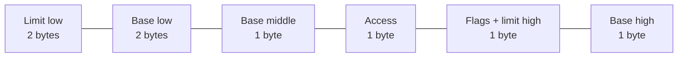

`10011010b` is binary for `0x9A`. The spelling is important: it is
`1001 1010`, not `1001 1100` or any other sequence. We can verify the
conversion by adding the values of the bits that are `1`:

```text
binary:  1 0 0 1 1 0 1 0
bit:     7 6 5 4 3 2 1 0
value: 128       +16 +8    +2 = 154 decimal = 0x9A
```

For an x86 segment access byte, each position has a defined meaning. Here,
**position** means the location number (`7` is the leftmost/highest bit and
`0` is the rightmost/lowest bit), while **stored value** means the `0` or `1`
actually found at that position:

```text
position:        7     6 5    4     3     2     1     0
stored value:    1     0 0    1     1     0     1     0
field:           P    DPL     S     E     C/R   R/W   A
```

Read the table vertically. For example, position 7 stores value 1, so `P = 1`;
positions 6 and 5 store `00`, so `DPL = 00`; position 3 stores value 1, so
`E = 1`:

```text
P   = 1  → present: the descriptor is valid
DPL = 00 → privilege level 0, our highest kernel level for now
S   = 1  → this is a code/data descriptor, not a system descriptor
E   = 1  → executable: the CPU may fetch instructions from it
C   = 0  → non-conforming code segment
R   = 1  → readable: code bytes may also be read as data
A   = 0  → not yet marked accessed; the CPU may set this later
```

### What does “non-conforming” mean?

The `C` bit is a rule for **entering** an executable segment. It is not a
statement about whether the instructions are valid or invalid.

An x86 program runs at a privilege level. We currently use privilege level 0,
the level normally used by an operating-system kernel. With `C = 0`, this is a
normal (non-conforming) code segment: a direct jump or call into it must obey
the ordinary privilege checks. In our small kernel, all code is level 0, so the
check succeeds and execution continues.

With `C = 1`, the segment would be a conforming code segment. Code running at a
less privileged level could enter it under special rules, but the CPU would
keep the caller's current privilege level. This is a specialized arrangement
that our kernel does not need yet. We choose `C = 0` because it is the normal,
simpler kernel-code setting.

The important distinction is:

```text
S = 1 → this descriptor is for ordinary code/data, not a system descriptor
E = 1 → this ordinary descriptor is executable code
C = 0 → entering this code uses normal privilege checks
```

The exact bit layout is part of the x86 descriptor format. We show the binary
form because every position has a separate meaning; treating `0x9A` as a magic
number would hide that structure. The data descriptor uses `10010010b`
(`0x92`) instead: its executable bit is `0`, while its writable-data bit is
`1`.

### The data descriptor

The data descriptor is almost identical, but its access byte is:

```asm
db 10010010b                 ; 0x92
```

The executable bit is zero and the writable-data bit is set. This tells the
processor that the selector may be used for data and stack accesses, not for
fetching instructions.

### The flags byte and a larger limit

The value `11001111b` is `0xCF`. Its high four bits contain flags, and its low
four bits contain the high part of the segment limit:

```text
1100 1111
││││ └──┴── high limit bits = 0xF
││└─────── default operation size = 32 bits
└└──────── granularity = 4 KiB units
```

With 4 KiB granularity, the limit value `0xFFFFF` describes nearly 4 GiB:

```text
(0xFFFFF + 1) × 0x1000 = 0x100000000 bytes = 4 GiB
```

The arithmetic is not a new runtime calculation in our code; it explains why
these descriptor bytes create a flat, wide 32-bit segment.

## 5. Telling the CPU where the GDT is

The CPU needs a small six-byte description of the GDT itself. Our source calls it
`gdt_descriptor`:

```asm
gdt_descriptor:
    dw gdt_end - gdt_start - 1
    dd stage2_address(gdt_start)
```

`gdt_start` and `gdt_end` are labels that we created in our source file. They
do not come from BIOS, and the CPU does not invent them. NASM gives a label the
address of the next byte it is assembling at that point:

```asm
gdt_start:                 ; address of the first table byte
    dq 0                   ; descriptor 0: 8 bytes
    ; code descriptor:       8 bytes
    ; data descriptor:       8 bytes
gdt_end:                   ; address just after the last table byte
```

The end label is deliberately placed **one byte past** the table. Therefore
subtracting the labels gives the table's byte count:

```text
gdt_end - gdt_start = 24 bytes
```

The subtraction is performed by NASM while assembling; it is not an operation
that the running kernel performs. The label names are our choice—we could call
them `table_begin` and `table_after_end`, but every reference would have to use
the new names consistently.

It contains:

```text
first 2 bytes → GDT limit: size in bytes minus 1
next 4 bytes  → GDT base: physical address of the first descriptor
```

If the GDT occupies 24 bytes, the limit is 23 (`0x17`) because valid offsets run
from 0 through 23. The CPU uses the limit to reject a selector that would point
past the table.

`LGDT` loads this six-byte description into the CPU:

```asm
lgdt [stage2_address(gdt_descriptor)]
```

The brackets mean “read the six descriptor bytes from memory.” `LGDT` does not
activate a new code segment by itself; it only tells the CPU where the table is.

## 6. Enabling protected mode in CR0

`CR0` is a control register: a CPU register whose bits enable major processor
features. Bit zero of `CR0` is named **PE**, for Protection Enable.

The transition code performs a read-modify-write:

```asm
mov eax, cr0
or eax, 0x00000001
mov cr0, eax
```

Step by step:

1. Copy the current `CR0` value into `EAX`.
2. `OR` bit 0 with 1, leaving all other bits unchanged.
3. Write the result back to `CR0`.

Using `OR` rather than replacing `CR0` preserves control bits that the processor
or firmware may already have set. After the final instruction, the PE bit is 1,
so the CPU is in protected mode—but the code segment still needs to be reloaded.

## 7. Why the far jump is mandatory

Immediately after enabling PE, the CPU is still using the old cached meaning of
`CS` for instruction fetching. A **far jump** supplies both a selector and an
instruction offset:

```asm
jmp dword 0x08:stage2_address(protected_mode_entry)
```

The two parts mean:

```text
0x08                         → select GDT descriptor 1, the code descriptor
stage2_address(...)          → offset of the 32-bit entry point
```

The jump reloads `CS` from the GDT and begins fetching at the protected-mode entry
point. It also discards any already-fetched instructions that belonged to the old
interpretation of `CS`.

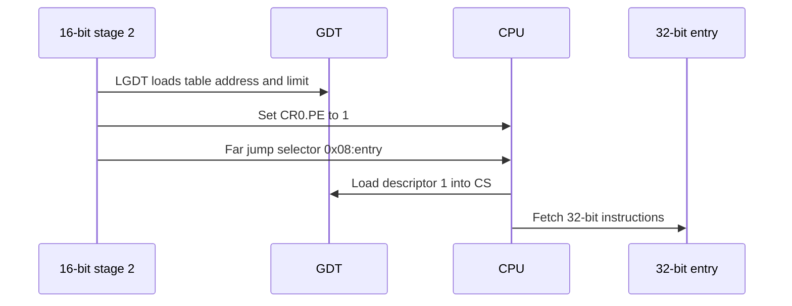

The assembler directive also changes at this boundary:

```asm
bits 32
protected_mode_entry:
```

`BITS 32` tells NASM how to encode the instructions that follow. It does not
change the CPU. The CPU changes mode because of `CR0.PE` and the far jump; NASM's
directive merely ensures the bytes at the destination are encoded appropriately.

## 8. Reloading the data and stack segments

The far jump reloads `CS`, but `DS`, `ES`, `FS`, `GS`, and `SS` still contain the
old real-mode-style values. We load the data selector `0x10` into each register:

```asm
mov ax, 0x10
mov ds, ax
mov es, ax
mov fs, ax
mov gs, ax
mov ss, ax
```

`0x10` selects GDT descriptor 2, the data descriptor. The segment registers now
refer to protected-mode descriptors rather than direct real-mode segment numbers.

The stack pointer also changes form:

```asm
mov esp, 0x00090000
```

`ESP` is the 32-bit stack-pointer register. We choose `0x90000` because Lesson 3
reported the low range below `0x9FC00` as available in our test machine. The stack
grows downward from that boundary. Before using a stack in a new mode, we must
configure both its segment (`SS`) and pointer (`ESP`).

## 9. BIOS output is no longer available

In real mode, we printed characters using:

```asm
int 0x10
```

That enters a BIOS video routine. BIOS expects to be called under its real-mode
contract, so we do not use that service after switching to protected mode.

Instead, we write directly to the VGA text buffer. VGA is the traditional PC
display hardware. In its ordinary text layout, each screen cell occupies two
bytes:

```text
first byte  → character code
second byte → color attribute
```

The text buffer begins at physical address `0xB8000`:

```asm
mov edi, 0x000b8000
mov ah, 0x07
```

For every character, `pm_print_string` writes:

```asm
mov [edi], al
mov [edi + 1], ah
add edi, 2
```

The routine also writes to QEMU's debug port `0xE9`, so `make run-headless` can
observe the message even without a graphical display. That port is a QEMU testing
feature, not a general PC display interface.

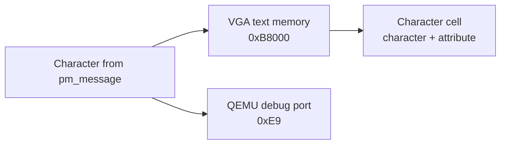

## 10. What the running output proves

The output now has a new final line:

```text
Protected mode: 32-bit code is running!
```

That line is not printed by BIOS. It is produced by `pm_print_string`, which
writes directly to VGA memory and QEMU's debug port after the far jump.

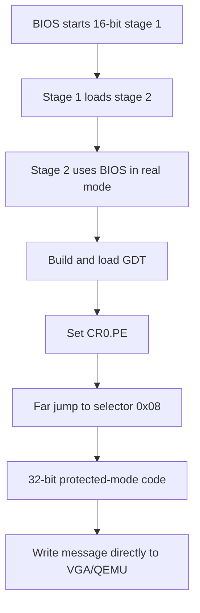

## 11. What this lesson has not done

Protected mode does not automatically mean:

- paging is enabled;
- virtual memory exists;
- applications are isolated;
- user mode exists; or
- the processor is executing 64-bit instructions.

We currently use ring-0 descriptors, flat base-zero segments, no page tables, and
one stack. Those later mechanisms will be introduced when each solves a concrete
problem.

## Exercises using only this lesson

1. Why must descriptor 0 be all zeroes? What would selector `0x00` select?
2. Compute the descriptor selected by `0x08` and `0x10` using the eight-byte
   descriptor size.
3. Explain why `BITS 32` alone cannot change the CPU's mode.
4. What would happen if we set `CR0.PE` but did not perform the far jump?
5. Calculate the two bytes written for the character `A` when the attribute is
   `0x07`.
6. Why is `INT 10h` used before the transition but direct VGA memory used after it?

## What we learned

We can now explain:

- what protected mode changes compared with real mode;
- how a GDT stores segment descriptors;
- why the first GDT descriptor is null;
- how selectors `0x08` and `0x10` identify code and data descriptors;
- how descriptor bytes encode permissions and a flat 32-bit range;
- how `LGDT` tells the CPU where the table is;
- how `CR0.PE` enables protected mode;
- why a far jump reloads `CS` and starts 32-bit instruction fetching;
- why all data and stack segment registers must be reloaded; and
- how direct VGA output replaces BIOS video services after the transition.

The processor is now executing 32-bit protected-mode code. The next lesson will
introduce the page-table structures needed to enter 64-bit long mode. The
longer-term path is:

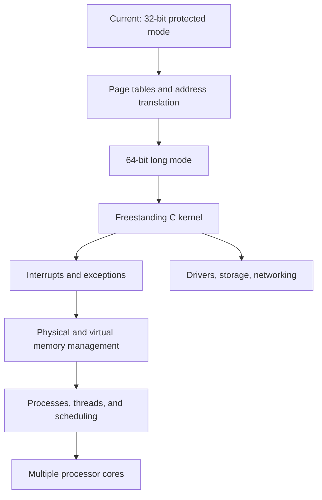
