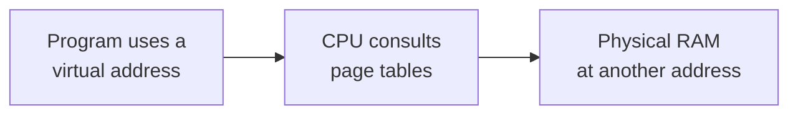
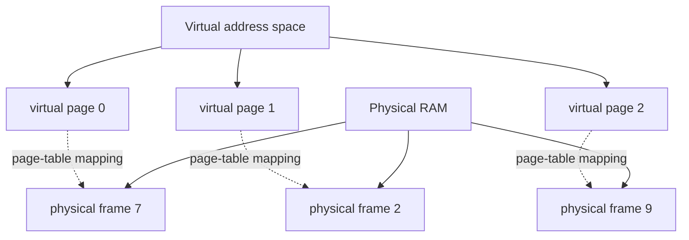
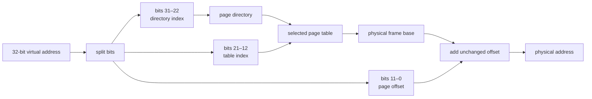
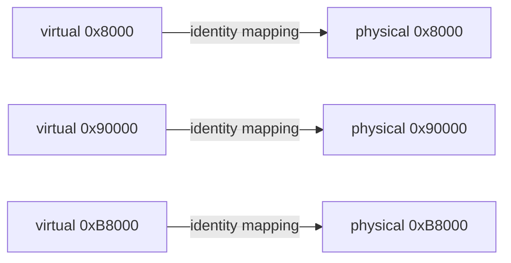

# Lesson 6 — Paging foundations: virtual addresses and page tables

## Before starting

This chapter builds on:

- [Lesson 0](00-cpu-assembly-foundations.md), which introduced binary numbers,
  registers, instructions, and memory addresses;
- [Lesson 3](03-physical-memory-map.md), which showed that BIOS reports ranges
  of **physical** RAM;
- [Lesson 5](05-protected-mode.md), which entered 32-bit protected mode and
  explained why broad code/data descriptors are not a useful final memory model.

The previous lesson left us with an important problem. A descriptor can describe
a large allowed range, but it does not allocate small pieces of RAM to separate
programs. If every program sees one broad range, the operating system still
needs a way to give each program its own addresses and permissions.

This lesson introduces that mechanism: **paging**. We will not enable paging in
the processor yet. The purpose here is to understand the objects and the
translation calculation before we write the control-register instructions.

## 1. The problem paging solves

In the early lessons, an address meant a location in the machine's RAM. That is
called a **physical address**: the number used to select a real byte location in
physical memory.

That direct model creates several problems:

```text
Program A writes address 0x00100000
Program B writes address 0x00100000
       ↓
Both programs would touch the same physical bytes.
```

The operating system wants every program to have a private-looking address
space. It also wants to place a program's memory wherever free RAM exists, even
if the program was written as though its memory began at a simple address.

Paging inserts a translation step:



A **virtual address** is an address used by the running program. A **physical
address** is the address used by the RAM hardware. They can be equal, but paging
allows them to be different.

The program does not need to know which physical bytes were chosen. The page
tables contain the translation, and the CPU performs it while executing each
memory access.

## 2. What is a page?

Paging does not translate every individual byte with a separate table entry.
That would require an enormous table. Instead, it divides addresses into fixed-
size blocks.

A **page** is one fixed-size block of virtual address space. A **page frame** is
a physical-RAM block of the same size. In the first 32-bit paging design we
will study, one page is:

```text
4 KiB = 4096 bytes = 0x1000 bytes
```

The page size is a hardware convention. It is not chosen separately for every
program. The operating system chooses which physical page frame backs each
virtual page.



The virtual pages and physical frames are the same size, so a translation only
needs to change the page number. The position of the byte **inside** its page
is preserved.

## 3. Splitting a 32-bit address

Our next paging design uses 32-bit addresses and 4-KiB pages. A 4-KiB page has
`4096 = 2^12` bytes, so the lowest 12 address bits identify the byte's offset
inside the page:

```text
31                         12 11                   0
+----------------------------+----------------------+
|       virtual page number  |   page offset        |
|          20 bits           |      12 bits         |
+----------------------------+----------------------+
```

The **page offset** is the byte's position within its 4-KiB page. The remaining
20 bits identify which virtual page contains that byte.

For example, split the virtual address `0x00123456`:

```text
address:       0x00123456
page number:   0x00123456 >> 12 = 0x00000123
page offset:   0x00123456 & 0x00000FFF = 0x00000456
```

The shift by 12 removes the twelve offset bits. The bitwise `AND` with
`0xFFF` keeps only those twelve bits. These are the same kinds of register and
bit operations introduced in Lesson 0; paging gives them a new job.

Suppose the page table maps virtual page `0x123` to physical frame base
`0x00456000`. The CPU forms the physical address by preserving the offset:

```text
physical frame base + page offset
= 0x00456000 + 0x00000456
= 0x00456456
```

The program used `0x00123456`, but RAM was accessed at `0x00456456`.

## 4. Why there are two table levels

A single table containing one entry for every 4-KiB page would need:

```text
4 GiB / 4 KiB = 1,048,576 virtual pages
```

That is over one million entries even before we store permission information.
The 32-bit paging format divides the lookup into two smaller tables:

1. a **page directory**, whose entries point to page tables; and
2. a **page table**, whose entries point to physical page frames.

Each entry is 4 bytes. A page directory has 1024 entries, and each page table
has 1024 entries. The address bits are divided like this:

```text
31                 22 21                 12 11          0
+--------------------+--------------------+--------------+
| directory index    | table index        | page offset  |
| 10 bits            | 10 bits            | 12 bits      |
+--------------------+--------------------+--------------+
```

The calculation is:

```text
10 bits → 2^10 = 1024 directory entries
10 bits → 2^10 = 1024 entries in one page table
12 bits → 2^12 = 4096 bytes in one page

1024 × 1024 × 4096 bytes = 4 GiB
```

The directory index chooses one page-table pointer. The table index chooses one
page-frame pointer inside that page table. The offset chooses one byte inside
the selected frame.



This is still a simple array lookup. The CPU performs it in hardware; the
operating system prepares the arrays and tells the CPU where the directory is.

## 5. What a page-table entry contains

A **page-table entry**, abbreviated **PTE**, is a 32-bit value describing one
virtual page's physical frame and access rules. A **page-directory entry**, or
**PDE**, similarly points to a page table and contains rules for that table.

The complete bit layout has more fields, but our first design needs these:

```text
present  = 1 → this mapping exists
read/write     0 means read-only; 1 permits writes
user/supervisor 0 is kernel-only; 1 permits user-mode access later
address        the aligned physical frame or page-table address
```

The low flag bits and the aligned address share one 32-bit entry. Alignment
leaves the low 12 bits available for flags because every page/frame address ends
in twelve zero bits:

```text
physical frame address: 0x00456000 = ...000000000000
                                      └── 12 alignment bits ──┘
```

A present, writable, kernel-only PTE for that frame is conceptually:

```text
frame address 0x00456000
OR present flag 0x001
OR writable flag 0x002
OR supervisor flag 0x000
= entry value 0x00456003
```

The exact flags are hardware-defined. The important idea is that one entry
combines two things: **where** the page is and **what accesses** are allowed.

## 6. Identity mapping: the safest first experiment

An **identity map** is a page-table mapping in which the virtual address equals
the physical address:

```text
virtual 0x00000000 → physical 0x00000000
virtual 0x00001000 → physical 0x00001000
virtual 0x00002000 → physical 0x00002000
```

Identity mapping is not the final design of a modern operating system. It is a
careful first experiment because enabling paging does not immediately move the
code, stack, or hardware addresses we already use.

Before we eventually enable paging, our stage 2 uses addresses such as:

```text
stage 2 code: 0x00008000
protected-mode stack: 0x00090000
VGA text memory: 0x000B8000
```

If the first page tables identity-map the first 4 MiB, all three addresses keep
the same numeric value after translation. This lets us prove that paging works
before introducing a relocated kernel or a different virtual layout.



The page tables themselves must also occupy RAM that is mapped while paging is
enabled. The next implementation lesson will place the initial directory and
table in known low-memory locations, fill the entries, load the directory's
address into `CR3`, and set the paging-enable bit in `CR0`.

## 7. What changes when paging is enabled?

Before paging, a protected-mode segment calculation produces a linear address
that is used directly as a physical address in our current setup. After paging,
the CPU performs another step:


The **linear address** is the result after segmentation and before paging. In
our flat descriptors, base zero makes it numerically equal to the offset. That
does not mean paging is unnecessary; paging is the mechanism that can translate
and protect virtual pages.

If a page is not present, or an access violates its permissions, the CPU raises
a **page fault**, an exception that transfers control to an operating-system
handler. We have not installed an interrupt table or a page-fault handler yet,
so the next lesson will use only mappings that are present and valid.

## 8. Paging compared with segmentation

The two mechanisms solve related but different problems:

| Mechanism | Unit | Main job in our design |
|---|---|---|
| Segmentation | A segment described by a GDT record | Interpret a selector and apply broad range/type rules |
| Paging | A 4-KiB page mapped by page tables | Translate virtual pages and apply per-page permissions |

Our protected-mode GDT still participates in producing a linear address. The
page tables then translate that address to physical RAM. In later 64-bit mode,
ordinary segments will be mostly flat, while paging will carry most of the
memory-layout and isolation work.

## 9. What this lesson has not changed

This chapter is a model and vocabulary lesson. It has not yet:

- created a page directory or page table in `boot/stage2.asm`;
- loaded `CR3`;
- set the paging-enable bit in `CR0`;
- installed a page-fault handler;
- entered 64-bit long mode; or
- allocated memory for separate programs.

The current executable milestone remains Lesson 5. This deliberate pause keeps
the next assembly routine readable: every address, table entry, and control bit
will have been introduced before it appears in the implementation.

## Exercises using only this lesson

1. Explain the difference between a virtual address and a physical address.
2. For virtual address `0x00345ABC`, calculate the page number and page offset
   for 4-KiB pages.
3. Why are the lowest 12 bits preserved during a 4-KiB page translation?
4. Split a 32-bit address into its directory index, table index, and offset
   fields. How many bits belong to each field?
5. If virtual page `0x123` maps to physical frame base `0x00800000`, where does
   virtual address `0x00123456` reach physically?
6. Why is identity mapping useful while first enabling paging?
7. Why can the same page-table entry contain both an address and flags?
8. Explain why an absent page or a forbidden write causes a page fault.

## What we learned

We can now explain:

- why direct physical addressing is not enough for separate programs;
- the difference between virtual addresses, linear addresses, and physical
  addresses;
- what a 4-KiB page and physical page frame are;
- how a 32-bit address splits into directory index, table index, and offset;
- why 32-bit paging uses a page directory and page tables;
- what present, writable, and supervisor permissions mean;
- how identity mapping keeps early addresses stable; and
- how segmentation and paging form two separate address-translation layers.

The next lesson will turn this model into the first page directory and page
table, enable paging in 32-bit protected mode, and verify the result before we
continue toward 64-bit long mode.
